# Amauta — Especificación de Requisitos de Software

> Plataforma educativa abierta, en tiempo real y al hueso.

| Campo | Valor |
|---|---|
| Documento | Especificación de Requisitos de Software (ERS) |
| Versión | 1.3 — aprobada |
| Estado | Aprobado. Es la base de `docs/MVP.md`; los cambios posteriores se registran como nuevas versiones |
| Fecha | 2026-10-07 |
| Repositorio | <https://github.com/benabhi/amauta> |
| Alcance del MVP | `docs/MVP.md` 1.0 (aprobado): 171 requisitos en 20 capacidades |

## Control de cambios

| Versión | Fecha | Cambios |
|---|---|---|
| 0.1 | 2026-10-05 | Primera versión completa. Parte del borrador inicial e incorpora: la ronda 1 de decisiones (nombres de los niveles, modelo de cuentas, público prioritario, autonomía y distribución); el entorno de desarrollo en Docker con soporte para Windows; pruebas y componentes reutilizables; la dirección visual; URLs y dominios por institución; notificaciones en cascada y correo con colas; mensajería; exámenes autocorregidos; tablón con respuestas y fijados; LDAP a futuro; antibot; archivado en frío; clonado; importación y exportación; respaldo y restauración; registro de actividad; dashboard de administración; y la investigación comparativa de LMS (Anexo A). |
| 0.2 | 2026-10-05 | Ronda 2 de decisiones: alcance académico (cursada con condición final, correlatividades e inscripción a cursadas), spike para elegir el framework, ciclos por clonado con linaje y licencia AGPL-3.0. Evaluación integral: particionado de tablas de alto volumen, calendario de feriados y lista de primeros pasos. |
| 0.3 | 2026-10-05 | DEC-010 revisada: Amauta es un LMS al estilo Moodle. Quedan fuera la inscripción a cursadas, la condición académica oficial y las correlatividades que bloquean, que pasan a ser informativas; la condición final se reemplaza por etiquetas de resultado configurables. Se elimina RF-TRA-016 y se agrega RF-TRA-017. |
| 0.4 | 2026-10-05 | Correlatividades pospuestas por completo (DEC-033): se elimina RF-TRA-008, RF-TRA-017 pasa a Futuro y el mapa del trayecto se redefine con las etapas como líneas. |
| 0.5 | 2026-10-05 | Ronda 3 de decisiones: voseo por defecto y español neutro en V1; escala de universidad mediana (30.000 estudiantes, picos de 3.000 conexiones); MVP como esqueleto de una materia; IA opcional a futuro; identidad andina; mensajes entre estudiantes activados por defecto; registro de actividad estándar por defecto; commits con descripción en español. |
| 1.0 | 2026-10-05 | Cierre: se aceptan las 9 propuestas pendientes (DEC-006, 014, 015, 019, 021, 022, 023, 028 y 029) y el SSO queda como conector opcional a futuro (DEC-020). Documento aprobado como base de `docs/MVP.md`. |
| 1.1 | 2026-10-05 | Sincronización con `docs/MVP.md` 1.0: 61 requisitos pasan de MVP a V1. Los que entran de forma parcial mantienen la fase MVP y su alcance se detalla en el MVP. Se actualizan la hoja de ruta (sección 10) y DEC-034. |
| 1.2 | 2026-10-06 | El repositorio de desarrollo vive en el disco de Windows, sin WSL; la recarga en vivo usa vigilancia por sondeo (DEC-035, RNF-DEV-004). |
| 1.3 | 2026-10-07 | Pregunta abierta sobre materia y edición en el trayecto (DEC-036), a decidir antes de V1. Las menciones con «@» notifican a la persona mencionada: nuevo evento `feed.mentioned` en el catálogo (DEC-037, RF-TAB-004, Anexo D). |

## Cómo leer este documento

**Identificadores.** Cada requisito tiene un identificador estable. Si un requisito se elimina, su identificador no se reutiliza.

- `RF-XXX-NNN`: requisito funcional del área `XXX`.
- `RNF-XXX-NNN`: requisito no funcional.
- `DEC-NNN`: decisión de diseño, registrada en la sección 12.
- `P1` a `P12`: principios de diseño (sección 3.3), citados para justificar requisitos.

**Prioridad** (MoSCoW adaptado):

| Prioridad | Significado |
|---|---|
| Debe | Sin esto el producto no cumple su propósito. |
| Debería | Importante, pero puede postergarse sin romper el producto. |
| Podría | Deseable si el costo es bajo. |
| Futuro | Fuera de la versión 1. Se diseña para no bloquearlo. |

**Fase tentativa:** `MVP`, `V1`, `V2`, `V3`. Es orientativa: el alcance definitivo del MVP se fija en `docs/MVP.md`.

**Marcadores:** `[A CONFIRMAR · DEC-NNN]` indica que el texto depende de una decisión todavía abierta.

**Formato de cada requisito:**

> **RF-CUR-001** · Debe · MVP — Descripción verificable del requisito.

**Áreas funcionales:**

| Código | Área | Código | Área |
|---|---|---|---|
| ADM | Instancia y administración de plataforma | MSG | Mensajería |
| INS | Institución | ARC | Archivos |
| TRA | Trayecto | CER | Certificados y credenciales |
| CUR | Curso | BUS | Búsqueda y navegación rápida |
| TAB | Tablón | ANA | Analítica y reportes |
| CON | Contenido | AUD | Auditoría y registros |
| TAR | Tareas y entregas | API | API, webhooks y tiempo real |
| EVA | Evaluaciones | IMP | Importación, exportación y migración |
| PRE | Banco de preguntas | TAX | Taxonomía |
| CAL | Calificaciones | FED | Clúster y federación |
| ASI | Asistencia | I18N | Localización |
| COM | Comisiones y grupos | PRV | Privacidad |
| PRO | Progreso y finalización | LND | Landing y sitio público |
| CLD | Calendario | IA | Asistencia por IA (opcional) |
| USR | Personas y perfiles | UI | Interfaz (requisitos transversales) |
| MAT | Matriculación | ROL | Roles y permisos |
| AUT | Autenticación | NOT | Notificaciones |
| EML | Correo electrónico | | |

**Áreas no funcionales:** REN (rendimiento), ESC (escalabilidad), DIS (disponibilidad), SEG (seguridad), PRV (privacidad), ACC (accesibilidad), USA (usabilidad), MAN (mantenibilidad), OBS (observabilidad), DEP (despliegue), RES (respaldo y recuperación), DEV (entorno de desarrollo), TST (pruebas).

## Contenido

1. Resumen ejecutivo
2. Introducción
3. Visión del producto
4. Modelo de dominio
5. Requisitos funcionales
6. Interfaz y experiencia de usuario
7. Requisitos no funcionales
8. Arquitectura técnica
9. Metodología de desarrollo
10. Fases y hoja de ruta
11. Riesgos
12. Registro de decisiones
- Anexo A — Investigación comparativa de LMS
- Anexo B — Catálogo inicial de permisos
- Anexo C — Roles predeterminados
- Anexo D — Catálogo de eventos
- Anexo E — Presets de terminología
- Anexo F — Fuentes

---

## 1. Resumen ejecutivo

Amauta es una plataforma de gestión del aprendizaje (LMS) **open source y autoalojable**, pensada en primer lugar para **universidades e institutos terciarios**. Propone una alternativa directa a los LMS monolíticos:

- una estructura fija de tres niveles: **Institución › Trayecto › Curso**;
- una interfaz estándar e intuitiva al estilo de Google Classroom, con lo justo para dar clases;
- un núcleo técnico sobre Elixir, Phoenix LiveView y PostgreSQL, capaz de sostener los picos reales de la vida universitaria (un parcial que empiezan miles de estudiantes en el mismo minuto) sin degradarse.

**Diferenciales:**

1. **Al hueso.** Cada función justifica su existencia; lo demás queda fuera o para después. Menos opciones y mejores valores por defecto.
2. **Tres niveles que se entienden solos.** Cada nivel funciona por separado (se puede crear un curso suelto) y a la vez compone un todo con permisos en cascada.
3. **Multi-institución nativa.** Cada institución vive en su propio schema de PostgreSQL: aislamiento fuerte, respaldos granulares y portabilidad entre servidores. En otros LMS esto es un producto aparte o una edición comercial.
4. **Tiempo real y alta concurrencia.** El tablón, las entregas, el monitoreo de evaluaciones y las notificaciones se actualizan solos, sostenidos por el modelo de procesos de la BEAM.
5. **API para absolutamente todo.** Toda acción de la interfaz está disponible por una API REST documentada, con los mismos permisos, más webhooks y eventos en tiempo real.
6. **Permisos ultra granulares y explicables.** Catálogo de permisos atómicos, roles por institución, asignaciones en cascada por ámbito y un explicador que responde «¿por qué esta persona puede (o no) hacer esto acá?».
7. **Visual, accesible y con identidad propia.** Mapa del trayecto, constructor de cursos por bloques, navegación con zoom semántico, estética plana en tonos pastel, tipografía hiperlegible y conformidad con WCAG 2.2 AA.
8. **Autónomo y libre.** Sin dependencias de servicios externos en tiempo de ejecución, instalación con `docker compose` y exportación total de los datos en formatos abiertos.

**Qué no es Amauta:** un sistema de gestión académica (no reemplaza inscripciones a carreras, legajos, mesas de examen ni actas oficiales), una tienda de cursos, una plataforma de videoconferencia ni un ecosistema de plugins.

---

## 2. Introducción

### 2.1 Propósito del documento

Este documento especifica **qué** debe hacer Amauta y **con qué cualidades**. Es la referencia para diseñar, implementar, probar y priorizar, y de él se deriva `docs/MVP.md`. Sigue la estructura general de ISO/IEC/IEEE 29148 (sucesora de IEEE 830), adaptada a un proyecto open source que se construye por iteraciones.

Está dirigido a quienes desarrollan y contribuyen al proyecto, a quienes toman decisiones de producto y a las instituciones que evalúan adoptarlo.

### 2.2 Alcance

**Dentro del alcance:**

- Gestión de instituciones, trayectos y cursos, con una interfaz propia para cada nivel y la posibilidad de duplicar o clonar cualquiera de los tres.
- Cursado diario: tablón con respuestas, adjuntos y fijados; contenido; tareas y entregas; evaluaciones con tiempo y autocorrección; calificaciones; asistencia; comisiones y grupos.
- Comunicación: mensajería dentro del curso, notificaciones claras y configurables en cascada, y correo electrónico con colas y límites de tasa.
- Personas, matriculación, roles y permisos granulares en cascada, y autenticación nativa (con LDAP previsto para más adelante).
- Calendario, búsqueda, certificados con editor visual, analítica, reportes y auditoría.
- API completa y webhooks; exportación de cualquier listado e importación masiva con deshacer.
- Respaldo y restauración al estilo Moodle (curso, trayecto, institución e instancia), archivado en frío para ahorrar espacio y políticas de retención.
- Configuración de la instancia y de cada institución, seguridad y protección antibot.
- Telemetría en vivo y, a futuro, federación de nodos.
- Landing page del proyecto y portal público de cada institución.

**Fuera del alcance:**

| Fuera de alcance | Motivo |
|---|---|
| Gestión académica o administrativa (SIS): admisión e inscripción a carreras, inscripción a cursadas por período, condición académica oficial (regular, promocionado, libre), correlatividades que habilitan o bloquean, legajos, planes de estudio oficiales, mesas de examen, actas, títulos y aranceles. | Es otro tipo de sistema (DEC-010). Amauta es un LMS al estilo Moodle: acá se arman y se dictan los cursos. Puede exportar información útil para esos sistemas, pero no los reemplaza ni depende de ellos (P4). |
| Correlatividades entre cursos, incluso como información visual. | Pospuestas para evaluar más adelante (DEC-033). |
| Integraciones obligatorias con sistemas externos (por ejemplo, SIU-Guaraní). | Autonomía (DEC-004). Otros sistemas pueden integrarse con Amauta a través de su API, nunca al revés. |
| SCORM. | Formato de paquetes de contenido usado sobre todo en capacitación corporativa. Queda fuera por foco y autonomía (DEC-004). |
| LTI. | Estándar para incrustar herramientas externas dentro de un LMS; implica depender de terceros (DEC-004). |
| Cobros y venta de cursos. | Amauta no es una tienda. |
| Videoconferencia propia. | Se pueden enlazar salas externas como cualquier otro enlace. |
| Detección de plagio con servicios externos y vigilancia por cámara (proctoring). | Dependencia externa y riesgos de privacidad. Podría existir un detector de similitud interno (RF-TAR-020). |
| Aplicaciones móviles nativas. | Se cubre con una aplicación web instalable (PWA) (DEC-022). |
| Plugins de terceros en el núcleo. | Contradice P1. La extensión se hace vía API y webhooks. |

### 2.3 Glosario

| Término | En código | Definición |
|---|---|---|
| Instancia | — | Una instalación de Amauta: uno o más nodos que comparten base de datos y almacenamiento. |
| Nodo | `node` | Un proceso de la máquina virtual BEAM que ejecuta Amauta. |
| Nodo máster | `master node` | (Futuro) Nodo que observa y orquesta una federación de instancias. |
| **Institución** | `Institution` | **Nivel 1.** Entidad raíz y unidad de aislamiento (tenant): tiene su schema, sus personas, roles, identidad visual, autenticación y catálogo. |
| **Trayecto** | `Pathway` | **Nivel 2.** Recorrido formativo que agrupa cursos en etapas y cohortes (por ejemplo, una carrera). Es opcional. |
| **Curso** | `Course` | **Nivel 3.** Unidad mínima de cursado, con tablón, contenido, personas y calificaciones (por ejemplo, una materia en un período). |
| Etapa | `PathwayStage` | Agrupación ordenada de cursos dentro de un trayecto (por ejemplo, «1.er año»). |
| Cohorte | `Cohort` | Conjunto de estudiantes que ingresan a un trayecto en un mismo período. |
| Período lectivo | `AcademicPeriod` | Intervalo de tiempo de la institución (año, cuatrimestre, etc.) al que se asocian los cursos. |
| Edición | — | Un curso dictado en un período concreto. Las nuevas ediciones se crean clonando la anterior (DEC-009). |
| Comisión | `Section` | Subdivisión administrativa de un curso, con docentes y horario propios. |
| Grupo | `Group` | Subconjunto de estudiantes para trabajo colaborativo. Se organizan en conjuntos de grupos (`GroupSet`). |
| Unidad | `Unit` | Bloque organizador del contenido de un curso. Su nombre visible es configurable (semana, clase, módulo). |
| Elemento | `Item` | Cada pieza dentro de una unidad: material, página, tarea, evaluación, pregunta, encuesta o sesión de clase. |
| Tablón | `Feed` | Flujo de publicaciones y comentarios de un curso, trayecto o institución. |
| Tarea | `Assignment` | Actividad que requiere una entrega del estudiante. |
| Entrega | `Submission` | Respuesta de un estudiante (o de un grupo) a una tarea. |
| Evaluación | `Assessment` | Cuestionario con preguntas, ventana de disponibilidad y, opcionalmente, límite de tiempo. |
| Intento | `Attempt` | Cada vez que un estudiante rinde una evaluación. |
| Banco de preguntas | `QuestionBank` | Repositorio reutilizable de preguntas organizado en categorías. |
| Libro de calificaciones | `Gradebook` | Matriz de notas de un curso, con categorías, ponderaciones y nota final. |
| Etiqueta de resultado | `ResultLabel` | Traducción configurable de la nota final a una etiqueta (por ejemplo, «Aprobado» o «Promocionado»), como las letras de calificación de Moodle. Es informativa: la condición académica oficial la registra el sistema de gestión de la institución (DEC-010). |
| Matrícula | `Enrollment` | Vínculo de una persona con un trayecto o curso, con rol, estado, fechas y origen. |
| Persona | `User` | Cuenta de una persona dentro de una institución. |
| Cuenta vinculada | `AccountLink` | Asociación entre las cuentas de una misma persona en distintas instituciones de la instancia. |
| Permiso | `Permission` | Capacidad atómica (por ejemplo, `course.post.create`). |
| Rol | `Role` | Conjunto nombrado de permisos. |
| Ámbito | `scope` | Nivel donde se asigna un rol: Institución, Trayecto, Curso o Comisión. |
| Asignación de rol | `RoleAssignment` | Persona + rol + ámbito, con vigencia opcional. |
| Ajuste local | `PermissionOverride` | Modificación de los permisos de un rol en un ámbito concreto. |
| Preset de terminología | `TerminologyPreset` | Conjunto de nombres visibles para niveles y conceptos (por ejemplo, Carrera y Materia). |
| Paquete Amauta | — | Archivo portable (`.amauta`) con estructura, contenido y archivos de un curso, trayecto o institución. |
| Tenant | `tenant` | Término técnico para la Institución como unidad aislada de datos. |
| Schema | `schema` | Espacio de nombres de PostgreSQL. Cada Institución tiene el suyo. |
| BEAM / OTP | — | Máquina virtual de Erlang y Elixir, y su conjunto de bibliotecas para sistemas concurrentes y tolerantes a fallos. |
| LiveView | — | Tecnología de Phoenix para interfaces en tiempo real renderizadas en el servidor sobre WebSocket. |
| ETS | — | Erlang Term Storage: tablas en memoria de acceso concurrente, usadas como caché. |
| PubSub / Presence | — | Mensajería entre procesos y nodos, y seguimiento de quién está conectado. |
| Oban | — | Biblioteca de trabajos en segundo plano persistidos en PostgreSQL. |

### 2.4 Referencias

- ISO/IEC/IEEE 29148:2018 — Ingeniería de requisitos.
- W3C — Web Content Accessibility Guidelines (WCAG) 2.2.
- Ley 25.326 de Protección de los Datos Personales (Argentina).
- Ley 26.653 de Accesibilidad de la Información en las Páginas Web (Argentina) y su reglamentación.
- OWASP Application Security Verification Standard (ASVS) 5.0.
- RFC 9457 — Problem Details for HTTP APIs.
- OpenAPI Specification 3.1.
- Standard Webhooks (especificación abierta para firmar y entregar webhooks).
- RFC 5545 — iCalendar.
- RFC 8058 — Baja con un clic en emails (`List-Unsubscribe-Post`).
- 1EdTech Open Badges 3.0.
- Conventional Commits 1.0, Semantic Versioning 2.0 y Keep a Changelog.
- Gitflow (modelo de ramas de Vincent Driessen).
- Las fuentes de la investigación comparativa están en el Anexo F.

---

## 3. Visión del producto

### 3.1 El problema

- **Sobrecarga de configuración.** Los LMS tradicionales acumulan miles de ajustes, decenas de tipos de actividad y bloques configurables. Cada docente arma su aula a su manera y los estudiantes reaprenden la navegación en cada materia.
- **Curva de aprendizaje alta.** Tareas simples, como publicar un aviso o corregir una entrega, requieren demasiados pasos.
- **Rendimiento frágil en los picos.** El inicio de un parcial masivo o el cierre de una entrega son los momentos de mayor carga y los que más fallan.
- **Multi-institución como producto aparte.** Alojar varias dependencias aisladas, cada una con su identidad, suele exigir instalaciones separadas o ediciones comerciales.
- **Actualizaciones riesgosas**, con ecosistemas de plugins que se rompen en cada versión.
- **Interfaces envejecidas y poco accesibles**, pensadas para escritorio.
- **Ciclo lectivo manual.** Cada cuatrimestre se recrean o copian las aulas a mano y se reajustan las fechas una por una.
- En el otro extremo, herramientas simples como Google Classroom resuelven la usabilidad pero dependen de un ecosistema externo, ofrecen poca estructura institucional (no tienen trayectos ni asistencia, y su libro de calificaciones es básico) y dan poco control sobre los datos.

La propia industria va hacia la simplificación: Moodle quitó Chat y Encuesta de su núcleo en la versión 5.0 (Anexo A). Amauta apunta al punto medio: **la simplicidad de Classroom con la estructura institucional de un LMS universitario, sin la sobrecarga**.

### 3.2 Propuesta de valor por perfil

| Perfil | Qué gana con Amauta |
|---|---|
| Estudiante | Un solo lugar que le dice qué hacer, para cuándo y cómo le fue. Rápido en el celular. |
| Docente | Arma su materia en minutos, corrige rápido y empieza un ciclo nuevo sin rehacer nada. |
| Coordinación de trayecto | Ve el trayecto como un mapa, con el avance de cada cohorte y alertas tempranas. |
| Gestión académica y administración | Cargas masivas, roles claros, identidad propia y reportes. |
| Equipo de TI | Un `docker compose`, actualizaciones seguras, telemetría en vivo y respaldos por institución. |
| Integradores | API completa, webhooks y eventos en tiempo real. |

### 3.3 Principios de diseño

| # | Principio | Enunciado |
|---|---|---|
| P1 | Al hueso | Cada funcionalidad se justifica con un caso de uso frecuente. Ante la duda, va a «Futuro». |
| P2 | Estructura estándar | Todos los cursos se ven y funcionan igual. La estructura viene dada; el docente solo carga contenido. |
| P3 | Valores por defecto opinados | Todo funciona bien sin configurar nada. Las opciones avanzadas existen, pero no estorban. |
| P4 | Autonomía | Sin dependencias de servicios externos en tiempo de ejecución. Toda integración es opcional. |
| P5 | API primero | Todo lo que se hace en la interfaz se puede hacer por API, con los mismos permisos. |
| P6 | Tiempo real por defecto | Lo que cambia se ve sin recargar la página. |
| P7 | Móvil primero y accesible | La experiencia del estudiante se diseña primero para el celular. WCAG 2.2 AA siempre. |
| P8 | El rendimiento es una funcionalidad | Los picos (parciales, vencimientos) son el caso de diseño, no la excepción. |
| P9 | Aislamiento y portabilidad | Cada institución es una caja hermética que se puede mover entera. |
| P10 | Explicable | El sistema dice por qué: por qué algo está bloqueado, por qué alguien tiene o no un permiso, por qué cambió una nota. |
| P11 | Visual y espacial | La jerarquía se ve y se recorre como un mapa, con transiciones que conservan el contexto. |
| P12 | Nunca perder trabajo | Autoguardado, reconexión transparente, papelera y deshacer. |

### 3.4 Público objetivo y contexto de uso

**Público primario (DEC-003):** universidades e institutos terciarios de Argentina y de Latinoamérica hispanohablante.

**Público secundario (futuro):** escuelas, capacitación en organizaciones y cursos abiertos. Lo habilitan los presets de terminología (sección 4.9) sin cambiar el modelo.

**Contexto universitario que guía los requisitos:**

- Materias con muchas comisiones y cursos masivos de primer año, con más de 1.000 estudiantes.
- Equipos docentes jerárquicos: titular, adjunto, jefe de trabajos prácticos (JTP) y ayudantes.
- Calendario cuatrimestral o anual, con parciales, recuperatorios y trabajos prácticos.
- Condición de cursada (regular, promoción, libre), correlatividades y mesas de examen: las gestiona el sistema académico de cada institución, no Amauta (DEC-010). Amauta traduce la nota final a etiquetas configurables.
- Asistencia mínima como requisito de regularidad.
- Estudiantes que trabajan y se conectan desde el celular con datos móviles.
- Universidades públicas alcanzadas por la Ley 26.653 de accesibilidad web.
- Fuerte cultura de software libre y autoalojamiento en el sistema universitario público.

### 3.5 Topologías de despliegue

| Topología | Descripción | Ejemplo |
|---|---|---|
| T1 · Institución única | Una instancia con una sola Institución. Facultades y departamentos se modelan como categorías. | Un instituto terciario. |
| T2 · Multi-dependencia | Una instancia con varias Instituciones que comparten infraestructura; cada una tiene su identidad y su login. | Una universidad donde cada facultad, la escuela de posgrado y la secretaría de extensión son Instituciones. |
| T3 · Red o consorcio | Un organismo opera una instancia que aloja a varias organizaciones independientes. | Un consorcio de institutos terciarios. |
| T4 · Federación (futuro) | Varios nodos Amauta autónomos coordinados por un nodo máster (sección 8.11). | Una red regional con un nodo por sede. |

### 3.6 Perfiles de usuario

| Perfil | Objetivo principal | Frecuencia | Dispositivo dominante | Dolor actual |
|---|---|---|---|---|
| Estudiante | Saber qué hacer y entregar a tiempo | Diaria, en ráfagas cortas | Celular | Información dispersa, notificaciones ruidosas, interfaces lentas con datos móviles. |
| Docente responsable | Organizar la materia y el equipo, y evaluar | Diaria o semanal | Notebook y celular | Configuración excesiva; rehacer el aula cada cuatrimestre. |
| Docente o ayudante | Corregir, responder y tomar asistencia | Diaria | Notebook y celular | Corrección lenta, sin filtros por comisión. |
| Coordinación de trayecto | Seguir cohortes y cursos | Semanal | Notebook | No hay vista de conjunto ni alertas. |
| Gestión académica | Matricular, armar períodos y sacar reportes | Picos al inicio de cada período | Notebook | Cargas masivas manuales. |
| Administración institucional | Configurar, gestionar roles e identidad, dar soporte | Semanal | Notebook | Permisos opacos. |
| Superadministración de instancia (TI) | Operar, actualizar, respaldar y monitorear | Mensual y ante incidentes | Notebook | Actualizaciones riesgosas, sin visibilidad del sistema. |
| Integrador | Automatizar e integrar vía API | Puntual | — | APIs incompletas. |
| Observador | Consultar sin modificar (auditoría, tutoría) | Puntual | Notebook | Accesos «todo o nada». |

### 3.7 Supuestos y dependencias

- La institución dispone de un servidor capaz de ejecutar contenedores Linux con Docker Compose y de un proxy inverso con TLS. El sistema operativo del servidor no importa: en producción se recomienda Linux, y Windows o macOS con Docker Desktop también funcionan (RNF-DEP-003).
- El desarrollo se hace principalmente en Windows con Docker Desktop, con el repositorio en el disco de Windows (RNF-DEV-004).
- Hay un servidor SMTP para enviar emails. Sin SMTP funcionan las notificaciones dentro de la plataforma y el inicio de sesión con contraseña, pero no el enlace mágico.
- Navegadores soportados: las dos últimas versiones de Chrome, Edge, Firefox, Safari (incluido iOS) y Samsung Internet.
- Conectividad mínima de 3G para el uso estudiantil.

### 3.8 Restricciones

- Elixir y Erlang/OTP (BEAM), Phoenix con LiveView, PostgreSQL 18 o superior, almacenamiento compatible con S3 y Tailwind CSS v4.
- Despliegue con `docker compose`, compatible con los proxies inversos Traefik, HAProxy, Nginx y Caddy.
- Licencia AGPL-3.0 (DEC-008). Todas las dependencias deben tener licencias compatibles, con preferencia por licencias aprobadas por la OSI.
- Código en inglés; comentarios y documentación en español.
- Flujo de ramas Gitflow.
- Sin dependencias de red externas en tiempo de ejecución (P4).

---

## 4. Modelo de dominio

### 4.1 Jerarquía de tres niveles (DEC-001)

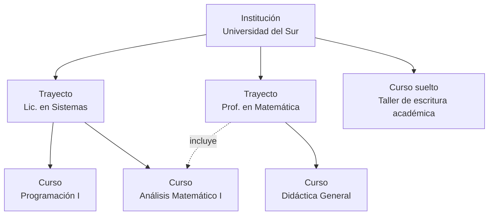

| Nivel | Nombre por defecto | En código | Qué es | Interfaz propia |
|---|---|---|---|---|
| 1 | Institución | `Institution` | La organización: universidad, facultad, instituto. Es el tenant. | Inicio, catálogo y lienzo, personas, roles, identidad visual, autenticación, períodos, reportes, auditoría y ajustes. |
| 2 | Trayecto | `Pathway` | Recorrido formativo con varios cursos: una carrera, una diplomatura, un ciclo de formación. | Mapa, cursos, personas y cohortes, progreso, tablón y ajustes. |
| 3 | Curso | `Course` | Unidad mínima de cursado: una materia, un taller, un seminario. | Tablón, contenido, personas, calificaciones, asistencia (opcional) y ajustes. |

Los nombres visibles se adaptan por institución mediante presets (sección 4.9): una universidad puede ver «Facultad › Carrera › Materia» sin que cambie nada en el código, la API ni las URLs.

### 4.2 Independencia y composición

- **R1 · La Institución es obligatoria.** Es el tenant: todo vive dentro de una.
- **R2 · El Trayecto es opcional.** Un Curso puede existir suelto dentro de la Institución (por ejemplo, un taller de extensión).
- **R3 · Cursos compartidos.** Un Curso puede formar parte de varios Trayectos (una materia común a varias carreras). Tiene un único **trayecto propietario**, del cual hereda los permisos de coordinación. Los demás trayectos lo **incluyen por referencia**: lo muestran en su mapa, siguen el progreso de sus estudiantes y pueden matricular a sus cohortes, pero no lo administran (DEC-014).
- **R4 · Interfaz y responsables propios.** Cada nivel tiene su interfaz, su configuración y sus responsables. Un rol asignado en un nivel aplica, por defecto, a todo lo que ese nivel contiene (cascada, sección 5.17).
- **R5 · Autosuficiencia.** Un nivel inferior no necesita al superior para el uso diario: un curso funciona completo aunque su trayecto no esté configurado.
- **R6 · Tres niveles fijos.** Las agrupaciones adicionales (facultad, departamento, área) no son niveles nuevos: se modelan con categorías jerárquicas (sección 4.7). La jerarquía es fija por diseño (P2).

### 4.3 Interior de un Curso

Todos los cursos tienen la misma estructura (P2), visible como pestañas fijas:

| Pestaña | Contiene |
|---|---|
| Tablón | Publicaciones del equipo docente (y de estudiantes, si se habilita), comentarios y tarjetas automáticas de nuevas tareas o evaluaciones. |
| Contenido | Unidades ordenadas y, dentro de cada una, elementos. |
| Personas | Equipo docente y estudiantes, organizados en comisiones y grupos. |
| Calificaciones | Libro de calificaciones (docentes) o «mis notas» (estudiantes). |
| Asistencia | Solo si el curso la habilita: sesiones de clase y registros. |
| Ajustes | Solo para quienes pueden editar el curso. |

**Tipos de elemento:**

| Tipo | Para qué | ¿Se califica? | ¿Genera tarjeta en el tablón? |
|---|---|---|---|
| Material | Archivos, enlaces y videos. | No | Opcional |
| Página | Contenido rico armado con el editor de bloques. | No | Opcional |
| Tarea | Consigna que requiere una entrega. | Sí | Sí |
| Evaluación | Cuestionario con ventana de disponibilidad y tiempo límite opcional. | Sí | Sí |
| Pregunta | Consigna breve con respuesta corta o de opción única, al estilo Classroom. | Opcional | Sí |
| Encuesta | Relevamiento nominal o anónimo, sin nota. | No | Opcional |
| Sesión de clase | Encuentro con fecha, para tomar asistencia. | Vía asistencia | No |

Además, cada curso tiene su banco de preguntas, su gestor de archivos y sus comisiones y grupos.

### 4.4 Interior de un Trayecto

- **Etapas** ordenadas (1.er año, 2.º año… o niveles), cada una con sus cursos.
- **Cursos obligatorios u optativos**, con grupos de optativas («elegir 2 de este grupo»).
- **Cohortes**: estudiantes agrupados por período de ingreso.
- **Reglas de finalización**: todos los obligatorios, N optativas y condiciones extra.
- **Tablón del trayecto**, para avisos a todas sus personas, a una etapa o a una cohorte.

### 4.5 Tiempo: períodos, ediciones y ciclos

- La institución define **períodos lectivos** (anual, cuatrimestral, trimestral, bimestral o personalizados), que pueden anidarse: «2027» contiene «1.er cuatrimestre 2027».
- Cada curso se asocia a un período, o a ninguno en el caso de cursos permanentes o autogestionados.
- **Modelo de ciclos** (DEC-009): una **edición** es un curso concreto en un período. El nuevo ciclo se crea **clonando** la edición anterior —estructura, contenido, tareas, evaluaciones, banco de preguntas, rúbricas, configuración y, opcionalmente, el equipo docente— **sin** estudiantes, entregas, notas ni tablón. La copia guarda su **linaje** (de qué edición proviene), lo que permite ver ediciones anteriores, compararlas y reutilizar material. Todas las fechas se desplazan automáticamente al nuevo período, conservando el día de la semana y las distancias relativas.
- **Alternativa evaluada:** una plantilla maestra con ediciones sincronizadas, donde los cambios en la plantilla se propagan. Es más potente y bastante más compleja; queda como evolución posible (Futuro).
- Al cerrar un período, sus cursos pasan a **archivados** (solo lectura), de forma automática o manual. El acceso de lectura de los estudiantes a cursos archivados es configurable.
- **Nuevo ciclo de un trayecto:** clona en un paso todos sus cursos al período siguiente (RF-TRA-007).

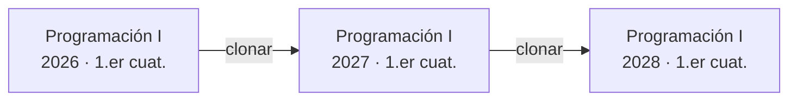

### 4.6 Personas, cuentas y matrículas (DEC-002)

- **Cuentas por institución.** Cada institución tiene sus propias personas dentro de su schema, con sus propios métodos de autenticación (nativo y, más adelante, LDAP). Esto maximiza el aislamiento y permite mover una institución entera entre servidores.
- **Vinculación de cuentas.** Una persona puede vincular sus cuentas de distintas instituciones de la misma instancia, demostrando que es titular de ambas (inicia sesión en cada una). A partir de ahí alterna entre instituciones con un **selector**, al estilo de Slack, sin volver a ingresar credenciales cada vez (traspaso de sesión con un token firmado de un solo uso). El vínculo vive en el schema global y solo guarda el par de referencias, sin duplicar datos personales.
- **Descubrimiento opcional.** «¿En qué instituciones tengo cuenta?»: la persona ingresa su email y recibe el listado por correo. Nunca se muestra en pantalla, para evitar la enumeración de cuentas.
- **Matrícula.** Vincula a una persona con un trayecto o un curso, con rol, estado, fechas, comisión y origen (manual, código, cohorte, importación o API).
- **Personal de plataforma.** La superadministración y la operación de la instancia viven en el schema global y no son personas de ninguna institución. Cualquier acceso a una institución se hace por suplantación auditada.

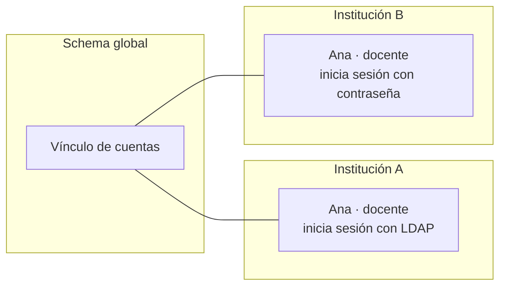

### 4.7 Taxonomía transversal

- **Categorías**: jerárquicas y definidas por cada institución. Se aplican a trayectos y cursos (por ejemplo, «Facultad de Ingeniería › Departamento de Computación»).
- **Etiquetas**: planas y con color, de vocabulario libre o controlado. Se aplican a trayectos, cursos, elementos y personas.
- **Campos personalizados (metadatos)**: la institución los define por tipo de entidad (trayecto, curso, persona, matrícula). Tipos: texto, número, fecha, lista de opciones, sí/no, URL y persona. Cada campo tiene obligatoriedad, validaciones y visibilidad (pública, interna o sensible).
- Todo lo anterior sirve para filtrar, agrupar, buscar, armar reportes y automatizar, y está disponible en la API.

### 4.8 Ciclo de vida y visibilidad

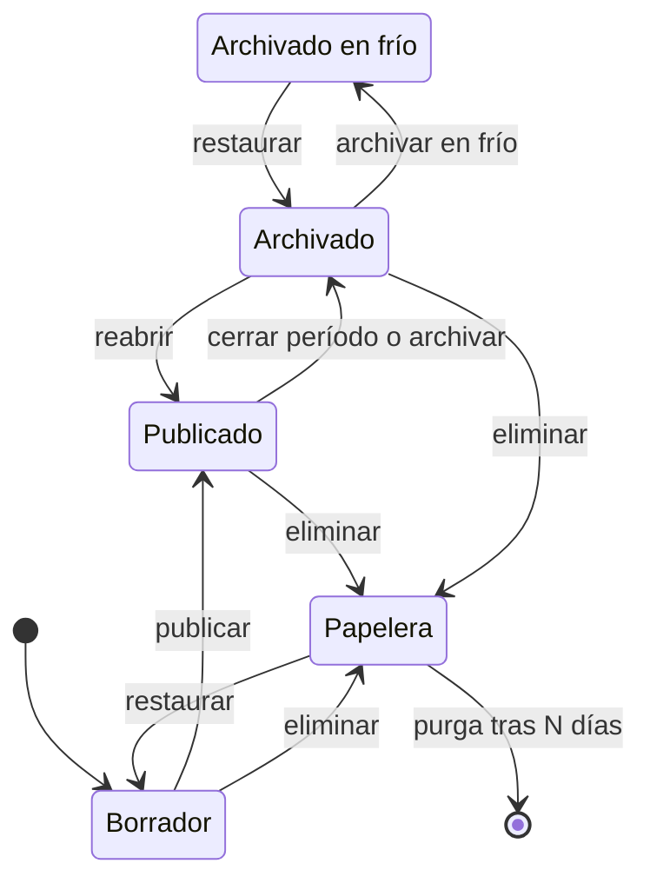

- Aplica a trayectos y cursos. La papelera conserva los elementos 30 días por defecto (configurable).
- **Archivado:** solo lectura, con todo disponible en línea.
- **Archivado en frío** (DEC-028): para ahorrar espacio, el curso se empaqueta comprimido en el almacenamiento y sale de la base de datos activa; también se liberan sus vistas previas y sus entradas en el índice de búsqueda. Sigue apareciendo en los listados con su ficha y se restaura en minutos cuando hace falta (RF-CUR-015).
- Los elementos dentro de un curso tienen además su propia visibilidad: **visible**, **oculto** o **programado** (se publica en una fecha).

### 4.9 Terminología configurable

- Cada institución elige un **preset** (Anexo E) y puede ajustar cada término: singular, plural y **género gramatical**, para que la interfaz concuerde («Nuevo curso» / «Nueva materia», «los cursos» / «las materias»).
- Términos configurables: los tres niveles, etapa, comisión, unidad, cohorte y período. Los tipos de elemento (tarea, evaluación, etc.) no se renombran: el docente le pone a cada uno el nombre que quiera (por ejemplo, «Primer parcial» o «TP 2»).
- El código, la API y las URLs usan siempre los nombres canónicos en inglés (`courses`, `pathways`). La terminología afecta solo a la interfaz, los emails y los PDF.

### 4.10 Modelo conceptual de datos

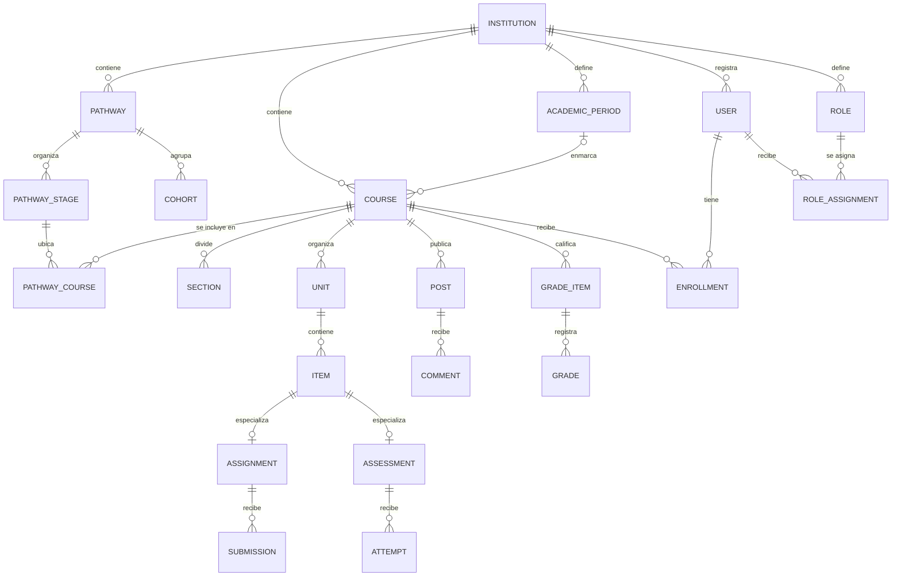

Es un modelo conceptual. El diseño físico (tablas, índices y restricciones) se documenta en ADR y en el código.

### 4.11 Qué vive en cada schema

| Schema global | Schema de cada institución |
|---|---|
| Configuración de la instancia | Personas, perfiles y credenciales |
| Registro de instituciones: identificador, slug, dominios, schema, estado y nodo | Roles, asignaciones y ajustes locales |
| Personal de plataforma (superadministración, operación, soporte) | Trayectos, cursos, contenido, entregas, evaluaciones y notas |
| Vínculos de cuentas entre instituciones | Configuración, identidad visual, terminología y autenticación |
| Auditoría de acciones de plataforma | Auditoría y actividad de la institución |
| Métricas agregadas y nodos de la federación (futuro) | Notificaciones, tokens de API, webhooks y metadatos de archivos |
| Cola de trabajos en segundo plano (cada trabajo indica su institución) | Taxonomía y campos personalizados |

**Regla:** no hay claves foráneas entre schemas de instituciones, ni desde el schema global hacia ellos. Las referencias cruzadas son por identificador (UUID) y se validan en la aplicación. Esto permite respaldar, restaurar o mover una institución de forma independiente (P9).

---

## 5. Requisitos funcionales

Los requisitos se agrupan por área. La fase indicada es tentativa: el alcance definitivo del MVP se fija en `docs/MVP.md`.

### 5.1 Instancia y administración de plataforma (ADM)

- **RF-ADM-001** · Debe · MVP — Asistente de primera ejecución: crea la cuenta de superadministración; configura la URL base y el modo de direcciones (sección 8.4), el almacenamiento S3, el SMTP (opcional) y el idioma por defecto; y crea la primera institución. Cada paso tiene un botón «probar conexión».
- **RF-ADM-002** · Debe · MVP — Alta, edición, suspensión, archivado y eliminación de instituciones. El alta crea el schema, ejecuta las migraciones, prepara el espacio de almacenamiento, carga los roles y la terminología por defecto y asigna la administración inicial. La eliminación exige una confirmación reforzada (escribir el nombre) y tiene un período de gracia.
- **RF-ADM-003** · Debe · MVP — Asignar y revocar la administración de cada institución.
- **RF-ADM-004** · Debe · MVP — Panel de la instancia: instituciones, personas activas, conexiones en vivo, uso de almacenamiento y estado de los servicios (base de datos, almacenamiento, SMTP y colas de trabajos).
- **RF-ADM-005** · Debe · V1 — Configuración de la instancia: dominios y modo de direcciones, políticas globales (contraseñas, tamaño máximo de subida, retención), idioma y zona horaria por defecto.
- **RF-ADM-006** · Debe · MVP — Actualizaciones: las migraciones corren en el schema global y en todos los schemas de instituciones, en paralelo y con concurrencia acotada. Un fallo en una institución no bloquea a las demás; se informa el estado por institución y se puede reintentar.
- **RF-ADM-007** · Debe · MVP — Respaldos automáticos y bajo demanda de la instancia completa y de cada institución (base de datos y archivos): programación configurable, retención escalonada (diaria, semanal y mensual), cifrado, destino configurable (otro bucket u otro proveedor S3, idealmente fuera del servidor), verificación automática mediante restauraciones de prueba, alertas si un respaldo falla y un panel con el estado, la descarga y la restauración de cada respaldo (sección 7.11).
- **RF-ADM-008** · Debe · MVP — Modos de dirección de la instancia: **ruta** (`http://localhost:4000/<institución>/…`; es el modo por defecto y el de desarrollo), **subdominio** (`https://<institución>.amauta.ejemplo/…`) e **institución única** (la instancia sirve a una sola institución en la raíz). El modo se cambia por configuración, sin tocar código (sección 8.4).
- **RF-ADM-009** · Debería · V1 — Cuotas por institución (almacenamiento, personas, tamaño máximo de archivo), con alertas al acercarse al límite.
- **RF-ADM-010** · Debería · V1 — Suplantación auditada: motivo obligatorio, duración limitada, banner visible durante toda la sesión y aviso opcional a la persona suplantada.
- **RF-ADM-011** · Debería · V1 — Modo mantenimiento global o por institución, con mensaje personalizable y acceso solo para administración.
- **RF-ADM-012** · Debería · V1 — Exportar una institución completa como paquete portable e importarla en otra instancia. Es la base de la migración entre nodos (sección 5.29).
- **RF-ADM-013** · Debe · MVP — Telemetría en vivo de la instancia (RF-ANA-004).
- **RF-ADM-014** · Debería · V1 — Publicación bajo subruta: la instancia completa se puede servir detrás de un proxy en una subruta (por ejemplo, `https://www.unsur.edu.ar/aulas/`), con todas las URLs, los recursos estáticos y los WebSockets funcionando.
- **RF-ADM-015** · Podría · V2 — Funcionalidades activables por institución (feature flags), para habilitar módulos de forma gradual.
- **RF-ADM-016** · Debe · V1 — Centro de configuración de la instancia: todas las opciones agrupadas por área, con buscador, descripción en lenguaje claro, valor por defecto y opción de restablecerlo, validación inmediata e historial (quién cambió qué y cuándo). La configuración se puede exportar e importar como JSON.
- **RF-ADM-017** · Debe · V1 — Seguridad de la instancia: límites de tasa, captcha y bloqueos configurables (sección 7.4), listas de IP bloqueadas y una lista opcional de IP permitidas para la superadministración.
- **RF-ADM-018** · Debería · V1 — Clonar una institución como punto de partida de otra: configuración, roles, terminología, identidad visual, categorías, plantillas y, opcionalmente, la estructura de trayectos y cursos, sin personas ni datos de cursado.
- **RF-ADM-019** · Debe · MVP — Dashboard profesional de administración, a nivel de instancia y de institución (DEC-032). Incluye:
  - indicadores clave: personas conectadas ahora y activas en el día, la semana y el mes; cursos activos; entregas e intentos de hoy; evaluaciones en curso; almacenamiento; colas; errores;
  - gráficos en tiempo real: conexiones, latencias, CPU y memoria de la BEAM, y base de datos;
  - estado de los servicios y alertas;
  - eventos recientes de auditoría y de seguridad, y estado de los respaldos;
  - accesos rápidos, un selector de rango temporal y navegación hacia el detalle.

  Desde V1, cada persona puede personalizar sus paneles (reordenar y ocultar widgets). El diseño sigue la misma vara visual que el resto del producto (sección 6.5).

### 5.2 Institución (INS)

- **RF-INS-001** · Debe · MVP — Datos de la institución: nombre, nombre corto, slug, logo, favicon, zona horaria, idioma por defecto, preset de terminología, descripción y contacto.
- **RF-INS-002** · Debe · MVP — Inicio adaptado al rol: la administración ve indicadores y pendientes de gestión; docentes y estudiantes ven sus cursos y pendientes (RF-UI-001).
- **RF-INS-003** · Debe · MVP — Gestión de trayectos y cursos: crear, editar, duplicar, archivar, mover cursos entre trayectos y asignar responsables.
- **RF-INS-004** · Debe · MVP — Directorio de personas: alta manual, invitación por email, importación CSV, edición, suspensión y baja; búsqueda y filtros por rol, trayecto, curso, etiqueta, campo personalizado y estado.
- **RF-INS-005** · Debe · V1 — Identidad visual: logo, color primario y de acento (con validación automática de contraste), imagen de inicio de sesión, tipografía de títulos (de una lista curada) y modo claro u oscuro por defecto, con vista previa en vivo antes de aplicar (sección 6.6).
- **RF-INS-006** · Debe · MVP — Terminología: elegir un preset y ajustar los términos con singular, plural y género (sección 4.9).
- **RF-INS-007** · Debe · V1 — Autenticación de la institución: métodos habilitados, autorregistro, dominios de email permitidos y obligatoriedad del segundo factor por rol (sección 5.18).
- **RF-INS-008** · Debe · MVP — Roles y permisos de la institución (sección 5.17).
- **RF-INS-009** · Debe · MVP — Períodos lectivos: crear, anidar, fijar fechas y marcar el período actual.
- **RF-INS-010** · Debe · V1 — Política de creación de cursos: quién puede crearlos (solo administración, coordinación o cualquier docente) y si requieren aprobación.
- **RF-INS-011** · Debe · V1 — Categorías, etiquetas y campos personalizados (sección 5.28).
- **RF-INS-012** · Debe · MVP — Remitente de los emails (nombre visible y dirección de respuesta) y notificaciones por defecto.
- **RF-INS-013** · Debería · V1 — Dominios propios: la institución agrega uno o más dominios (por ejemplo, `campus.unsur.edu.ar`); Amauta indica los registros DNS a crear, verifica la propiedad y la configuración, y designa un dominio canónico al que redirigen los demás (sección 8.4).
- **RF-INS-014** · Debería · V1 — Portal público de la institución: página de presentación con su identidad y catálogo de trayectos y cursos con inscripción abierta.
- **RF-INS-015** · Debería · V1 — Lienzo de la institución: vista visual de todos sus trayectos y cursos agrupados por categoría, con filtros y zoom semántico (sección 6.4). En el MVP alcanza con una grilla y una lista con filtros.
- **RF-INS-016** · Debería · V1 — Biblioteca institucional: materiales, preguntas y rúbricas reutilizables entre cursos, con permisos.
- **RF-INS-017** · Debería · V1 — Plantillas institucionales de curso, trayecto, certificado y rúbrica.
- **RF-INS-018** · Debería · V1 — Avisos institucionales: banner o publicación para toda la institución o para un segmento (rol, trayecto, etiqueta).
- **RF-INS-019** · Debería · V1 — Políticas de retención: archivar cursos de períodos cerrados después de N meses y purgar entregas después de N años, respetando las obligaciones legales de conservación.
- **RF-INS-020** · Debería · V1 — SMTP propio de la institución (opcional), que reemplaza al de la instancia.
- **RF-INS-021** · Podría · V2 — Alias de dominio que redirige a un trayecto o curso concreto (por ejemplo, `sistemas.unsur.edu.ar` → trayecto de Sistemas). Trayectos y cursos no tienen dominio propio: usan slugs personalizables (sección 8.4).
- **RF-INS-022** · Debe · V1 — Configuración de la institución con la misma experiencia que la de la instancia (RF-ADM-016): agrupada, con buscador, valores por defecto, historial y exportación e importación.
- **RF-INS-023** · Debe · V1 — Seguridad de la institución: política de contraseñas, duración de las sesiones, segundo factor obligatorio por rol (desde V1) y lista opcional de IP permitidas para los roles administrativos.
- **RF-INS-024** · Debería · V1 — Panel de uso del almacenamiento por trayecto, curso y tipo de archivo, con lo que más ocupa y acciones sugeridas (archivar en frío, purgar entregas antiguas según la retención).
- **RF-INS-025** · Debería · V1 — Fusionar personas duplicadas (por ejemplo, después de una importación), conservando matrículas, entregas, notas e historial, con auditoría.
- **RF-INS-026** · Debería · V1 — Reasignar la autoría y la responsabilidad de cursos y contenidos cuando una persona deja la institución.
- **RF-INS-027** · Debe · V1 — Calendario institucional de feriados y días no lectivos, que se usa al generar series de clases, al desplazar fechas y al calcular la asistencia.
- **RF-INS-028** · Debería · V1 — Lista de primeros pasos para una institución nueva (logo, período, importación de personas, primer trayecto), con el progreso visible.

### 5.3 Trayecto (TRA)

- **RF-TRA-001** · Debe · MVP — Crear y editar trayectos: nombre, código, slug, descripción, portada, color o ícono, categoría, etiquetas, campos personalizados, responsables y estado.
- **RF-TRA-002** · Debe · MVP — Estructura: etapas ordenadas; cursos por etapa marcados como obligatorios u optativos; grupos de optativas («elegir N de este grupo»).
- **RF-TRA-003** · Debe · MVP — Matriculación masiva al trayecto (CSV, selección o cohorte), con propagación opcional a sus cursos (todos, por etapa o solo los obligatorios) y asignación de comisión.
- **RF-TRA-004** · Debe · V1 — Cohortes: agrupar estudiantes por período de ingreso y ver su avance agregado.
- **RF-TRA-005** · Debe · V1 — Tablón del trayecto, con destinatarios: todo el trayecto, una etapa o una cohorte.
- **RF-TRA-006** · Debe · V1 — Cursos compartidos: incluir por referencia un curso cuyo propietario es otro trayecto (regla R3, DEC-014).
- **RF-TRA-007** · Debería · V1 — Nuevo ciclo: clonar en un paso el trayecto y sus cursos al período siguiente, con un asistente para revisar qué se copia (contenido, tareas con fechas desplazadas, banco de preguntas, rúbricas, configuración y docentes) y qué no (estudiantes, entregas, notas y tablón) (DEC-009).
- ~~RF-TRA-008~~ — Eliminado en la versión 0.4: las correlatividades quedan para evaluar más adelante (DEC-033).
- **RF-TRA-009** · Debería · V1 — Mapa del trayecto: vista tipo plano de subte, donde los cursos son estaciones y cada etapa es una línea de color que recorre sus cursos en orden; los obligatorios y los optativos se distinguen a simple vista. Se edita arrastrando y soltando. Para cada estudiante muestra su recorrido: completado, en curso o pendiente. Tiene una alternativa textual accesible (sección 6.4).
- **RF-TRA-010** · Debería · V1 — Progreso del trayecto por estudiante y por cohorte: cursos completados, promedio, porcentaje de avance y alertas.
- **RF-TRA-011** · Debería · V1 — Finalización del trayecto según reglas (obligatorios, N optativas y condiciones extra), que puede emitir un certificado.
- **RF-TRA-012** · Podría · V2 — Inscripción abierta al trayecto desde el portal público, con cupos y fechas.
- **RF-TRA-013** · Podría · V2 — Detección de choques: avisar cuando dos evaluaciones de cursos de la misma etapa coinciden en fecha.
- **RF-TRA-014** · Debe · V1 — Duplicar un trayecto dentro de la institución, con o sin sus cursos.
- **RF-TRA-015** · Debería · V1 — Copiar un trayecto, con sus cursos, a otra institución de la instancia (requiere permisos en ambas).
- ~~RF-TRA-016~~ — Eliminado en la versión 0.3: la inscripción a cursadas queda fuera del alcance (DEC-010).
- **RF-TRA-017** · Futuro — Usar la finalización de un curso como condición para desbloquear el contenido de otro, al estilo de las restricciones de acceso de Moodle. Se evalúa junto con las correlatividades (DEC-033).

### 5.4 Curso (CUR)

- **RF-CUR-001** · Debe · MVP — Crear un curso: nombre, código, slug, período, descripción, portada (generativa por defecto o imagen propia), ícono o emoji, color, trayectos, categoría, etiquetas y campos personalizados. Crear un curso vacío no debe llevar más de 30 segundos.
- **RF-CUR-002** · Debe · MVP — Interfaz estándar con las pestañas fijas de la sección 4.3, iguales en todos los cursos.
- **RF-CUR-003** · Debe · MVP — Encabezado del curso: portada, nombre, período, selector de comisión, equipo docente y accesos rápidos (código de inscripción para docentes y enlace de videollamada si existe).
- **RF-CUR-004** · Debe · MVP — Vista previa «como estudiante» para quienes editan, y «ver como esta persona» para la administración (auditado).
- **RF-CUR-005** · Debe · MVP — Estados del curso: borrador, publicado, archivado y papelera (sección 4.8).
- **RF-CUR-006** · Debe · V1 — Duplicar un curso eligiendo qué copiar, y crear una nueva edición para otro período conservando el linaje y desplazando las fechas (sección 4.5).
- **RF-CUR-007** · Debe · MVP — Ajustes mínimos y opinados: visibilidad; inscripción (código, enlace, aprobación); comisiones; quién publica en el tablón (solo docentes, todos, o todos con moderación); comentarios; escala de calificación; nombre de las unidades (unidad, semana, clase o módulo); y si se usa el módulo de asistencia.
- **RF-CUR-008** · Debe · MVP — «Para hacer» del estudiante y «Para revisar» del docente, por curso y reunidos en el inicio.
- **RF-CUR-009** · Debería · V1 — Plantillas de curso, aplicables al crear uno.
- **RF-CUR-010** · Debería · V1 — Asistente de armado: unas pocas preguntas («¿cuántas semanas?», «¿hay parciales?», «¿trabajos prácticos?») generan el esqueleto del curso con unidades y evaluaciones vacías.
- **RF-CUR-011** · Debería · V1 — Exportar e importar el curso como paquete Amauta (sección 5.27).
- **RF-CUR-012** · Debería · V1 — Desplazar fechas: mover todas las fechas del curso N días, o alinearlas al inicio de un período, de una sola vez.
- **RF-CUR-013** · Debe · V1 — Copiar unidades o elementos sueltos a otro curso propio, y duplicar un elemento dentro del mismo curso.
- **RF-CUR-014** · Debería · V1 — Copiar un curso a otra institución de la instancia (requiere permisos en ambas).
- **RF-CUR-015** · Debería · V1 — Archivado en frío (sección 4.8): el curso archivado se empaqueta comprimido en el almacenamiento, se liberan su espacio en la base de datos, sus vistas previas y su índice de búsqueda, y se restaura en minutos cuando se necesita. Se puede aplicar a un período completo de una sola vez.
- **RF-CUR-016** · Debería · V1 — Descargar en un ZIP los materiales de una unidad o de todo el curso, para estudiar sin conexión.
- **RF-CUR-017** · Podría · V2 — Modo presentación: mostrar una publicación, página o elemento a pantalla completa y con letra grande, para proyectar en el aula.

### 5.5 Tablón (TAB)

- **RF-TAB-001** · Debe · MVP — Publicar con el editor de bloques (texto con formato, listas, enlaces, imágenes, código, fórmulas LaTeX y videos incrustados), con adjuntos.
- **RF-TAB-002** · Debe · MVP — Elegir destinatarios: todo el curso, comisiones, grupos o personas concretas.
- **RF-TAB-003** · Debe · MVP — Borradores, publicación programada, edición (con marca «editado» e historial) y eliminación.
- **RF-TAB-004** · Debe · MVP — Respuestas en hilo: cualquier participante puede responder a una publicación y a una respuesta (un solo nivel de anidación, para que la conversación siga siendo legible), con menciones a personas. La persona mencionada recibe una notificación (`feed.mentioned`, DEC-037). Las respuestas se pueden desactivar por publicación o por curso.
- **RF-TAB-005** · Debe · MVP — Adjuntar archivos en publicaciones y respuestas (también los estudiantes, si el curso lo permite), con vista previa integrada y los mismos límites que el resto de los archivos.
- **RF-TAB-006** · Debe · MVP — Fijar con un clic: el docente fija o desfija una publicación desde su menú o arrastrándola a la zona de destacados. Puede haber varias fijadas, ordenadas a mano y con vencimiento opcional (se desfijan solas en una fecha). Las fijadas se ven siempre arriba del tablón y en el encabezado del curso.
- **RF-TAB-007** · Debe · MVP — Quién publica: solo docentes, todos, o todos con moderación previa (configurable por curso). Moderación: ocultar, eliminar o editar respuestas, silenciar a una persona en el tablón y denunciar contenido inapropiado.
- **RF-TAB-008** · Debe · MVP — Tiempo real: las publicaciones y las respuestas nuevas aparecen sin recargar. Si la persona está leyendo más abajo, aparece un aviso «N publicaciones nuevas» en lugar de mover el contenido.
- **RF-TAB-009** · Debe · MVP — Tarjetas automáticas al publicar una tarea, evaluación o material (configurable por curso).
- **RF-TAB-010** · Debe · MVP — Notificaciones según las preferencias de cada persona (sección 5.19).
- **RF-TAB-011** · Debería · V1 — Tipos de publicación: aviso, pregunta (respuesta corta u opción única) y encuesta rápida con resultados en vivo.
- **RF-TAB-012** · Debería · V1 — Respuesta destacada: el docente destaca una respuesta (por ejemplo, la que resuelve una consulta) para que aparezca primera.
- **RF-TAB-013** · Debería · V1 — Confirmación de lectura en avisos importantes: «visto por 87 de 120», con el listado de quienes faltan.
- **RF-TAB-014** · Debería · V1 — Reutilizar una publicación de otro curso.
- **RF-TAB-015** · Debería · V1 — Buscar y filtrar dentro del tablón.
- **RF-TAB-016** · Podría · V2 — Publicar en varios cursos a la vez.
- **RF-TAB-017** · Podría · V2 — Reacciones simples a publicaciones y respuestas.

### 5.6 Contenido (CON)

- **RF-CON-001** · Debe · MVP — Unidades ordenables (arrastrar y soltar, también con teclado), con título, descripción, fechas opcionales y visibilidad (visible, oculta o programada).
- **RF-CON-002** · Debe · MVP — Elementos de los tipos de la sección 4.3. En el MVP: material, página, tarea, evaluación y pregunta.
- **RF-CON-003** · Debe · MVP — Editor de bloques al estilo Notion, con menú «/»: texto, títulos, listas, lista de verificación, cita, recuadro destacado, código con resaltado, fórmula LaTeX, imagen, archivo, video (archivo propio o enlace incrustado), tabla, separador, desplegable y enlace a otro elemento del curso.
- **RF-CON-004** · Debe · MVP — Mover elementos dentro de una unidad y entre unidades con el mouse, el dedo o el teclado.
- **RF-CON-005** · Debe · MVP — Visibilidad y publicación programada por elemento, y asignación a comisiones, grupos o personas.
- **RF-CON-006** · Debe · MVP — Seguimiento de finalización por elemento: manual («marcar como hecho») o automático (visto, entregado, aprobado o nota mínima).
- **RF-CON-007** · Debe · MVP — Navegación lineal «anterior / siguiente» entre elementos e índice lateral del curso.
- **RF-CON-008** · Debe · MVP — Visor integrado de PDF e imágenes, y reproductor de audio y video, sin servicios externos.
- **RF-CON-009** · Debería · V1 — Condiciones de desbloqueo simples (fecha, completar otro elemento, nota mínima, pertenecer a un grupo), con un mensaje claro para el estudiante sobre qué le falta («Se desbloquea cuando entregues el TP 1»).
- **RF-CON-010** · Debería · V1 — Cronograma: línea de tiempo del curso con unidades y vencimientos. Arrastrar una unidad mueve juntas todas sus fechas.
- **RF-CON-011** · Debería · V1 — Historial de versiones de las páginas, con restauración.
- **RF-CON-012** · Debería · V1 — Insertar recursos de la biblioteca institucional o de otros cursos propios.
- **RF-CON-013** · Debería · V1 — Elementos de tipo encuesta y sesión de clase.
- **RF-CON-014** · Podría · V2 — Comprobador de accesibilidad del contenido: texto alternativo faltante, contraste, jerarquía de títulos y enlaces poco descriptivos.
- **RF-CON-015** · Podría · V2 — Grabar audio, video o pantalla desde el navegador para materiales y entregas, sin servicios externos.
- **RF-CON-016** · Futuro — Contenido interactivo H5P con reproductor embebido, sin dependencia externa (DEC-021).

### 5.7 Tareas y entregas (TAR)

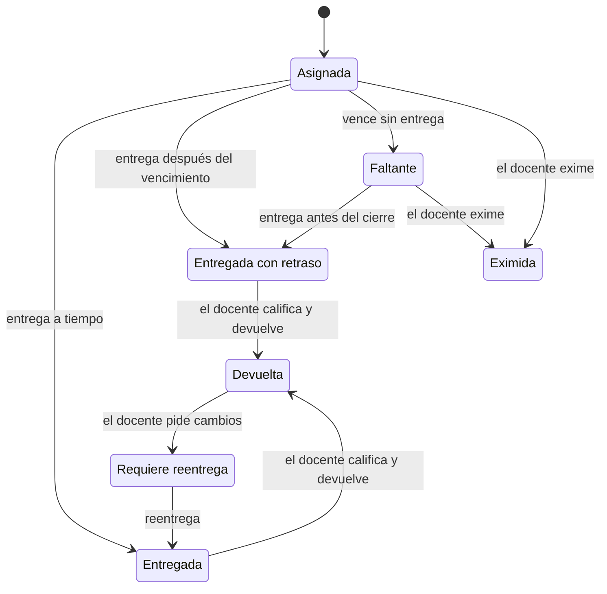

- **RF-TAR-001** · Debe · MVP — Crear tareas: título, consigna (editor de bloques), adjuntos o plantillas, puntaje máximo o escala, vencimiento opcional, fecha de cierre (hasta cuándo se aceptan entregas tardías), destinatarios y categoría de calificación.
- **RF-TAR-002** · Debe · MVP — Tipos de entrega combinables: archivos (con límites de tipo, tamaño y cantidad), texto en línea y enlace.
- **RF-TAR-003** · Debe · MVP — Estados claros para el estudiante, según el diagrama: asignada, entregada, entregada con retraso, faltante, devuelta, requiere reentrega y eximida.
- **RF-TAR-004** · Debe · MVP — Resumen para el docente: entregadas, pendientes, devueltas y faltantes, con filtro por estado y comisión.
- **RF-TAR-005** · Debe · MVP — Corrector rápido: recorrer las entregas con el teclado, ver los archivos en el visor integrado, calificar, comentar y devolver, con guardado automático.
- **RF-TAR-006** · Debe · MVP — Comentarios privados por entrega (hilo entre el equipo docente y el estudiante).
- **RF-TAR-007** · Debe · MVP — Comprobante de entrega con fecha, hora y huella (hash) de cada archivo, descargable por el estudiante.
- **RF-TAR-008** · Debe · V1 — Descarga masiva de entregas en un ZIP organizado por estudiante.
- **RF-TAR-009** · Debería · V1 — Rúbricas reutilizables (criterios por niveles, con puntajes); se califica con clics.
- **RF-TAR-010** · Debería · V1 — Banco de comentarios frecuentes del docente.
- **RF-TAR-011** · Debería · V1 — Prórrogas y excepciones por estudiante o grupo.
- **RF-TAR-012** · Debería · V1 — Entregas grupales: una entrega por grupo, con nota compartida o individual.
- **RF-TAR-013** · Debería · V1 — Notas ocultas hasta publicarlas en lote.
- **RF-TAR-014** · Debería · V1 — Varios correctores: repartir entregas entre docentes y ayudantes y seguir el avance de la corrección.
- **RF-TAR-015** · Debería · V1 — Penalización automática por entrega tardía, configurable.
- **RF-TAR-016** · Debería · V1 — Destinatarios dinámicos: asignar una tarea o evaluación a quienes cumplan una condición (por ejemplo, el recuperatorio para quienes no aprobaron o no rindieron el primer parcial).
- **RF-TAR-017** · Podría · V2 — Anotaciones sobre el PDF entregado (resaltar y comentar) en el navegador.
- **RF-TAR-018** · Podría · V2 — Evaluación entre pares, con asignación aleatoria y rúbrica.
- **RF-TAR-019** · Podría · V2 — Corrección anónima.
- **RF-TAR-020** · Podría · V2 — Detector de similitud interno entre entregas del mismo curso, sin servicios externos.

### 5.8 Evaluaciones (EVA)

- **RF-EVA-001** · Debe · MVP — Crear evaluaciones (parciales, exámenes y cuestionarios con tiempo): título, instrucciones, preguntas (del banco o nuevas), puntajes, ventana de disponibilidad (apertura y cierre), límite de tiempo, cantidad de intentos, método de calificación (mejor, último o promedio) y destinatarios.
- **RF-EVA-002** · Debe · MVP — Tipos de pregunta del MVP: opción única, opción múltiple, verdadero o falso, respuesta corta (con variantes aceptadas y sin distinguir tildes ni mayúsculas), numérica (con tolerancia) y desarrollo (corrección manual).
- **RF-EVA-003** · Debe · MVP — Autocorrección: las preguntas objetivas se corrigen solas al entregar. Si la evaluación no tiene preguntas de desarrollo, la nota queda calculada al instante, se publica según la configuración de retroalimentación y pasa sola al libro de calificaciones. Si las tiene, todo lo demás se corrige automáticamente y solo esas preguntas quedan en «Para revisar».
- **RF-EVA-004** · Debe · MVP — Reloj autoritativo del servidor: el tiempo se calcula en el servidor y el navegador solo muestra una cuenta regresiva sincronizada.
- **RF-EVA-005** · Debe · MVP — Autoguardado de cada respuesta al instante y reconexión transparente: si se corta la conexión, el estudiante retoma donde estaba sin perder nada (P12).
- **RF-EVA-006** · Debe · MVP — Envío automático al vencer el tiempo o la ventana, garantizado aunque el estudiante haya cerrado el navegador (trabajo programado persistente).
- **RF-EVA-007** · Debe · MVP — Aleatorización: orden de las preguntas, orden de las opciones y selección aleatoria de N preguntas de una categoría del banco.
- **RF-EVA-008** · Debe · MVP — Retroalimentación configurable: cuándo ve el estudiante su puntaje, las respuestas correctas y los comentarios (en el momento, al cerrar la evaluación o cuando el docente lo decida).
- **RF-EVA-009** · Debe · MVP — Adaptaciones por estudiante: tiempo extra, intentos extra o ventana distinta (accesibilidad e inclusión).
- **RF-EVA-010** · Debe · MVP — Monitor en vivo para el docente: quiénes empezaron, quiénes están rindiendo, quiénes entregaron, tiempo restante y desconexiones.
- **RF-EVA-011** · Debe · MVP — Vista previa como estudiante.
- **RF-EVA-012** · Debe · V1 — Modo práctica (autoevaluación): sin nota, intentos ilimitados y retroalimentación inmediata, para que el estudiante se ponga a prueba antes de un parcial.
- **RF-EVA-013** · Debería · V1 — Tipos de pregunta adicionales: emparejamiento, ordenamiento, completar espacios (cloze), carga de archivo y calculada (con variables aleatorias por estudiante).
- **RF-EVA-014** · Debería · V1 — Navegación libre o secuencial sin retroceso; una pregunta por página o todas juntas.
- **RF-EVA-015** · Debería · V1 — Integridad básica: contraseña de acceso, restricción por red o IP, y registro informativo de salidas de la pestaña. No hay vigilancia por cámara.
- **RF-EVA-016** · Debería · V1 — Revisión docente: corregir preguntas de desarrollo, recalificar si se corrige una pregunta y ver estadísticas por pregunta (dificultad y discriminación).
- **RF-EVA-017** · Debería · V1 — Fecha de vencimiento separada del cierre, para que la evaluación figure en «Para hacer» y en el calendario.
- **RF-EVA-018** · Podría · V2 — Modo en vivo tipo juego: preguntas proyectadas en el aula, respuestas desde el celular y resultados en tiempo real, con ranking opcional.

### 5.9 Banco de preguntas (PRE)

- **RF-PRE-001** · Debe · MVP — Banco de preguntas por curso, organizado en categorías y reutilizable en varias evaluaciones.
- **RF-PRE-002** · Debe · MVP — Editor de preguntas con vista previa en vivo, fórmulas e imágenes.
- **RF-PRE-003** · Debería · V1 — Importar y exportar preguntas en formatos de texto abiertos: GIFT, Aiken y Moodle XML. Facilita traer bancos existentes; es un formato de archivo, no una integración (P4).
- **RF-PRE-004** · Debería · V1 — Versionado de preguntas: editar una pregunta no altera los intentos ya rendidos.
- **RF-PRE-005** · Debería · V1 — Bancos compartidos a nivel de trayecto o institución, con permisos.
- **RF-PRE-006** · Debería · V1 — Etiquetas, dificultad estimada y búsqueda dentro del banco.

### 5.10 Calificaciones (CAL)

- **RF-CAL-001** · Debe · MVP — Libro de calificaciones: matriz de estudiantes por ítems calificables, filtrable por comisión y grupo, con edición en la celda y navegación por teclado.
- **RF-CAL-002** · Debe · MVP — Escalas: numérica configurable (por defecto de 0 a 10, con nota mínima de aprobación configurable), porcentual, conceptual (por ejemplo, «Aprobado / Desaprobado») y personalizadas.
- **RF-CAL-003** · Debe · MVP — Categorías con ponderación (por ejemplo, parciales 60 %, trabajos prácticos 30 % y participación 10 %), descarte de la nota más baja y puntos extra.
- **RF-CAL-004** · Debe · MVP — Ítems manuales sin actividad asociada (por ejemplo, «Oral» o «Parcial presencial»).
- **RF-CAL-005** · Debe · MVP — Nota final calculada, que se puede reemplazar manualmente dejando una justificación (auditada).
- **RF-CAL-006** · Debe · MVP — Historial de cada nota: quién la cambió, cuándo y cuál era el valor anterior.
- **RF-CAL-007** · Debe · MVP — Exportar a CSV, XLSX y PDF (planilla con fecha y espacio para firma).
- **RF-CAL-008** · Debe · MVP — Vista del estudiante: sus notas, devoluciones, promedio actual y ponderaciones visibles.
- **RF-CAL-009** · Debe · MVP — Edición concurrente segura: si dos docentes editan a la vez, cada uno ve los cambios del otro en tiempo real y nunca se pisan valores sin aviso.
- **RF-CAL-010** · Debería · V1 — Etiquetas de resultado configurables, como las letras de calificación de Moodle: rangos de la nota final (y, opcionalmente, un mínimo de asistencia) que se traducen en una etiqueta, por ejemplo «Promocionado» desde 7 y «Aprobado» desde 4. Son informativas: la condición académica oficial la registra el sistema de gestión de la institución (DEC-010).
- **RF-CAL-011** · Debería · V1 — Importar notas desde CSV (por ejemplo, las de un examen presencial).
- **RF-CAL-012** · Debería · V1 — Cierre de calificaciones: a partir de una fecha se bloquean los cambios, y reabrir requiere un permiso específico.
- **RF-CAL-013** · Podría · V2 — Simulador para el estudiante: «¿qué nota necesito en el próximo parcial para promocionar?».

### 5.11 Asistencia (ASI)

- **RF-ASI-001** · Debería · V1 — Sesiones de clase, una por una o en serie (por ejemplo, todos los martes y jueves del cuatrimestre), por comisión y con tema opcional.
- **RF-ASI-002** · Debería · V1 — Toma de asistencia rápida desde el celular: lista con toques (presente, ausente, tarde, justificado) que parte de «todos presentes».
- **RF-ASI-003** · Debería · V1 — Autorregistro del estudiante con un código QR rotativo que el docente proyecta en el aula. El código cambia cada pocos segundos para que no se pueda compartir.
- **RF-ASI-004** · Debería · V1 — Porcentaje de asistencia por estudiante, con umbral configurable (por ejemplo, 75 %) y alerta temprana.
- **RF-ASI-005** · Debería · V1 — Justificaciones con adjunto, tratadas como dato sensible (sección 5.31).
- **RF-ASI-006** · Debería · V1 — La asistencia puede alimentar el libro de calificaciones y las etiquetas de resultado.
- **RF-ASI-007** · Debería · V1 — Exportación por curso y por comisión.

### 5.12 Comisiones y grupos (COM)

- **RF-COM-001** · Debe · MVP — Comisiones: subdivisiones de un curso (por ejemplo, «Comisión A · Mañana») con docentes asignados, horario y aula física. Cada estudiante pertenece a una comisión.
- **RF-COM-002** · Debe · MVP — Un docente asignado a una comisión puede ver y gestionar solo a sus estudiantes, si así lo define su rol (permisos con ámbito de comisión, sección 5.17).
- **RF-COM-003** · Debe · MVP — Filtro por comisión en todo el curso: tablón, entregas, calificaciones, asistencia y personas.
- **RF-COM-004** · Debería · V1 — Grupos de trabajo dentro del curso o de una comisión, creados a mano, al azar o por autoinscripción con cupo.
- **RF-COM-005** · Debería · V1 — Conjuntos de grupos reutilizables en varias tareas (por ejemplo, «Grupos del TP integrador»).

### 5.13 Progreso y finalización (PRO)

- **RF-PRO-001** · Debe · MVP — Barra de progreso del estudiante en cada curso: elementos completados sobre requeridos.
- **RF-PRO-002** · Debería · V1 — Criterios de finalización del curso (elementos requeridos, nota mínima, asistencia mínima), que pueden disparar la emisión de un certificado.
- **RF-PRO-003** · Debería · V1 — Vista de progreso de la clase para el docente: matriz de estudiantes por elementos, con estados codificados por color y filtro por comisión.
- **RF-PRO-004** · Debería · V1 — Alertas tempranas de «estudiantes en riesgo» con reglas simples y configurables (sin ingresar hace N días, N entregas faltantes, nota bajo un umbral, asistencia bajo un umbral) y una acción rápida para escribirles.
- **RF-PRO-005** · Podría · V2 — Recordatorios automáticos por reglas (por ejemplo, «si no entregó 48 horas antes del vencimiento, recordárselo»).
- **RF-PRO-006** · Podría · V2 — Visualización del progreso inspirada en el quipu andino (sección 6.4), con alternativa textual.

### 5.14 Calendario (CLD)

- **RF-CLD-001** · Debe · V1 — Calendario personal que reúne vencimientos, evaluaciones, sesiones y eventos de cursos, trayectos e institución, con vistas de agenda, semana y mes, pensado primero para el celular.
- **RF-CLD-002** · Debe · V1 — Eventos manuales por curso, comisión, trayecto o institución.
- **RF-CLD-003** · Debería · V1 — Suscripción iCalendar con una URL secreta y revocable por persona, para ver el calendario en cualquier aplicación de calendario.
- **RF-CLD-004** · Podría · V2 — Turnos de consulta: el docente publica franjas horarias y los estudiantes reservan.

### 5.15 Personas y perfiles (USR)

- **RF-USR-001** · Debe · MVP — Perfil: nombre, apellido, nombre preferido, pronombres (opcional), foto, email, idioma, zona horaria y los campos personalizados de la institución (por ejemplo, legajo o DNI), cuya visibilidad controlan los permisos.
- **RF-USR-002** · Debe · MVP — Pestaña Personas del curso: equipo docente y estudiantes agrupados por rol y comisión, con acciones (cambiar de comisión, quitar del curso, ver actividad).
- **RF-USR-003** · Debe · MVP — Estados de cuenta: invitada (pendiente), activa, suspendida y archivada.
- **RF-USR-004** · Debe · MVP — Importación CSV con mapeo de columnas, validación por fila, simulación previa (sin aplicar cambios) y reporte de errores descargable.
- **RF-USR-005** · Debe · MVP — Preferencias de notificaciones y de accesibilidad: tamaño de letra, alto contraste, reducción de movimiento, tipografía alternativa y tema claro u oscuro.
- **RF-USR-006** · Debe · MVP — «Mis datos»: descargar toda la información personal propia (sección 5.31).
- **RF-USR-007** · Debería · V1 — Vinculación de cuentas entre instituciones y selector de institución (sección 4.6).
- **RF-USR-008** · Podría · V2 — Perfil público opcional, con los certificados obtenidos.
- **RF-USR-009** · Debería · V1 — Historial de cursos de la persona dentro de la institución: todos sus cursos por período, con su nota y su etiqueta de resultado, asistencia y certificados, exportable a PDF.

### 5.16 Matriculación (MAT)

- **RF-MAT-001** · Debe · MVP — Métodos de matriculación: manual, importación CSV, por trayecto o cohorte (propagación), código del curso, enlace de invitación (con vencimiento y límite de usos) y API.
- **RF-MAT-002** · Debe · MVP — Cada matrícula registra rol, estado (activa, pendiente, suspendida o finalizada), fechas de inicio y fin, comisión y origen.
- **RF-MAT-003** · Debe · MVP — Dar de baja una matrícula conserva el historial: las entregas y las notas se archivan, no se borran.
- **RF-MAT-004** · Debería · V1 — Autoinscripción desde el catálogo, con o sin aprobación, restringible por dominio de email y por ventana de fechas.
- **RF-MAT-005** · Debería · V1 — Cupos y lista de espera.
- **RF-MAT-006** · Debería · V1 — Matrícula temporal (oyente o invitado) con vencimiento automático.

### 5.17 Roles y permisos (ROL)

El modelo es: **permisos atómicos** que se agrupan en **roles**, que se asignan a personas en un **ámbito** (Institución, Trayecto, Curso o Comisión), con **cascada** hacia abajo y **ajustes locales** opcionales. El resultado se calcula, se guarda en caché y se puede explicar.

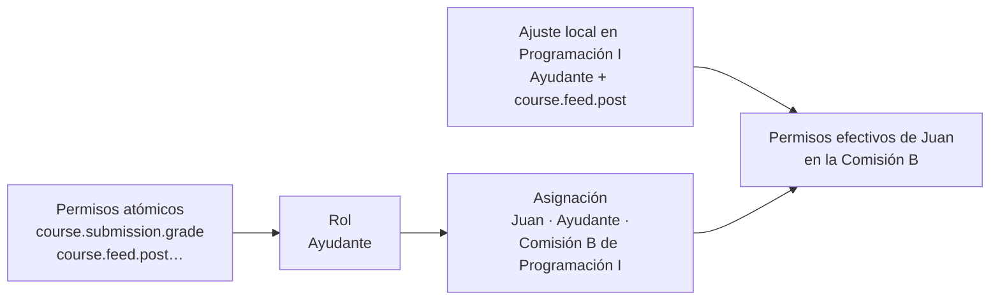

- **RF-ROL-001** · Debe · MVP — Catálogo de permisos atómicos con la convención `<ámbito>.<recurso>.<acción>`, con variantes `_own` (sobre lo propio) y `_any` (sobre lo de cualquiera) cuando corresponde; por ejemplo, `course.post.delete_own` y `course.post.delete_any`. El catálogo vive en el código, está versionado y documentado (Anexo B), y cada permiso tiene una descripción legible y un nivel de riesgo.
- **RF-ROL-002** · Debe · MVP — Roles definidos por cada institución. Se incluyen roles de sistema (Anexo C) que no se pueden eliminar, pero sí clonar y renombrar.
- **RF-ROL-003** · Debe · MVP — Asignación de rol = persona + rol + ámbito (Institución, Trayecto, Curso o Comisión). Una asignación aplica al ámbito y a todo lo que contiene (cascada).
- **RF-ROL-004** · Debe · MVP — Permisos efectivos = unión de los permisos de todas las asignaciones aplicables, con los ajustes locales aplicados.
- **RF-ROL-005** · Debe · MVP — Anti-escalada: nadie puede asignar un rol con permisos que no tiene en ese ámbito, ni editar roles para darse más permisos.
- **RF-ROL-006** · Debe · V1 — Explicador de permisos: «¿por qué esta persona puede (o no) hacer esto acá?», con la cadena completa: asignación → rol → ajuste local → resultado (P10).
- **RF-ROL-007** · Debe · V1 — Editor visual de roles: permisos agrupados por área con descripciones en lenguaje claro, indicador de riesgo (por ejemplo, «permite ver datos personales»), búsqueda, comparación entre roles y matriz rol × permiso.
- **RF-ROL-008** · Debe · V1 — Permisos a nivel de campo para datos sensibles: ver email, DNI, legajo y campos personalizados marcados como sensibles.
- **RF-ROL-009** · Debe · MVP — Roles de plataforma, fuera de las instituciones: superadministración, operación (sin acceso a contenidos ni datos personales) y soporte (con suplantación auditada).
- **RF-ROL-010** · Debe · MVP — Los tokens de API nunca superan los permisos de su dueño y, además, se limitan a los alcances (scopes) elegidos al crearlos.
- **RF-ROL-011** · Debe · MVP — Todo cambio de roles, asignaciones y ajustes queda auditado.
- **RF-ROL-012** · Debe · MVP — Los permisos se verifican siempre en el servidor, en cada acción (interfaz, API y trabajos en segundo plano). Ocultar un botón nunca es la única protección.
- **RF-ROL-013** · Debería · V1 — Ajustes locales: en un trayecto o curso concreto se puede agregar o quitar un permiso a un rol (por ejemplo, «en este curso, los ayudantes pueden publicar en el tablón»). Una denegación marcada como **bloqueada** en un ámbito superior no puede revertirse en los inferiores.
- **RF-ROL-014** · Debería · V1 — Vigencia en las asignaciones (desde y hasta); por ejemplo, un ayudante solo durante el cuatrimestre.
- **RF-ROL-015** · Debería · V1 — «Ver como rol»: previsualizar la interfaz con los permisos de un rol.
- **RF-ROL-016** · Debería · V1 — Exportar e importar definiciones de roles entre instituciones (JSON).
- **RF-ROL-017** · Debería · V1 — Presets de roles para universidades argentinas (titular, adjunto, JTP, ayudante de primera, ayudante alumno, dirección de carrera y bedelía), construidos sobre los roles de sistema.

### 5.18 Autenticación (AUT)

- **RF-AUT-001** · Debe · MVP — Email y contraseña: hash Argon2id, política configurable y rechazo de contraseñas comunes mediante una lista incluida en el sistema, sin consultar servicios externos.
- **RF-AUT-002** · Debe · MVP — Enlace mágico por email (si hay SMTP configurado).
- **RF-AUT-003** · Debe · MVP — Confirmación de email y recuperación de contraseña.
- **RF-AUT-004** · Debe · MVP — Pantalla de inicio de sesión con la identidad visual de la institución, que se resuelve por su dirección (sección 8.4).
- **RF-AUT-005** · Debe · MVP — Sesiones: ver las activas, cerrar las demás, vencimiento por inactividad configurable y «recordarme».
- **RF-AUT-006** · Debe · MVP — Protección contra fuerza bruta: límite de intentos por IP y por cuenta, bloqueo progresivo y aviso de inicio de sesión desde un dispositivo nuevo.
- **RF-AUT-007** · Debe · V1 — Autorregistro configurable por institución (deshabilitado, abierto, restringido por dominio de email o con aprobación). Los formularios públicos (registro, inicio de sesión tras varios intentos fallidos, recuperación de contraseña, autoinscripción y verificación de certificados) se protegen contra bots con un captcha autoalojado de prueba de trabajo, invisible para la mayoría de las personas y sin servicios externos (RNF-SEG-016 a RNF-SEG-022).
- **RF-AUT-008** · Debe · MVP — Proveedores de identidad enchufables: la autenticación se implementa detrás de una interfaz común de «proveedor», de modo que LDAP, OIDC o SAML se puedan agregar más adelante sin reestructurar cuentas, sesiones ni permisos.
- **RF-AUT-009** · Debería · V1 — Segundo factor TOTP (aplicaciones autenticadoras) con códigos de recuperación, obligatorio por rol si la institución así lo define.
- **RF-AUT-010** · Debería · V1 — Cuentas de servicio por institución, para integraciones.
- **RF-AUT-011** · Podría · V2 — Passkeys (WebAuthn).
- **RF-AUT-012** · Futuro · V2 — LDAP / Active Directory por institución, previsto para más adelante (DEC-026): conexión cifrada obligatoria (LDAPS o StartTLS), mapeo de atributos (nombre, email, legajo), mapeo opcional de grupos a roles o matrículas, alta automática en el primer ingreso, sincronización programada opcional y botón «probar conexión». Amauta nunca guarda contraseñas de LDAP.
- **RF-AUT-013** · Futuro — Conectores opcionales OIDC y SAML 2.0 (por ejemplo, Keycloak o Microsoft Entra ID), nunca obligatorios (DEC-020).

### 5.19 Notificaciones y correo electrónico (NOT y EML)

Toda notificación nace de un **evento** del catálogo (Anexo D), se dirige a una **audiencia** y se entrega por los **canales** que resulten de las preferencias en cascada (DEC-027).

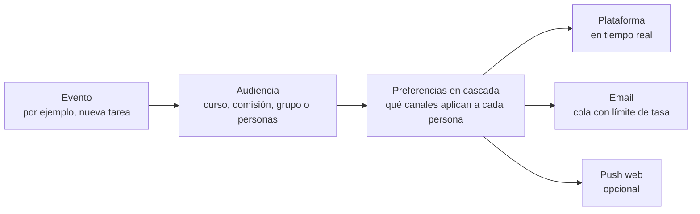

**Configuración en cascada.** Cada nivel define los valores por defecto del nivel inferior y puede **bloquear** un ajuste para que nadie más abajo lo cambie. Es el mismo modelo mental que el de los permisos:

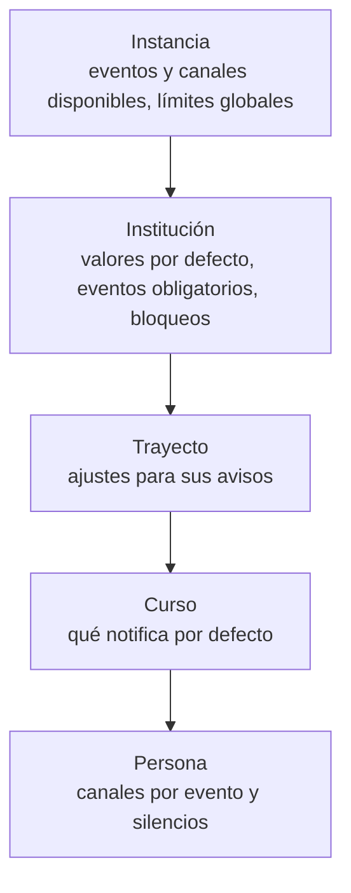

#### Notificaciones

- **RF-NOT-001** · Debe · MVP — Centro de notificaciones en tiempo real: no leídas, agrupación («3 respuestas nuevas en…»), filtros por curso y por tipo, y «marcar todo como leído».
- **RF-NOT-002** · Debe · MVP — Notificaciones claras: qué pasó, dónde (Institución › Trayecto › Curso), quién lo hizo y una acción directa (por ejemplo, «Ver la entrega»). Cada notificación explica **por qué la recibe la persona** («por ser estudiante de Programación I») y enlaza al ajuste que la controla (P10).
- **RF-NOT-003** · Debe · MVP — Catálogo de eventos notificables (Anexo D), con descripción legible y los canales posibles de cada evento.
- **RF-NOT-004** · Debe · MVP — Configuración en cascada (instancia → institución → trayecto → curso → persona): gana el nivel más específico, salvo que un nivel superior haya bloqueado el ajuste. La institución puede marcar eventos como obligatorios (por ejemplo, avisos institucionales críticos), que la persona no puede desactivar.
- **RF-NOT-005** · Debe · V1 — Difusión en cascada: un aviso publicado en la institución o en un trayecto llega a las personas de todos los niveles alcanzados, con filtros de audiencia (rol, etapa, cohorte, comisión) y sin duplicados.
- **RF-NOT-006** · Debe · V1 — Silenciar un curso, una publicación o una conversación, y modo «no molestar» temporal.
- **RF-NOT-007** · Debe · MVP — Recordatorios automáticos de vencimientos y de evaluaciones próximas (por defecto, 24 horas antes; configurable).
- **RF-NOT-008** · Debe · MVP — La difusión a miles de destinatarios se procesa por lotes en segundo plano, sin demorar la publicación (RNF-REN-013).
- **RF-NOT-009** · Debería · V1 — Resumen diario o semanal por email, configurable.
- **RF-NOT-010** · Debería · V1 — Notificaciones push web desde la PWA. Dependen del servicio de push de cada navegador, así que son opcionales y desactivables.
- **RF-NOT-011** · Debería · V1 — Horario de silencio por persona y por institución.

#### Correo electrónico

- **RF-EML-001** · Debe · MVP — Todo email sale por una cola persistente, nunca dentro de la acción de la persona, con prioridades: los de acceso (enlace mágico, recuperación de contraseña) van antes que las notificaciones, y estas antes que los resúmenes y los envíos masivos.
- **RF-EML-002** · Debe · MVP — Límite de tasa configurable por instancia y por institución (por segundo, minuto, hora y día) para respetar los límites del servidor SMTP y no saturarlo. Los envíos masivos se dosifican solos y se muestra una estimación de cuánto van a tardar.
- **RF-EML-003** · Debe · MVP — Reintentos con espera exponencial ante fallos temporales. Los fallos permanentes se registran, y las direcciones con rebotes reiterados pasan a una lista de supresión.
- **RF-EML-004** · Debe · MVP — Agrupación: varias notificaciones para la misma persona dentro de una ventana breve se combinan en un solo email.
- **RF-EML-005** · Debe · MVP — Matriz granular evento × canal, configurable en cascada (RF-NOT-004): en cada nivel se ve y se decide qué se envía por email y qué no.
- **RF-EML-006** · Debe · MVP — Configuración del SMTP con prueba de envío, remitente y dirección de respuesta, más un SMTP propio por institución (RF-INS-020).
- **RF-EML-007** · Debe · MVP — Plantillas de email por evento, localizadas y con la identidad de la institución. La institución puede editar el asunto y el texto (con variables y vista previa) sin romper el diseño base; la versión en texto plano se genera sola.
- **RF-EML-008** · Debe · V1 — Registro de envíos: estado de cada mensaje (en cola, enviado, reintentando, fallido o suprimido), búsqueda por destinatario y reenvío manual. Métricas de enviados por hora, tasa de fallos y tamaño de la cola.
- **RF-EML-009** · Debe · MVP — Baja con un clic en los emails que no son transaccionales (cabeceras `List-Unsubscribe` y `List-Unsubscribe-Post`, RFC 8058) y enlace a las preferencias en cada email.
- **RF-EML-010** · Debe · MVP — En desarrollo no sale ningún email: todos se capturan en Mailpit (RNF-DEV-012).
- **RF-EML-011** · Debería · V1 — Envíos masivos programados (por ejemplo, avisos institucionales) con ventana de envío.
- **RF-EML-012** · Debería · V1 — Los emails no urgentes respetan el horario de silencio: se retienen y salen al terminar.
- **RF-EML-013** · Debería · V1 — Guía de entregabilidad (SPF, DKIM y DMARC) en la documentación de instalación, y un aviso en el panel si el dominio remitente no está bien configurado.
- **RF-EML-014** · Podría · V2 — Procesamiento automático de rebotes (buzón de rebotes o direcciones VERP) para alimentar la lista de supresión.

### 5.20 Mensajería (MSG)

- **RF-MSG-001** · Debe · V1 — Mensajes directos uno a uno entre participantes de un mismo curso: estudiantes con docentes y estudiantes entre sí (DEC-012).
- **RF-MSG-002** · Debe · V1 — Consulta al equipo docente: un estudiante escribe a todo el equipo docente de su curso o comisión en una sola conversación, y cualquier docente puede responder.
- **RF-MSG-003** · Debe · V1 — Tiempo real: los mensajes llegan sin recargar, con indicador de no leídos y notificación según las preferencias.
- **RF-MSG-004** · Debe · V1 — Adjuntos (con los mismos límites y validaciones que el resto de los archivos) y formato básico.
- **RF-MSG-005** · Debe · V1 — Política configurable en cascada: la institución y cada curso pueden limitar quién escribe a quién (por ejemplo, desactivar los mensajes entre estudiantes en un curso). Por defecto, los mensajes entre estudiantes vienen activados (DEC-012).
- **RF-MSG-006** · Debe · V1 — Privacidad: las conversaciones solo las leen sus participantes. Únicamente ante una denuncia, una persona con un permiso específico puede revisar la conversación denunciada, con motivo obligatorio y auditoría.
- **RF-MSG-007** · Debe · V1 — Convivencia y seguridad: bloquear a una persona, denunciar mensajes y límites de tasa contra el spam.
- **RF-MSG-008** · Debe · V1 — Cuando termina la matrícula o se archiva el curso, sus conversaciones quedan en modo solo lectura.
- **RF-MSG-009** · Debe · MVP — Comentarios privados en las entregas (RF-TAR-006), vinculados a cada entrega.
- **RF-MSG-010** · Debería · V1 — Conversaciones grupales (por ejemplo, de un grupo de trabajo).
- **RF-MSG-011** · Debería · V1 — Mensaje a una selección: el docente escribe a varias personas a la vez desde cualquier lista (por ejemplo, «a quienes no entregaron el TP 1»), y cada una recibe una conversación individual.
- **RF-MSG-012** · Podría · V2 — Confirmaciones de lectura opcionales y edición o eliminación de los mensajes propios durante unos minutos.

### 5.21 Archivos (ARC)

- **RF-ARC-001** · Debe · MVP — Subida directa del navegador al almacenamiento S3 con URLs prefirmadas (el archivo no pasa por la aplicación), con barra de progreso, reanudación por partes para archivos grandes, arrastrar y soltar, y pegar desde el portapapeles.
- **RF-ARC-002** · Debe · MVP — Descarga con URLs prefirmadas de corta duración, verificando permisos en cada solicitud.
- **RF-ARC-003** · Debe · MVP — Límites configurables por instancia, institución y curso: tamaño, tipos permitidos y cuotas.
- **RF-ARC-004** · Debe · MVP — Validación del tipo real del archivo por su contenido, no solo por la extensión.
- **RF-ARC-005** · Debe · V1 — Miniaturas y vistas previas (imágenes y primera página de PDF), generadas en segundo plano.
- **RF-ARC-006** · Debe · V1 — Gestor de archivos del curso: todos los archivos por unidad o por tipo, búsqueda y dónde se usa cada uno.
- **RF-ARC-007** · Debe · MVP — Aislamiento: cada institución tiene su propio espacio de almacenamiento, y las claves de los objetos no son adivinables.
- **RF-ARC-008** · Debe · V1 — Limpieza programada de archivos huérfanos, después de un período de gracia.
- **RF-ARC-009** · Debería · V1 — Antivirus opcional (ClamAV como servicio del compose), con cuarentena.
- **RF-ARC-010** · Debería · V1 — Deduplicación por contenido dentro de una institución.
- **RF-ARC-011** · Podría · V2 — Vista previa de documentos de oficina mediante conversión a PDF con un servicio autoalojado opcional.
- **RF-ARC-012** · Debería · V1 — Las miniaturas y vistas previas son datos derivados: se pueden purgar para ahorrar espacio (por ejemplo, al archivar en frío) y se regeneran solas cuando se necesitan.
- **RF-ARC-013** · Debería · V1 — Almacenamiento frío: los paquetes archivados en frío y los respaldos se pueden guardar en un bucket o proveedor S3 distinto y más barato.

### 5.22 Certificados y credenciales (CER)

- **RF-CER-001** · Debería · V1 — Editor visual de plantillas tipo lienzo (arrastrar y soltar): textos, imágenes, logos, firmas, formas, código QR y variables (`{{estudiante.nombre}}`, `{{curso.nombre}}`, `{{fecha}}`, `{{nota_final}}`, `{{horas}}`, `{{codigo}}`); guías de alineación, ajuste a grilla, capas, deshacer y rehacer, tamaños A4 y Carta en ambas orientaciones y tipografías curadas.
- **RF-CER-002** · Debería · V1 — Plantillas iniciales prediseñadas, coherentes con la identidad visual de Amauta.
- **RF-CER-003** · Debería · V1 — Emisión automática por reglas (al finalizar un curso o un trayecto, con nota mínima) o manual (individual o masiva).
- **RF-CER-004** · Debería · V1 — PDF vectorial generado en el servidor, en segundo plano, con fuentes incrustadas e idéntico a la vista previa.
- **RF-CER-005** · Debería · V1 — Verificación pública por URL o QR con un código único: muestra si el certificado es válido o fue revocado, con los datos mínimos indispensables.
- **RF-CER-006** · Debería · V1 — Revocación y reemisión con motivo (auditadas).
- **RF-CER-007** · Debería · V1 — «Mis certificados» en el perfil del estudiante.
- **RF-CER-008** · Podría · V2 — Credenciales verificables Open Badges 3.0, firmadas criptográficamente y portables.

### 5.23 Búsqueda y navegación rápida (BUS)

- **RF-BUS-001** · Debe · MVP — Paleta de comandos global (Ctrl/⌘ + K): ir a cursos, personas y elementos, y ejecutar acciones («crear tarea», «ir a calificaciones»).
- **RF-BUS-002** · Debe · V1 — Búsqueda de texto completo en español (sin distinguir tildes y tolerante a errores de tipeo), que respeta los permisos de quien busca.
- **RF-BUS-003** · Debería · V1 — Búsqueda dentro del texto de PDF y documentos, extraído en segundo plano.

### 5.24 Analítica y reportes (ANA)

- **RF-ANA-001** · Debe · MVP — Exportaciones grandes en segundo plano, con aviso al terminar y sin bloquear la interfaz.
- **RF-ANA-002** · Debe · MVP — Panel básico de la instancia: instituciones, personas activas, conexiones en vivo, almacenamiento y salud de los servicios.
- **RF-ANA-003** · Debería · V1 — Panel del curso para docentes: participación, entregas a tiempo, tarde y faltantes, distribución de notas y estudiantes en riesgo.
- **RF-ANA-004** · Debe · MVP — Telemetría en vivo (de la instancia y, a futuro, del nodo máster): procesos, memoria, uso de schedulers y colas de la BEAM; conexiones, consultas lentas, tamaño por schema y tasa de aciertos de caché de PostgreSQL; colas y fallos de trabajos; conexiones LiveView por institución; latencias HTTP p50, p95 y p99, y tasa de errores.
- **RF-ANA-005** · Debería · V1 — Panel del trayecto: avance por cohorte, tasa de aprobación por curso y cuellos de botella (cursos con más desaprobados).
- **RF-ANA-006** · Debería · V1 — Panel institucional: personas activas por día y por mes, cursos activos, horarios pico, almacenamiento y adopción docente.
- **RF-ANA-007** · Debería · V1 — Generador de reportes: elegir entidad, columnas, filtros y agrupación; previsualizar; exportar a CSV, XLSX o PDF; guardar y programar envíos por email.
- **RF-ANA-008** · Podría · V2 — Umbral mínimo de agregación en los reportes, para que no se pueda identificar a personas en grupos muy chicos.
- **RF-ANA-009** · Debería · V1 — Análisis de comportamiento: patrones de acceso (días, horarios y dispositivos), tiempo estimado de dedicación por curso y por elemento, e índice de participación de cada estudiante comparado con su cohorte, para detectar a tiempo a quien se está alejando. Requiere el nivel completo de registro y respeta las reglas de transparencia y privacidad de RF-AUD-008.

### 5.25 Auditoría, historial y registros (AUD)

- **RF-AUD-001** · Debe · MVP — Bitácora de auditoría inmutable de acciones críticas: inicios y cierres de sesión (incluidos los fallidos), cambios de roles y permisos, cambios de notas, eliminaciones, exportaciones de datos personales, suplantaciones, cambios de configuración y accesos a datos sensibles.
- **RF-AUD-002** · Debe · MVP — Cada evento registra quién (persona, rol efectivo y, si corresponde, quién la suplanta), qué (acción, entidad y diferencias antes/después), cuándo (UTC), dónde (IP, navegador y nodo), por qué (motivo, cuando se exige) y un identificador de correlación.
- **RF-AUD-003** · Debe · MVP — Inmutabilidad técnica: la aplicación no tiene permisos de base de datos para modificar ni borrar la auditoría; cada registro se encadena con el hash del anterior, y la integridad de la cadena se verifica periódicamente.
- **RF-AUD-004** · Debe · MVP — Registro de actividad granular, separado de la auditoría y con su propia retención: inicios de sesión, accesos a cursos, vistas de elementos, descargas de archivos, reproducciones de video, entregas, intentos y su navegación, y mensajes enviados (sin su contenido), con fecha, dispositivo y sesión. Sirve para la analítica, el seguimiento y la resolución de reclamos (por ejemplo, «¿el estudiante abrió la consigna?»).
- **RF-AUD-005** · Debe · V1 — Actividad por persona: línea de tiempo filtrable, último acceso a la plataforma y a cada curso, y mapa de calor de días y horarios de actividad.
- **RF-AUD-006** · Debe · V1 — Actividad por curso y por elemento: quién vio, descargó o entregó cada cosa, y quién no (por ejemplo, «¿quién no abrió el aviso del parcial?»), con una acción rápida para escribirles.
- **RF-AUD-007** · Debe · V1 — Historial por entidad: institución, trayecto, curso, elemento, persona, matrícula, nota y configuración muestran su línea de tiempo de cambios (quién, qué, cuándo, y el antes y el después), con restauración de versiones anteriores donde tiene sentido (páginas, consignas y configuración).
- **RF-AUD-008** · Debe · MVP — Transparencia y privacidad del registro de actividad: la institución define la granularidad y la retención; ver el detalle individual requiere un permiso específico y queda auditado; cada persona puede ver su propia actividad; y la política de privacidad informa qué se registra. Por defecto rige el nivel **estándar** (accesos, vistas, descargas y entregas); el nivel **completo**, que suma el tiempo estimado de dedicación y la navegación dentro de los exámenes, lo activa cada institución (DEC-031).
- **RF-AUD-009** · Debe · V1 — Visor de auditoría con filtros (persona, acción, entidad y fecha) y exportación.
- **RF-AUD-010** · Debe · MVP — Consola integrada de errores del servidor: agrupados, con traza, frecuencia, primera y última aparición, y estado (resuelto o no), sin servicios externos.
- **RF-AUD-011** · Debe · V1 — Logs del servidor en vivo y su histórico: filtrables por nivel, nodo, institución y texto, descargables, y con la posibilidad de cambiar el nivel de log en caliente, sin reiniciar.
- **RF-AUD-012** · Debería · V1 — Retención configurable por tipo de registro, con archivado comprimido y firmado en almacenamiento frío.

### 5.26 API, webhooks y tiempo real (API)

- **RF-API-001** · Debe · MVP — Paridad total (P5): toda operación disponible en la interfaz —incluidas la administración, los roles y la configuración— está disponible en la API. Un test automático contrasta el catálogo de acciones del dominio con la API y falla si falta alguna (sección 8.2).
- **RF-API-002** · Debe · MVP — API REST JSON versionada (`/api/v1`), documentada con OpenAPI 3.1 generada desde el código, con un portal de documentación interactivo servido por la propia instancia.
- **RF-API-003** · Debe · MVP — Autenticación con tokens personales (con alcances y vencimiento) y con cuentas de servicio.
- **RF-API-004** · Debe · MVP — Autorización idéntica a la de la interfaz: mismas reglas, mismo código.
- **RF-API-005** · Debe · MVP — Paginación por cursor, filtros, ordenamiento, selección de campos e inclusión de relaciones.
- **RF-API-006** · Debe · MVP — Errores en formato RFC 9457 (Problem Details), con códigos estables y mensajes localizados.
- **RF-API-007** · Debe · MVP — Idempotencia en las operaciones de creación mediante la cabecera `Idempotency-Key`.
- **RF-API-008** · Debe · MVP — Límites de tasa por token y por IP, con cabeceras estándar (`RateLimit`, `Retry-After`).
- **RF-API-009** · Debe · V1 — Registro de uso por token (auditoría y métricas).
- **RF-API-010** · Debe · V1 — Política de deprecación: cada versión se soporta durante un plazo publicado, y los cambios se anuncian con las cabeceras `Deprecation` y `Sunset`.
- **RF-API-011** · Debería · V1 — Webhooks por institución: suscripción a eventos (Anexo D), cuerpo firmado según la especificación Standard Webhooks, reintentos con espera exponencial, registro de entregas, reenvío manual y desactivación automática tras fallos sostenidos.
- **RF-API-012** · Debería · V1 — Suscripción a eventos en tiempo real por WebSocket.
- **RF-API-013** · Debería · V1 — Operaciones masivas y asíncronas, con seguimiento (`202 Accepted` y un recurso que informa el estado del trabajo).
- **RF-API-014** · Debería · V1 — OAuth 2.1 con PKCE, para que aplicaciones de terceros actúen en nombre de una persona, con pantalla de consentimiento.
- **RF-API-015** · Podría · V2 — Clientes (SDK) generados desde la especificación OpenAPI.
- **RF-API-016** · Podría · V2 — API GraphQL para lecturas complejas.
- **RF-API-017** · Podría · V2 — Servidor MCP (Model Context Protocol, un estándar abierto) para que asistentes de IA operen sobre Amauta con los permisos de la persona que los autoriza (DEC-013).

### 5.27 Importación, exportación y migración (IMP)

- **RF-IMP-001** · Debe · V1 — Exportación completa de los datos de una institución en formatos abiertos (JSON, CSV y archivos originales): no hay encierro de datos.
- **RF-IMP-002** · Debe · V1 — Paquete Amauta (`.amauta`): un ZIP con un manifiesto JSON versionado y los archivos, a nivel de curso, trayecto o institución. Al exportar se elige si incluye personas y datos de cursado (entregas, notas, asistencia), y se puede cifrar con una contraseña. Las conversaciones privadas nunca viajan en el paquete de un curso; solo en el respaldo completo de la institución. Sirve para respaldos, plantillas, compartir cursos y migrar entre nodos (DEC-030).
- **RF-IMP-003** · Debería · V2 — Importador de respaldos de cursos de Moodle (`.mbz`): estructura, recursos, páginas, tareas, cuestionarios y bancos de preguntas; las personas y los datos de cursado solo si el respaldo los trae y se elige importarlos. Es un formato de archivo, no una integración (P4).
- **RF-IMP-004** · Podría · V2 — Importación desde IMS Common Cartridge.
- **RF-IMP-005** · Debe · MVP — Exportar cualquier listado (personas, matrículas, comisiones y grupos, entregas, notas, asistencia, trayectos y cursos) a CSV, XLSX o PDF, respetando los filtros, las columnas visibles y los permisos. Las exportaciones con datos personales quedan auditadas.
- **RF-IMP-006** · Debe · MVP — Asistente de importación único para personas, matrículas, comisiones y grupos, notas, cursos y estructura de trayectos: plantillas descargables, mapeo de columnas, validación por fila, simulación previa, reporte de errores y **deshacer la importación completa** si algo salió mal.
- **RF-IMP-007** · Debe · V1 — Restauración al estilo Moodle: restaurar un paquete como curso o trayecto nuevo, fusionarlo con uno existente o reemplazar su contenido, con vista previa de lo que se va a restaurar y mapeo de personas por email o legajo cuando el paquete trae datos de cursado.
- **RF-IMP-008** · Debería · V1 — Respaldos automáticos de cursos (por ejemplo, semanales y al archivar), con retención configurable y un área de respaldos donde descargarlos o restaurarlos.
- **RF-IMP-009** · Debería · V1 — Importaciones programadas o por API (por ejemplo, un CSV que otro sistema deja cada noche), con el mismo motor de validación.

### 5.28 Taxonomía (TAX)

- **RF-TAX-001** · Debe · V1 — Categorías jerárquicas por institución, para trayectos y cursos.
- **RF-TAX-002** · Debe · V1 — Etiquetas con color, de vocabulario libre o controlado, para trayectos, cursos, elementos y personas.
- **RF-TAX-003** · Debe · V1 — Filtrar, agrupar y buscar por categoría y etiqueta en todas las listas.
- **RF-TAX-004** · Debería · V1 — Campos personalizados por tipo de entidad (sección 4.7), disponibles como filtros, como columnas de reportes y en la API.
- **RF-TAX-005** · Debería · V1 — Vistas guardadas (combinaciones de filtros con nombre).

### 5.29 Clúster y federación (FED)

- **RF-FED-001** · Debe · MVP — Decisiones que habilitan la federación desde el primer día: identificadores UUIDv7, institución como unidad portable (schema y espacio de almacenamiento propios), sin claves foráneas entre schemas, eventos de dominio publicados por PubSub y ningún estado local en disco.
- **RF-FED-002** · Debería · V1 — Clúster homogéneo: varios nodos BEAM detrás del balanceador que comparten base de datos y almacenamiento, con autodescubrimiento y PubSub y Presence distribuidos.
- **RF-FED-003** · Futuro · V3 — Cada nodo Amauta funciona como una unidad autónoma (con su base de datos y su almacenamiento) y puede unirse a una federación.
- **RF-FED-004** · Futuro · V3 — Nodo máster: vista unificada y en tiempo real de todos los nodos (salud, métricas, instituciones por nodo y uso).
- **RF-FED-005** · Futuro · V3 — Mover una institución completa de un nodo a otro con una ventana breve de solo lectura, verificación de integridad y vuelta atrás automática si algo falla.
- **RF-FED-006** · Futuro · V3 — Mover o copiar cursos y trayectos entre instituciones de distintos nodos mediante paquetes, con mapeo de personas por email o identificador.
- **RF-FED-007** · Futuro · V3 — Si el máster cae, los nodos siguen funcionando con normalidad: el máster observa y orquesta, nunca es una dependencia en tiempo de ejecución.

### 5.30 Localización (I18N)

- **RF-I18N-001** · Debe · MVP — Toda cadena visible está externalizada (Gettext): no hay textos de interfaz escritos directamente en el código. El español rioplatense (con voseo) es el idioma base y el idioma por defecto (DEC-011).
- **RF-I18N-002** · Debe · MVP — Formatos locales de fechas, horas, números, plurales y listas según CLDR.
- **RF-I18N-003** · Debe · MVP — Zona horaria por institución y por persona. Todo se guarda en UTC; los vencimientos se muestran en hora local, aclarando cuando difiere de la del curso.
- **RF-I18N-004** · Debe · MVP — El idioma se resuelve en este orden: preferencia de la persona, institución, instancia.
- **RF-I18N-005** · Debe · MVP — Concordancia de género y número con la terminología personalizada (sección 4.9).
- **RF-I18N-006** · Debe · MVP — Emails y PDF en el idioma de quien los recibe.
- **RF-I18N-007** · Debe · MVP — Estilos con propiedades lógicas de CSS, para soportar escritura de derecha a izquierda en el futuro sin reescribir.
- **RF-I18N-008** · Debería · V1 — Español neutro como segundo idioma; inglés y portugués de Brasil como idiomas adicionales.
- **RF-I18N-009** · Debe · MVP — Tono de la interfaz cercano y con voseo («Entregá tu TP», «Escribí algo para tu clase»), con una guía de estilo de redacción que lo mantenga consistente (DEC-011).
- **RF-I18N-010** · Debería · V1 — Proceso de traducción comunitaria con archivos `.po` en el repositorio y una guía de contribución.

### 5.31 Privacidad (PRV)

- **RF-PRV-001** · Debe · MVP — Derechos de las personas titulares de los datos (Ley 25.326): acceso (descargar sus datos), rectificación y supresión mediante un flujo de solicitud que respeta las obligaciones de conservación de registros académicos.
- **RF-PRV-002** · Debe · MVP — Política de privacidad y términos configurables por institución, con aceptación versionada y registrada.
- **RF-PRV-003** · Debe · V1 — Datos sensibles marcados como tales (salud, discapacidad, adaptaciones), con permisos específicos y auditoría de cada acceso.
- **RF-PRV-004** · Debe · MVP — Sin rastreadores de terceros y solo cookies esenciales. Por eso no hace falta un banner de cookies.
- **RF-PRV-005** · Debería · V1 — Retención y anonimización programadas según las políticas de la institución.

### 5.32 Landing y sitio público (LND)

- **RF-LND-001** · Debe · V1 — Landing page del proyecto con las secciones de la sección 6.8. Tiene que ser memorable y destacarse claramente de la competencia: minimalista, en pastel, clara y amigable, con efectos sutiles y muy cuidados (DEC-025, sección 6.5.6).
- **RF-LND-002** · Debe · V1 — Animaciones ligadas al scroll (apariciones escalonadas, parallax suave y secuencias narrativas en las que un curso se arma bloque por bloque) y microinteracciones, a 60 cuadros por segundo, sin bloquear la interacción y respetando la preferencia de reducir movimiento.
- **RF-LND-003** · Debe · V1 — Rendimiento en un celular de gama media con 4G: LCP < 2,0 s, INP < 200 ms y CLS < 0,05.
- **RF-LND-004** · Debe · V1 — Accesible (WCAG 2.2 AA), optimizada para buscadores (metadatos, Open Graph, sitemap y datos estructurados) y multilingüe.
- **RF-LND-005** · Debe · MVP — Comportamiento configurable de la raíz de cada instancia: mostrar la landing del proyecto, un portal con las instituciones de la instancia o redirigir a una institución.
- **RF-LND-006** · Debe · V1 — La landing se construye con los mismos componentes y tokens que la aplicación, de modo que muestra la interfaz real y no capturas de pantalla.
- **RF-LND-007** · Debería · V1 — Demo interactiva: una instancia con datos de ejemplo que se restablece periódicamente.

### 5.33 Asistencia por IA (IA) — opcional

- **RF-IA-001** · Futuro — Asistencia por IA **opcional y desactivada por defecto**, habilitable por institución, con proveedor configurable que admite modelos autoalojados. Nunca es requisito para usar Amauta (P4, DEC-013).
- **RF-IA-002** · Futuro — Casos de uso candidatos: borradores de preguntas a partir de un material, borradores de rúbricas, resumen del tablón para quien estuvo ausente y sugerencias de texto alternativo para imágenes.
- **RF-IA-003** · Futuro — Transparencia: el contenido generado se marca como tal, requiere revisión humana antes de publicarse y su uso queda registrado.

---

## 6. Interfaz y experiencia de usuario

### 6.1 Principios de experiencia

1. **Una sola forma de hacer cada cosa.** Sin caminos alternativos que confundan.
2. **La acción frecuente, a un toque:** publicar, entregar, corregir y tomar asistencia.
3. **Estados vacíos que enseñan.** Cada pantalla vacía explica qué va ahí y ofrece la acción principal.
4. **Deshacer antes que confirmar.** Las acciones no destructivas se pueden deshacer durante unos segundos; solo lo irreversible pide confirmación.
5. **Respuesta inmediata.** Interfaz optimista cuando es seguro, y esqueletos de carga en lugar de spinners.
6. **Explicar siempre el porqué** (P10).
7. **El estudiante, en el celular y con una mano:** navegación inferior y objetivos táctiles grandes.
8. **Teclado para quien lo usa mucho:** atajos y paleta de comandos.
9. **Lenguaje claro y cercano**, sin jerga técnica.

### 6.2 Navegación y estructura de pantalla

**Escritorio.** Barra lateral izquierda colapsable (Inicio, Para hacer o Para revisar, Calendario, Mis cursos, Trayectos e Institución, según permisos). Barra superior con migas de pan (Institución › Trayecto › Curso), paleta de comandos, notificaciones, selector de institución y perfil.

```
 amauta   Univ. del Sur › Lic. en Sistemas › Programación I     [Ctrl K]  (3)  (A)
────────────────┬──────────────────────────────────────────────────────────────────
 Inicio         │ ░░░░░░░░░░░░░░░░░░░░ portada generativa ░░░░░░░░░░░░░░░░░░░░
 Para hacer  3  │ Programación I · 2027 · 1.er cuatrimestre      [Comisión A ▾]
 Calendario     │
                │ Tablón   Contenido   Personas   Calificaciones   Asistencia
 MIS CURSOS     │ ──────
 · Prog. I      │ [ Escribí algo para tu clase…                               ]
 · Análisis I   │
 · Álgebra      │ Fijado · Cambio de aula para el primer parcial
                │ Nueva tarea · TP 1 · vence el viernes 14/3 a las 23:59
                │ Prof. Ríos · Les dejo el material de la clase 2…
```

**Móvil.** Barra inferior (Inicio, Para hacer, Agenda, Perfil); pestañas del curso deslizables; hojas inferiores (bottom sheets) en lugar de ventanas modales.

```
┌───────────────────────────┐
│ <  Programación I     ... │
│ ░░░░░░ portada ░░░░░░░░░░ │
│ Tablón  Contenido  Perso> │
│ ┌───────────────────────┐ │
│ │ TP 1 · vence viernes  │ │
│ │ [     Entregar      ] │ │
│ └───────────────────────┘ │
│ Fijado · Cambio de aula...│
│ Prof. Ríos · Material...  │
├───────────────────────────┤
│ Inicio  Hacer  Agenda  Yo │
└───────────────────────────┘
```

**Zoom semántico (P11).** Entrar a un trayecto o a un curso se anima como un acercamiento desde la tarjeta de origen: la tarjeta se expande hasta convertirse en el encabezado. Volver aleja. La persona nunca pierde la noción de dónde está.

**URLs legibles y cortas**, pensadas para compartirse por mensajería: `…/c/prog1-2027`.

### 6.3 Pantallas clave

| Nivel | Pantallas | Propósito |
|---|---|---|
| Persona | Inicio | Tarjetas de cursos con portada generativa y panel «Para hoy / esta semana» (estudiantes) o «Para revisar» (docentes). |
| Persona | Para hacer / Para revisar | Pendientes de todos los cursos, ordenados por fecha y con filtros. |
| Persona | Calendario, Notificaciones | Agenda, semana y mes; centro de notificaciones. |
| Persona | Perfil y preferencias | Datos, accesibilidad, notificaciones, sesiones, tokens de API y cuentas vinculadas. |
| Curso | Tablón · Contenido · Personas · Calificaciones · Asistencia · Ajustes | Sección 4.3. |
| Curso | Elemento (estudiante) | Consigna, entrega, estado y comentarios privados. |
| Curso | Elemento (docente) | Resumen de entregas y acceso al corrector. |
| Curso | Corrector rápido | Corrección en flujo continuo, con teclado. |
| Curso | Rendir evaluación | Modo foco, con reloj y estado de guardado siempre visibles. |
| Curso | Monitor de evaluación | Estado en vivo de quienes rinden. |
| Trayecto | Mapa · Cursos · Personas y cohortes · Progreso · Tablón · Ajustes | Sección 4.4. |
| Institución | Inicio de administración · Catálogo y lienzo · Personas · Roles · Identidad visual · Autenticación · Períodos · Taxonomía · Reportes · Auditoría · Ajustes | Sección 5.2. |
| Instancia | Panel · Instituciones · Salud y telemetría · Errores · Logs · Ajustes | Sección 5.1. |
| Público | Landing · Portal de la institución · Verificación de certificados · Inicio de sesión | Secciones 5.32 y 5.22. |

### 6.4 Constructores visuales: formas creativas de armar

1. **Mapa del trayecto (plano de subte).** Cada curso es una estación y cada etapa, una línea de color que recorre sus cursos en orden. Se arma arrastrando cursos desde un panel lateral a cada línea. El trazado se ordena solo y se puede ajustar a mano. El estudiante ve su recorrido iluminado. Alternativa accesible: lista por etapas.
2. **Lienzo de la institución.** Vista de pájaro de todos los trayectos agrupados por categoría, con filtros por etiqueta y zoom semántico hacia cada trayecto.
3. **Constructor de curso por bloques.** Unidades como secciones plegables y elementos como tarjetas; menú «/» para insertar cualquier cosa en cualquier lugar; arrastrar y soltar entre unidades; atajos de teclado.
4. **Cronograma.** Cinta temporal del curso: arrastrar una unidad desplaza todas sus fechas; los vencimientos se ven como hitos; y se avisa si dos evaluaciones de cursos de la misma etapa coinciden en fecha (RF-TRA-013).
5. **Asistente de armado.** Unas pocas preguntas generan el esqueleto del curso (unidades, parciales y trabajos prácticos), listo para completar.
6. **Plantillas con vista previa.** Galería visual de plantillas de curso y de unidad («semana típica: lectura + video + actividad»).
7. **Corrector rápido.** Pantalla dividida: la entrega a la izquierda; la rúbrica y la nota a la derecha; «siguiente» con una tecla; banco de comentarios siempre a mano.
8. **Editor de certificados.** Lienzo con guías inteligentes, variables que se arrastran y vista previa con datos reales.
9. **Portadas generativas.** Cada curso nace con una portada única, generada a partir de su identificador con geometría inspirada en los textiles andinos (tocapus) y la paleta pastel. Se puede «barajar» o reemplazar por una imagen.
10. **Quipu de progreso.** Cada cuerda es una unidad y cada nudo, un elemento completado: una forma propia, visual y no competitiva de ver el avance, con alternativa textual.
11. **Modo foco para rendir.** Pantalla limpia, una pregunta por vez si así se configura, reloj discreto y estado de guardado siempre visible.

### 6.5 Sistema de diseño

#### 6.5.1 Dirección de arte (DEC-025)

**Minimalismo cálido con detalles memorables.** Una base de papel y tinta, mucho aire, el pastel como protagonista de superficies e ilustraciones, y efectos sutiles que premian la atención sin reclamarla. La referencia es la claridad de Notion, pero Amauta suma color, calidez y movimiento propios. **Objetivo explícito: que la landing y la interfaz se distingan a primera vista de cualquier otro LMS.**

- **Atributos de la marca:** clara, cálida, precisa, viva y respetuosa.
- **Referencias de calidad** (para estudiar, nunca para copiar): Linear (precisión y movimiento), Stripe (gradientes y narrativa con el scroll), Notion (claridad y tipografía), Things (detalle y calma), Raycast (paleta de comandos) y Arc (personalidad).
- **Firma visual** (DEC-017): geometría abstracta inspirada en los textiles andinos (tocapus) para portadas y patrones, el quipu como metáfora de progreso y una paleta que toma sus nombres de los tintes naturales andinos. Se usa de forma abstracta y respetuosa, sin símbolos sagrados.

#### 6.5.2 Color

**Neutros** (propuesta inicial):

| Token | Claro | Oscuro | Uso |
|---|---|---|---|
| `--color-paper` | `#FBF9F6` | `#14131A` | Fondo general |
| `--color-surface` | `#FFFFFF` | `#1C1B23` | Tarjetas y paneles |
| `--color-surface-sunken` | `#F4F1EC` | `#111017` | Áreas hundidas, campos |
| `--color-ink` | `#1F1D1A` | `#ECEAF2` | Texto principal |
| `--color-ink-muted` | `#5E5A55` | `#A9A5B4` | Texto secundario |
| `--color-line` | `#E7E2DA` | `#2C2A35` | Bordes y divisores |

**Familias pastel** (con nombres de tintes andinos, DEC-017):

| Familia | Inspiración | Pastel (fondos) | Profundo (texto e íconos sobre el pastel) | Rol |
|---|---|---|---|---|
| Añil | Tinte índigo | `#DCE7FB` | `#2F55A4` | Primario de marca, enlaces, foco (`--color-primary` sólido: `#3F57C6`) |
| Airampo | Semilla de cactus (lilas y magentas) | `#ECE1FA` | `#6B3FA0` | Acento |
| Chilca | Arbusto andino (verdes) | `#DDF2E3` | `#2E7347` | Éxito, completado |
| Q'olle | Flor andina (amarillos) | `#FFF1C7` | `#7A5B00` | Advertencia, pendiente |
| Cochinilla | Grana cochinilla (carmín) | `#FBDDE6` | `#A3304F` | Error, peligro |
| Nogal | Corteza y arcilla (terracotas) | `#FCE4D6` | `#A04A23` | Categorías, tareas |

- Todos los pares pastel/profundo propuestos superan el contraste 4,5:1, y `--color-primary` con texto blanco ronda 6:1. La verificación se automatiza en CI.
- Las variantes oscuras se derivan en el espacio de color OKLCH y se verifican con el mismo criterio.
- Las familias también sirven como colores de cursos y categorías, siempre con su par profundo para el texto.

#### 6.5.3 Tipografía

| Uso | Familia | Por qué |
|---|---|---|
| Interfaz y lectura | Atkinson Hyperlegible Next | Creada por el Braille Institute para distinguir al máximo cada carácter (I, l, 1; O, 0). Siete pesos y versión variable, más de 150 idiomas, licencia libre (OFL). Ideal para un sitio de enseñanza. |
| Código y datos | Atkinson Hyperlegible Mono | De la misma familia, para código y datos tabulares. |
| Títulos y landing | Una tipografía display con personalidad, a elegir en la exploración visual (candidatas: Fraunces, serif suave y variable; Bricolage Grotesque, sans con carácter) | Aporta identidad sin sacrificar legibilidad. Solo en tamaños grandes. |
| Preferencia personal | Tipografía para dislexia (por ejemplo, OpenDyslexic) | Opción de accesibilidad; no es la predeterminada. |

Reglas: base de 16 px (17 px en contenido de lectura); interlineado de 1,5 en la interfaz y 1,65 en lectura; 60 a 75 caracteres por línea; escala modular de 1,25; números tabulares en tablas y notas; fuentes autoalojadas y recortadas a los caracteres necesarios (subsetting).

#### 6.5.4 Iconografía e ilustración

- **Íconos:** un único set, Phosphor Icons (licencia MIT, seis pesos). Peso «regular» en la interfaz y «duotone» con relleno pastel en estados vacíos, bienvenida y landing. Autoalojado como sprite SVG, en tamaños de 16, 20 y 24 px.
- **Ícono o emoji por curso**, como en Notion.
- **Ilustraciones** planas en pastel para estados vacíos, errores (404 y 500), bienvenida y landing, con un estilo único y documentado (trazo, paleta y proporciones), en SVG liviano.

#### 6.5.5 Forma, espacio y elevación

- Grilla base de 4 px. Espaciados: 4, 8, 12, 16, 24, 32, 48, 64 y 96.
- Radios: 6 (controles), 10 (tarjetas), 16 (paneles), 24 (hojas y modales) y completo (avatares y chips).
- Elevación con sombras suaves y cálidas (teñidas, nunca negro puro), en 3 niveles. En modo oscuro, la elevación se expresa con la luminosidad de la superficie.
- Bordes de 1 px en `--color-line`.
- Densidad cómoda por defecto y compacta para tablas y el libro de calificaciones.

#### 6.5.6 Movimiento y efectos

La interfaz no es estática: los efectos son sutiles, bonitos y siempre tienen un propósito (orientar, confirmar, dar continuidad o celebrar).

**Niveles de expresividad:**

| Nivel | Dónde | Carácter |
|---|---|---|
| Expresivo | Landing, bienvenida, portal público | Narrativo: secuencias ligadas al scroll y piezas protagonistas. |
| Sutil | Uso diario de la aplicación | Funcional: orienta, confirma y da continuidad. Nunca demora. |
| Celebratorio | Terminar un curso, entregar todo, recibir un certificado | Breve y alegre. Siempre omitible. |

**Catálogo de efectos:**

| # | Efecto | Dónde | Detalle |
|---|---|---|---|
| 1 | Gradiente de malla pastel en movimiento muy lento | Hero de la landing | Shader WebGL liviano, con alternativa estática; se pausa fuera de pantalla. |
| 2 | Textura de grano o papel | Landing y fondos | Ruido muy sutil que da calidez, hecho con CSS. |
| 3 | Aparición escalonada | Landing y listas | Opacidad y desplazamiento de 8 a 16 px, con 40 a 60 ms entre elementos. |
| 4 | Títulos que se revelan por palabras o líneas | Landing | Con máscara; el texto es legible y seleccionable desde el primer cuadro. |
| 5 | Trazos SVG que se dibujan con el scroll | Landing y mapa del trayecto | Las líneas del plano de subte se dibujan al llegar. |
| 6 | Resaltado tipo marcador | Landing y estados vacíos | Un trazo pastel se pinta detrás de las palabras clave. |
| 7 | Foco de luz que sigue al cursor | Landing y tarjetas de cursos | Gradiente radial suave; solo con mouse. |
| 8 | Inclinación 3D mínima (hasta 3°) | Tarjetas destacadas | Desactivada en pantallas táctiles y con «reducir movimiento». |
| 9 | Botones magnéticos muy sutiles | Llamadas a la acción de la landing | Desplazamiento máximo de 4 a 6 px. |
| 10 | Contadores animados | Landing y paneles | Al entrar en pantalla, con números tabulares. |
| 11 | Narración fijada por pasos (scrollytelling) | Landing | El zoom semántico y el curso que se arma solo. |
| 12 | Grilla «bento» con microdemos vivas | Landing | Cada celda muestra un componente real funcionando. |
| 13 | Transición con elemento compartido | Aplicación | La tarjeta del curso se convierte en su encabezado (API View Transitions). |
| 14 | Indicadores que se deslizan y listas que se reacomodan | Aplicación | Pestañas, segmentos y reordenamientos animados (técnica FLIP). |
| 15 | Microinteracciones con significado | Aplicación | El check que se dibuja al completar, el avión de papel al entregar, la barra que se llena con un leve rebote. |
| 16 | Celebraciones breves | Aplicación | Confeti pastel al terminar un curso o un trayecto; desactivable. |
| 17 | Esqueletos con brillo pastel | Aplicación | Mientras se carga contenido. |
| 18 | Mosaicos geométricos que mutan | Landing y portadas | Teselas inspiradas en tocapus que se transforman lentamente. |

**Reglas de movimiento:**

- Solo se animan `transform` y `opacity` (y filtros livianos). Nada que fuerce a recalcular el layout.
- Tokens de duración: 80 ms (instantáneo), 150 ms (rápido), 220 ms (base), 350 ms (lento) y 500 ms (escena). Curvas: estándar `cubic-bezier(0.2, 0.8, 0.2, 1)`, de entrada, de salida y un resorte suave.
- Con «reducir movimiento» activado, los desplazamientos se reemplazan por fundidos breves o se eliminan: no hay parallax ni reproducción automática.
- Ningún efecto bloquea la interacción ni retrasa el contenido.
- 60 cuadros por segundo en dispositivos de gama media. Los efectos costosos (WebGL) se desactivan solos si el dispositivo no da abasto o si está activo el ahorro de datos.
- Presupuesto de la landing: hasta 60 KB comprimidos de JavaScript para efectos (el shader del hero, hasta 15 KB); imágenes en AVIF o WebP; sin video en reproducción automática.
- Herramientas con licencia OSI: CSS nativo (incluidas las animaciones ligadas al scroll como mejora progresiva), la API View Transitions, Motion (MIT) y Lenis (MIT). Se evitan librerías con licencias no aprobadas por la OSI.

#### 6.5.7 Biblioteca de componentes

Toda la interfaz —aplicación y landing— se construye con **una única biblioteca de componentes** de Phoenix sobre los tokens de diseño. El estilo ad hoc está prohibido (RNF-MAN-007): si falta un componente, se crea en la biblioteca, no en la pantalla.

- **Catálogo vivo:** cada componente se documenta con sus variantes, estados y ejemplos en un storybook integrado (PhoenixStorybook), disponible en desarrollo.
- **Cada componente define:** su API (atributos y slots declarados), sus estados (normal, hover, foco, activo, deshabilitado, cargando y error), su accesibilidad (roles, ARIA y teclado), su comportamiento responsive y su modo oscuro, y tiene tests y una captura de regresión visual.

| Grupo | Componentes iniciales |
|---|---|
| Base | Botón, botón de ícono, enlace, ícono, avatar y grupo de avatares, insignia, chip o etiqueta, tooltip, separador, tecla (kbd) |
| Formularios | Campo de texto, área de texto, select, combobox con búsqueda, selector de fecha y hora, checkbox, radio, interruptor, deslizador, zona de carga de archivos, selector de color, campo con errores |
| Superposición | Menú desplegable, popover, modal, panel lateral, hoja inferior, aviso (toast), paleta de comandos |
| Navegación | Barra lateral, barra inferior, migas de pan, pestañas, control segmentado, paginación y scroll infinito, pasos (stepper) |
| Datos | Tarjeta, tarjeta de curso, lista, tabla y grilla virtualizada, línea de tiempo, calendario, columna kanban, estado vacío, esqueleto, barra y anillo de progreso, gráficos (sparkline, barras, dona, mapa de calor), cuenta regresiva, código QR |
| Dominio | Publicación del tablón, hilo de comentarios, estado de entrega, celda de nota, grilla de rúbrica, tarjeta de elemento, estación del mapa, editor de bloques, visor de PDF |

#### 6.5.8 Proceso y control de calidad visual

- Antes de implementar hay una exploración visual (moodboard, paleta, tipografías y estilo de ilustración) con una herramienta de diseño abierta y autoalojable (por ejemplo, Penpot). Las decisiones se registran en `docs/diseno/`.
- Revisión de diseño en cada PR que toque la interfaz, con un checklist: tokens, componentes, estados, accesibilidad, modo oscuro, móvil y movimiento.
- Regresión visual automática de componentes y pantallas clave (RNF-TST-001).
- **Presupuesto de pulido:** cada versión reserva tiempo para detalles visuales.

### 6.6 Identidad por institución (theming)

- Tokens que cada institución puede sobrescribir: color primario y de acento, logo, favicon, imagen de inicio de sesión y tipografía de títulos (de una lista curada).
- **Validación de contraste automática:** si un color no cumple WCAG AA, se ajusta su luminosidad (en OKLCH) o se rechaza con una explicación.
- Las variantes para modo oscuro se derivan automáticamente.
- Vista previa en vivo antes de aplicar.
- **No se permite CSS arbitrario por institución.** Así se preservan la homogeneidad, la accesibilidad y la seguridad.
- Implementación: variables CSS inyectadas por institución sobre los tokens base (Tailwind v4 define su tema con variables CSS).

### 6.7 Móvil primero y PWA

- Puntos de quiebre: 640, 768, 1024, 1280 y 1536 px. El diseño parte del celular.
- Objetivos táctiles de al menos 44 × 44 px.
- PWA instalable (manifiesto, íconos y pantalla de inicio), con caché del cascarón de la aplicación y una página «sin conexión».
- Reconexión discreta de LiveView, sin perder lo escrito (P12).
- Datos móviles: imágenes responsivas, carga diferida y respuestas livianas.

### 6.8 Landing page

Secciones, en orden:

1. **Hero.** Un título breve y potente, un subtítulo y dos llamadas a la acción (probar la demo e instalar). Fondo con gradiente de malla pastel en movimiento muy lento y una composición viva de la interfaz real: tarjetas de cursos que flotan con suavidad.
2. **Tres niveles, cero vueltas.** Secuencia fijada en la que el scroll hace zoom semántico: Institución → Trayecto (el plano de subte se dibuja) → Curso (aparecen las pestañas).
3. **Un aula que se entiende sola.** Tablón, Contenido, Personas y Calificaciones como microdemos vivas en una grilla bento.
4. **Hecho para el día del parcial.** La historia del pico de concurrencia, con un contador animado y una visualización de miles de conexiones simultáneas.
5. **Todo tiene API.** Un fragmento de código que se escribe solo y su respuesta JSON.
6. **Legible para todas las personas.** Demostración de la tipografía hiperlegible, el contraste, el teclado y el lector de pantalla.
7. **Tuyo de verdad.** Open source, autoalojado, sin dependencias externas, privacidad y exportación total de datos.
8. **Instalalo en minutos.** Una terminal animada con `docker compose up`.
9. **Hoja de ruta, comunidad y cómo contribuir.**
10. **Preguntas frecuentes y pie de página.**

Lemas candidatos, con el tono de la interfaz (DEC-011): «Todo lo que una clase necesita. Nada más.» · «Enseñá sin vueltas.» · «La plataforma educativa al hueso.»

### 6.9 Requisitos transversales de interfaz (UI)

- **RF-UI-001** · Debe · MVP — Inicio adaptado al rol: los estudiantes ven sus cursos y «Para hoy / esta semana»; los docentes, sus cursos, «Para revisar» y alertas; la administración, indicadores y pendientes de gestión.
- **RF-UI-002** · Debe · MVP — Migas de pan y ubicación siempre visibles (Institución › Trayecto › Curso), con salto rápido entre niveles.
- **RF-UI-003** · Debe · MVP — Paleta de comandos (RF-BUS-001) y atajos de teclado documentados; la tecla «?» muestra la ayuda de atajos.
- **RF-UI-004** · Debe · V1 — Deshacer: las acciones no destructivas muestran un aviso con «Deshacer» durante unos segundos; solo lo irreversible pide confirmación.
- **RF-UI-005** · Debe · MVP — Estados vacíos que enseñan: ilustración, explicación breve y acción principal.
- **RF-UI-006** · Debe · MVP — Modo claro, oscuro o según el sistema.
- **RF-UI-007** · Debe · MVP — Indicador de conexión discreto: si se pierde la conexión, la interfaz lo informa sin bloquear, reintenta sola y no pierde lo escrito (P12).
- **RF-UI-008** · Debe · MVP — Autoguardado de borradores en publicaciones, entregas de texto y páginas.
- **RF-UI-009** · Debe · MVP — Mensajes de error humanos, que explican qué pasó y qué hacer.
- **RF-UI-010** · Debe · MVP — Esqueletos de carga en lugar de spinners, e interfaz optimista cuando es seguro.
- **RF-UI-011** · Debe · MVP — URLs legibles, cortas y estables: los slugs se pueden editar y los anteriores redirigen a los nuevos.
- **RF-UI-012** · Debe · MVP — Todas las pantallas se construyen exclusivamente con la biblioteca de componentes y los tokens (RNF-MAN-007).
- **RF-UI-013** · Debe · V1 — Transiciones con continuidad espacial entre niveles (zoom semántico) y entre lista y detalle.
- **RF-UI-014** · Debería · V1 — Ayuda contextual («¿Qué es esto?») en los conceptos que lo necesiten.
- **RF-UI-015** · Debería · V1 — Recorrido de bienvenida breve y por rol, que se puede saltar y retomar.
- **RF-UI-016** · Debe · V1 — Acciones masivas en todas las listas: seleccionar varias filas y matricular, mover de comisión, escribir un mensaje, exportar, archivar o eliminar en un solo paso.
- **RF-UI-017** · Debe · V1 — Toda tabla se puede filtrar, ordenar, elegir columnas y exportar (RF-IMP-005), y recuerda la vista elegida por cada persona.
- **RF-UI-018** · Debe · MVP — «Copiar enlace» en todo lo que se puede compartir (curso, publicación, elemento, entrega), con enlaces profundos que llevan directo al destino después de iniciar sesión.
- **RF-UI-019** · Debe · MVP — Fechas relativas y claras («vence mañana a las 23:59»), con la fecha completa al pasar el cursor o al tocar.
- **RF-UI-020** · Debe · MVP — Aviso de cambios sin guardar antes de salir de una pantalla con un formulario modificado.
- **RF-UI-021** · Debe · V1 — Favoritos y orden propio de los cursos en el inicio y en la barra lateral; los cursos archivados se ocultan del inicio sin perderse.
- **RF-UI-022** · Debería · V1 — Modo liviano: respeta la preferencia de ahorro de datos del navegador y ofrece un interruptor que desactiva imágenes pesadas, efectos y precargas.
- **RF-UI-023** · Debería · V1 — Vistas para imprimir cuidadas (consignas, páginas, planillas y listados).
- **RF-UI-024** · Podría · V2 — Indicador de presencia al editar (quién más está editando la misma página), para evitar conflictos.

---

## 7. Requisitos no funcionales

### 7.1 Rendimiento (REN)

**Escenarios de referencia** (DEC-024): el primer despliegue real es una universidad mediana, de hasta 30.000 estudiantes con picos de 3.000 conexiones simultáneas. Hardware de referencia por nodo: 4 vCPU y 8 GB de RAM.

| Escenario | Carga | Objetivo |
|---|---|---|
| Navegación diaria | 10.000 conexiones LiveView simultáneas por nodo | p95 de eventos < 100 ms; CPU < 70 % sostenido |
| Inicio de un parcial | 2.000 estudiantes inician la misma evaluación en 60 s | p95 < 500 ms para iniciar el intento; 0 errores; 0 respuestas perdidas |
| Autoguardado durante el parcial | 2.000 estudiantes guardan una respuesta cada 20 s (unas 100 escrituras por segundo sostenidas) | p95 < 150 ms |
| Cierre de una entrega | 1.500 entregas con archivos en los últimos 5 minutos | 0 pérdidas; confirmación < 2 s después de completar la subida |
| Difusión en el tablón | Aviso en un curso de 3.000 estudiantes | Llega a todas las personas conectadas en < 1 s |
| Aviso institucional | 30.000 destinatarios | Notificaciones en la plataforma en < 1 min; emails dosificados según el límite configurado, sin degradar el resto |
| Libro de calificaciones | 1.500 estudiantes × 40 ítems | Navegación fluida (virtualizada); edición de celda p95 < 150 ms |

- **RNF-REN-001** — Latencia de eventos LiveView: p95 < 100 ms y p99 < 300 ms (tiempo de servidor) bajo carga nominal.
- **RNF-REN-002** — Primera respuesta HTTP (render inicial): p95 < 200 ms en el servidor.
- **RNF-REN-003** — API: p95 < 150 ms en lecturas simples y < 400 ms en escrituras.
- **RNF-REN-004** — Los escenarios de la tabla se cumplen en el hardware de referencia y se verifican con pruebas de carga antes de cada versión (RNF-TST-009).
- **RNF-REN-005** — Memoria promedio por conexión LiveView < 200 KB: listas con streams, assigns temporales y paginación; nunca colecciones completas en memoria.
- **RNF-REN-006** — Sin consultas N+1 en rutas críticas (verificado por tests). Cada consulta de listado tiene su índice; las consultas de más de 100 ms se registran y generan alertas.
- **RNF-REN-007** — Caché en memoria (ETS) para lecturas calientes, con tasa de aciertos > 95 % (sección 8.7).
- **RNF-REN-008** — Pool de conexiones a PostgreSQL dimensionado y monitoreado: espera por conexión p95 < 5 ms; réplica de lectura opcional para reportes.
- **RNF-REN-009** — El trabajo pesado (exportaciones, PDF, importaciones, miniaturas, emails masivos) se hace siempre en segundo plano, con colas separadas y concurrencia acotada; nunca dentro de la solicitud ni del proceso LiveView.
- **RNF-REN-010** — Contrapresión: límites de eventos por conexión y por persona. Ante una sobrecarga, el sistema rechaza de forma controlada y con un mensaje claro antes que colapsar.
- **RNF-REN-011** — Recursos estáticos: JavaScript inicial de la aplicación < 150 KB comprimido (editores y lienzos se cargan bajo demanda); CSS < 50 KB comprimido; caché inmutable con hash en el nombre de archivo.
- **RNF-REN-012** — Email: enviar nunca bloquea una acción. La cola no es el cuello de botella: procesa al ritmo máximo que permite el límite configurado para el servidor SMTP (sección 5.19).
- **RNF-REN-013** — Difusión masiva de notificaciones por lotes en segundo plano: publicar un aviso para decenas de miles de personas responde en < 500 ms y la entrega continúa sola.

### 7.2 Escalabilidad (ESC)

- **RNF-ESC-001** — Escala horizontal agregando nodos BEAM, sin cambios de código y sin necesidad de sesiones pegajosas (sticky sessions).
- **RNF-ESC-002** — Hasta 1.000 instituciones (schemas) por base de datos, con migraciones en paralelo; el alta de una institución tarda < 10 s.
- **RNF-ESC-003** — Primer despliegue (DEC-024): instituciones de hasta 30.000 estudiantes, cursos de hasta 5.000 y picos de 3.000 conexiones simultáneas, en un servidor con margen para pasar a dos. El diseño escala a 100.000 personas agregando nodos.
- **RNF-ESC-004** — Requisitos mínimos documentados y validados con pruebas (orientativo: 2 vCPU y 4 GB de RAM para hasta 2.000 personas activas por día).

### 7.3 Disponibilidad y tolerancia a fallos (DIS)

- **RNF-DIS-001** — Disponibilidad mensual de 99,5 % con un nodo y de 99,9 % con dos o más.
- **RNF-DIS-002** — Aislamiento de fallos: un error en una conexión o un proceso no afecta a otras personas, y una institución con problemas no afecta a las demás.
- **RNF-DIS-003** — Degradación elegante: si cae el almacenamiento, se puede seguir navegando y solo fallan las subidas y descargas (con un mensaje claro); si cae el SMTP, los emails se acumulan en la cola y salen cuando vuelve; si cae un nodo, los clientes reconectan a otro.
- **RNF-DIS-004** — Despliegues sin corte con dos o más nodos. Con un solo nodo, el corte dura menos de 30 s y la reconexión automática conserva lo que se estaba escribiendo.
- **RNF-DIS-005** — Endpoints de salud (`/health/live` y `/health/ready`) para el proxy y el orquestador.
- **RNF-DIS-006** — Trabajos programados persistentes, que sobreviven a reinicios.

### 7.4 Seguridad (SEG)

- **RNF-SEG-001** — Objetivo de verificación: OWASP ASVS 5.0, nivel 2.
- **RNF-SEG-002** — Aislamiento multi-tenant garantizado: la capa de datos rechaza cualquier consulta a tablas de institución sin una institución explícita, y la integración continua incluye tests automáticos de fuga entre instituciones.
- **RNF-SEG-003** — Autorización verificada en el servidor en cada evento de LiveView, cada endpoint de la API y cada trabajo en segundo plano.
- **RNF-SEG-004** — Cabeceras de seguridad: CSP estricta (sin scripts en línea salvo con nonce), HSTS, `X-Content-Type-Options`, `Referrer-Policy`, `Permissions-Policy` y `frame-ancestors`.
- **RNF-SEG-005** — Protección CSRF; cookies `Secure`, `HttpOnly` y `SameSite`; sesiones firmadas y cifradas; rotación de tokens.
- **RNF-SEG-006** — El contenido enriquecido se guarda estructurado y se renderiza con una lista blanca de elementos y atributos (sección 8.13).
- **RNF-SEG-007** — Los archivos de las personas nunca se sirven en línea desde el dominio de la aplicación: se entregan desde el almacenamiento con URLs prefirmadas y `Content-Disposition` adecuado, para evitar ataques con SVG o HTML subidos.
- **RNF-SEG-008** — Secretos (credenciales de SMTP, almacenamiento y, a futuro, LDAP) cifrados en la base con una clave de instancia, y nunca escritos en logs.
- **RNF-SEG-009** — Distribución de Erlang protegida: cookie secreta, TLS y red privada; nunca se exponen EPMD ni los puertos de distribución.
- **RNF-SEG-010** — Análisis estático de seguridad (Sobelow) y auditoría de dependencias (`mix_audit` y `mix hex.audit`) en CI; actualizaciones de dependencias automatizadas.
- **RNF-SEG-011** — Política de divulgación responsable (`SECURITY.md`) y proceso de parches de seguridad mediante ramas `hotfix/*`.
- **RNF-SEG-012** — Límites de tasa por IP, persona y token en el inicio de sesión, la API, la mensajería y los formularios públicos.
- **RNF-SEG-013** — Contraseñas con Argon2id y parámetros ajustados al hardware.
- **RNF-SEG-014** — Mínimo privilegio en la base de datos: el usuario de la aplicación no tiene permisos de DDL en tiempo de ejecución (las migraciones usan otro rol) ni permisos de modificación sobre la auditoría.
- **RNF-SEG-015** — Respaldos cifrados.

**Protección antibot y antiabuso:**

- **RNF-SEG-016** — Captcha autoalojado de prueba de trabajo (al estilo de ALTCHA), sin servicios externos, en los formularios públicos: registro, inicio de sesión tras varios fallos, recuperación de contraseña, autoinscripción y verificación de certificados. Es progresivo: solo aparece ante señales de riesgo, y para la mayoría de las personas resulta invisible.
- **RNF-SEG-017** — Señales antibot complementarias: campos trampa (honeypot), tiempo mínimo de llenado y límites por IP.
- **RNF-SEG-018** — Defensa contra fuerza bruta y relleno de credenciales: demoras progresivas, bloqueo temporal por cuenta y por IP, y aviso a la persona afectada.
- **RNF-SEG-019** — Respuestas uniformes que no revelan si una cuenta o un email existen (inicio de sesión, recuperación y registro).
- **RNF-SEG-020** — Límites por IP de conexiones WebSocket simultáneas, de subidas y de solicitudes a la API, más cuotas que impiden abusar del almacenamiento.
- **RNF-SEG-021** — Listas de IP bloqueadas y permitidas configurables, con bloqueo temporal automático de IP con comportamiento abusivo.
- **RNF-SEG-022** — Eventos de seguridad (picos de inicios de sesión fallidos, accesos denegados repetidos, cambios de credenciales) visibles en el panel de la instancia, con alertas.

### 7.5 Privacidad y cumplimiento (PRV)

- **RNF-PRV-001** — Cumplimiento de la Ley 25.326. La institución es la responsable del tratamiento; Amauta provee las herramientas (acceso, rectificación, supresión, retención y auditoría).
- **RNF-PRV-002** — Minimización: solo se piden los datos necesarios; los campos sensibles son opcionales y están marcados.
- **RNF-PRV-003** — Residencia de datos: al ser autoalojado, los datos quedan donde la institución decide; ningún dato se envía a terceros.
- **RNF-PRV-004** — Los logs y la telemetría no contienen datos personales innecesarios (se usan identificadores seudonimizados).
- **RNF-PRV-005** — Diseño compatible con el RGPD europeo, para instituciones que lo requieran.

### 7.6 Accesibilidad (ACC)

- **RNF-ACC-001** — WCAG 2.2 nivel AA en toda la plataforma y en la landing.
- **RNF-ACC-002** — Cumplimiento de la Ley 26.653 de accesibilidad web (Argentina).
- **RNF-ACC-003** — Navegación completa por teclado, foco siempre visible, orden lógico y enlaces para saltar al contenido.
- **RNF-ACC-004** — Compatibilidad con lectores de pantalla (NVDA, JAWS, VoiceOver y TalkBack). Las actualizaciones en tiempo real (tablón, mensajes, reloj de evaluación) se anuncian con regiones vivas, sin saturar.
- **RNF-ACC-005** — Contraste mínimo de 4,5:1 para texto y 3:1 para componentes, con validación automática de los temas institucionales.
- **RNF-ACC-006** — Respeto de las preferencias de reducir movimiento y de tema, zoom al 200 % y reflujo a 320 px sin pérdida de contenido.
- **RNF-ACC-007** — Tests automáticos de accesibilidad (axe) en CI sobre componentes y pantallas clave, y auditoría manual antes de cada versión mayor.
- **RNF-ACC-008** — Evaluaciones accesibles: anuncios del tiempo restante y adaptaciones de tiempo extra.
- **RNF-ACC-009** — El editor sugiere o exige texto alternativo para imágenes y subtítulos (VTT) para los videos subidos.

### 7.7 Usabilidad (USA)

- **RNF-USA-001** — Un docente sin capacitación crea un curso, publica un aviso y una tarea en menos de 5 minutos (prueba con al menos 5 docentes).
- **RNF-USA-002** — Un estudiante encuentra qué tiene que entregar esta semana en menos de 10 segundos desde que inicia sesión.
- **RNF-USA-003** — Puntaje SUS (System Usability Scale) de al menos 80 en pruebas con usuarios.
- **RNF-USA-004** — Consistencia: el 100 % de las pantallas usa la biblioteca de componentes (RNF-MAN-007).
- **RNF-USA-005** — Ayuda contextual mínima y estados vacíos explicativos en lugar de manuales extensos.

### 7.8 Mantenibilidad y calidad de código (MAN)

- **RNF-MAN-001** — Código en inglés; comentarios, `@moduledoc`, `@doc` y documentación en español (sección 9.4).
- **RNF-MAN-002** — Arquitectura modular por contextos de dominio, con límites explícitos verificados en compilación (por ejemplo, con la biblioteca Boundary).
- **RNF-MAN-003** — `mix format`, Credo en modo estricto, compilación sin warnings (`--warnings-as-errors`) y sin violaciones del verificador de tipos del compilador de Elixir.
- **RNF-MAN-004** — Cobertura de tests: al menos 85 % en el dominio, 70 % global y 100 % en autorización y aislamiento de instituciones.
- **RNF-MAN-005** — Documentación de módulos en español, publicada con ExDoc.
- **RNF-MAN-006** — Decisiones de arquitectura registradas como ADR en `docs/adr/`.
- **RNF-MAN-007** — **Componentes reutilizables e interfaz homogénea:** toda pantalla se construye con la biblioteca de componentes y los tokens del sistema de diseño (sección 6.5.7). Están prohibidos los estilos ad hoc y los valores mágicos (colores, espaciados o tamaños literales fuera de los tokens). Cada componente tiene su historia en el catálogo vivo, sus tests y su captura de regresión visual.
- **RNF-MAN-008** — Dependencias mínimas y justificadas: cada dependencia nueva requiere justificar su mantenimiento, su licencia y por qué no conviene una solución propia.
- **RNF-MAN-009** — Migraciones seguras (sin bloqueos largos), verificadas en CI.

### 7.9 Observabilidad (OBS)

- **RNF-OBS-001** — Telemetría en todos los puntos clave, con un panel integrado (sin servicios externos) y exportación opcional en formato Prometheus.
- **RNF-OBS-002** — Logs estructurados (JSON) con identificador de solicitud, institución, persona (seudonimizada) y nodo.
- **RNF-OBS-003** — Trazas OpenTelemetry opcionales, con exportador configurable.
- **RNF-OBS-004** — Phoenix LiveDashboard disponible para la superadministración.
- **RNF-OBS-005** — Alertas configurables: tasa de errores, latencias, disco, tamaño de colas (incluida la de emails) y fallos de entrega.

### 7.10 Despliegue y portabilidad (DEP)

- **RNF-DEP-001** — Producción con un único `docker compose up -d`: aplicación (release de Elixir), PostgreSQL y almacenamiento S3 (Garage por defecto). Opcionales: proxy de ejemplo (Caddy o Traefik), antivirus, servicio de PDF y métricas.
- **RNF-DEP-002** — Imagen de la aplicación multietapa y mínima, que corre como usuario no root, para amd64 y arm64, versionada con SemVer y publicada en el registro de contenedores de GitHub.
- **RNF-DEP-003** — Independiente del sistema operativo del servidor: corre en cualquier host capaz de ejecutar contenedores Linux. En producción se recomienda un host Linux; Windows y macOS con Docker Desktop sirven para desarrollo e instalaciones chicas.
- **RNF-DEP-004** — Configuración 12-factor por variables de entorno, validadas al arrancar con mensajes claros, y un `.env.example` documentado.
- **RNF-DEP-005** — Detrás de proxies inversos (Traefik, HAProxy, Nginx o Caddy): WebSockets, cabeceras `X-Forwarded-*` aceptadas solo desde proxies de confianza, URL pública configurable y publicación bajo subruta (RF-ADM-014).
- **RNF-DEP-006** — Integración con el proxy para dominios propios: endpoint de verificación para la emisión de certificados bajo demanda y configuración dinámica (sección 8.4).
- **RNF-DEP-007** — Migraciones automáticas al iniciar (desactivables), idempotentes y por institución.
- **RNF-DEP-008** — Actualizaciones documentadas, con respaldo automático previo y vuelta atrás.
- **RNF-DEP-009** — Sin dependencias de red externas en tiempo de ejecución: fuentes, íconos y scripts se sirven localmente, de modo que Amauta funciona en redes aisladas.
- **RNF-DEP-010** — PostgreSQL 18 o superior.

### 7.11 Respaldo y recuperación (RES)

- **RNF-RES-001** — Respaldo por institución (schema y archivos) y respaldo completo de la instancia, programables y con retención configurable.
- **RNF-RES-002** — RPO ≤ 15 minutos (con archivado continuo de WAL, opcional) y RTO ≤ 2 horas.
- **RNF-RES-003** — Restaurar una institución sin afectar a las demás.
- **RNF-RES-004** — Pruebas de restauración automatizadas y periódicas.
- **RNF-RES-005** — Papelera: cursos y elementos eliminados se recuperan durante 30 días (configurable).
- **RNF-RES-006** — Regla 3-2-1: al menos una copia de cada respaldo fuera del servidor (otro bucket, otro proveedor o un disco externo), con alertas si la copia externa falla.
- **RNF-RES-007** — Los respaldos automáticos no degradan el servicio: corren en horarios de baja actividad y con prioridad baja.

### 7.12 Entorno de desarrollo (DEV)

Servicios del `docker compose` de desarrollo:

| Servicio | Rol | Puertos | Volúmenes |
|---|---|---|---|
| `app` | Phoenix con recarga en vivo (imagen de desarrollo con Elixir, Erlang, Node y herramientas) | 4000 | Código del host (bind mount), `deps`, `_build`, `node_modules` y cachés (volúmenes nombrados) |
| `db` | PostgreSQL 18 | 5432 | `pgdata` |
| `storage` | Garage (S3) | 3900 (S3), 3903 (admin) | `garage-data`, `garage-meta` |
| `storage-init` | Tarea única que crea el bucket, las credenciales y las reglas CORS | — | — |
| `mail` | Mailpit: captura todos los emails y los muestra en una interfaz web | 1025 (SMTP), 8025 (web) | — |
| `clamav` (opcional) | Antivirus | 3310 | Firmas |
| `pdf` (opcional) | Renderizado de PDF | 3000 | — |
| `livebook` (opcional) | Exploración y operación conectada al nodo | 8080 | — |

- **RNF-DEV-001** — Un solo comando levanta todo el entorno de desarrollo con `docker compose`.
- **RNF-DEV-002** — El código del host se monta en el contenedor de Phoenix: se edita desde afuera con cualquier editor y los cambios se reflejan al instante (recompilación y recarga del navegador).
- **RNF-DEV-003** — `deps`, `_build`, `node_modules` y las cachés de Hex y Mix viven en volúmenes nombrados, fuera del bind mount, por rendimiento y para no mezclar artefactos del host con los del contenedor.
- **RNF-DEV-004** — **Windows como entorno de primera clase** (es el entorno del desarrollador principal): el repositorio vive en el disco de Windows (`C:\…\Amauta`) y se usa con Docker Desktop (DEC-035). Como los eventos de cambio de archivos no atraviesan de forma confiable el montaje desde `C:\` hacia los contenedores, la recarga en vivo usa vigilancia de archivos por sondeo (polling), y el compose de desarrollo lo activa por defecto. Si la E/S resulta demasiado lenta, mover el repositorio al sistema de archivos de WSL2 queda como alternativa documentada.
- **RNF-DEV-005** — Finales de línea LF forzados con `.gitattributes` (los scripts corren dentro de contenedores Linux); nombres de archivo consistentes en mayúsculas y minúsculas (Windows no las distingue, Linux sí); bit de ejecución versionado en los scripts.
- **RNF-DEV-006** — Comandos estandarizados, usables desde PowerShell y desde bash: levantar, detener, consola IEx, tests, migraciones, seeds, reiniciar la base, logs, formatear, lint y `precommit`.
- **RNF-DEV-007** — Datos de ejemplo realistas: 2 o 3 instituciones, trayectos, cursos con contenido, personas de cada rol, mensajes, entregas y notas.
- **RNF-DEV-008** — Paridad con producción: mismas versiones de PostgreSQL y del almacenamiento S3.
- **RNF-DEV-009** — Inicio de sesión rápido con usuarios de prueba de cada rol, disponible solo en desarrollo.
- **RNF-DEV-010** — En hosts Linux, el contenedor de desarrollo usa el UID y GID del usuario del host, para no dejar archivos con dueño root en el bind mount.
- **RNF-DEV-011** — Definición opcional de dev container para editores compatibles.
- **RNF-DEV-012** — Ningún email real sale del entorno de desarrollo: todos se capturan en Mailpit.

### 7.13 Pruebas (TST)

- **RNF-TST-001** — Pirámide de pruebas:
  - unitarias del dominio;
  - integración de contextos con base de datos real (sandbox de Ecto);
  - LiveView (`Phoenix.LiveViewTest` y PhoenixTest);
  - API (respuestas validadas contra la especificación OpenAPI);
  - extremo a extremo en navegador real (Playwright) para los flujos críticos;
  - accesibilidad (axe);
  - regresión visual de componentes y pantallas clave;
  - propiedades (StreamData) para cálculos de notas, permisos y fechas;
  - carga y estrés según los escenarios de la sección 7.1.
- **RNF-TST-002** — Multi-tenancy: las suites corren contra schemas de institución reales e incluyen tests de no fuga entre instituciones.
- **RNF-TST-003** — Autorización exhaustiva: una matriz rol × acción generada desde el catálogo de permisos.
- **RNF-TST-004** — Notificaciones y emails: resolución de preferencias en cascada, límites de tasa, agrupación, reintentos y plantillas (renderizado en todos los idiomas).
- **RNF-TST-005** — Fábricas de datos y fixtures por contexto.
- **RNF-TST-006** — Tests concurrentes (`async: true`) con el sandbox de Ecto; la suite completa corre en menos de 5 minutos en CI.
- **RNF-TST-007** — CI con GitHub Actions en cada push y PR: compilación sin warnings, formato, Credo, Sobelow, auditoría de dependencias, tests con cobertura, build de assets, tests extremo a extremo y de accesibilidad, verificación de traducciones al español y build de la imagen Docker. Nada se fusiona si algo falla.
- **RNF-TST-008** — Un comando único (`mix precommit`) corre localmente lo esencial antes de cada commit.
- **RNF-TST-009** — Pruebas de carga reproducibles antes de cada versión, con un generador que simula clientes LiveView reales (WebSocket y protocolo de LiveView).
- **RNF-TST-010** — Toda corrección de un bug incluye un test que lo reproduce.
- **RNF-TST-011** — Pruebas de actualización: migrar desde la versión anterior con datos de ejemplo en CI.
- **RNF-TST-012** — Cada componente de la biblioteca tiene tests de renderizado, variantes y accesibilidad.

---

## 8. Arquitectura técnica

Esta sección fija las decisiones técnicas que condicionan los requisitos. El detalle de implementación se documenta en ADR (`docs/adr/`).

### 8.1 Stack tecnológico

| Capa | Tecnología | Notas |
|---|---|---|
| Lenguaje y runtime | Elixir 1.20 o superior, sobre Erlang/OTP 28 o superior | Desde 1.20, Elixir infiere tipos en todo el código (tipado gradual) y detecta errores en compilación. |
| Web | Phoenix 1.8 o superior, LiveView 1.1 o superior, servidor HTTP Bandit | Patrón de *scopes* de Phoenix 1.8 para el acceso seguro a datos; *hooks* colocados junto al componente y comprensiones con clave de LiveView 1.1. |
| Dominio | Contextos de Phoenix con Ecto, o Ash Framework 3 | Se define con un spike comparativo al comenzar (DEC-007, sección 8.14). |
| Base de datos | PostgreSQL 18 o superior | `uuidv7()` nativo y E/S asíncrona; un schema por institución. |
| Trabajos en segundo plano | Oban (edición open source) | Sin depender de ediciones comerciales. |
| Tiempo real | Phoenix PubSub (adaptador `:pg`) y Presence | Distribuidos en el clúster. |
| Caché | ETS y `:persistent_term` | Sin servicios externos (no hace falta Redis). |
| Almacenamiento | S3 compatible; Garage por defecto | Sección 8.10. |
| Email | Swoosh con SMTP | Mailpit en desarrollo. |
| Autenticación | Base de `phx.gen.auth` (enlace mágico y contraseña), Argon2id, NimbleTOTP; proveedores enchufables | LDAP a futuro con `:eldap`, incluido en OTP (DEC-026). |
| Internacionalización | Gettext y CLDR (`ex_cldr`) | Español como idioma base. |
| Estilos | Tailwind CSS v4 con tokens propios | Componentes propios, sin daisyUI (DEC-015). |
| JavaScript | esbuild; *hooks* de LiveView; Tiptap (núcleo MIT) para el editor de bloques; KaTeX; Fabric.js para el lienzo de certificados; SortableJS para arrastrar y soltar; Motion y Lenis para la animación | Solo licencias OSI; las piezas pesadas se cargan bajo demanda. |
| PDF | Servicio de renderizado autoalojado (por ejemplo, Gotenberg) o ChromicPDF | DEC-019. |
| Observabilidad | Telemetry, LiveDashboard, ErrorTracker; PromEx y OpenTelemetry opcionales | Sin servicios externos obligatorios. |
| Calidad | ExUnit, PhoenixTest, Playwright, StreamData, Credo, Sobelow, `mix_audit`, ExCoveralls, Boundary, PhoenixStorybook | Sección 7.13. |

### 8.2 Arquitectura lógica

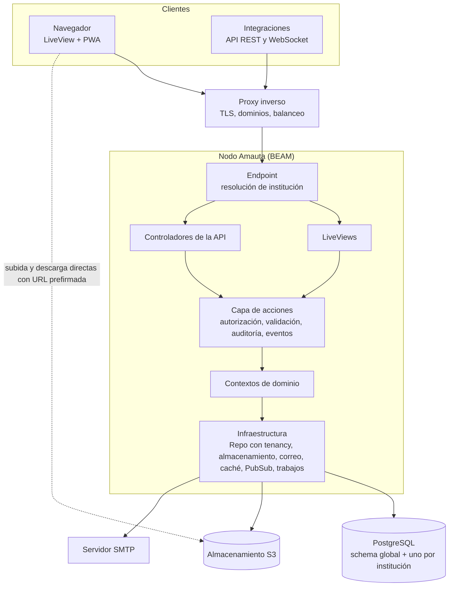

**Capa de acciones.** Cada operación del dominio (crear un curso, publicar un aviso, entregar una tarea, calificar, asignar un rol…) es una **acción** con nombre estable, esquema de entrada, permiso requerido, efectos (auditoría, eventos, notificaciones) y resultado tipado. La interfaz, la API y los trabajos en segundo plano invocan las mismas acciones, así que comparten exactamente la validación, la autorización y los efectos. El catálogo de acciones se puede listar en tiempo de ejecución: de ahí se verifican la paridad de la API (RF-API-001), el explicador de permisos (RF-ROL-006) y la documentación.

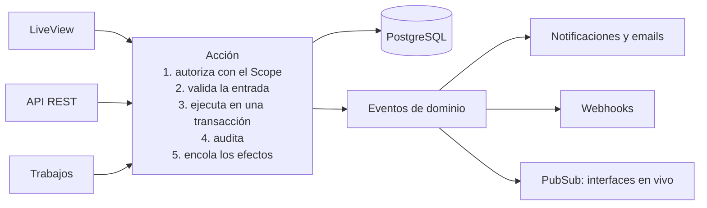

**Reglas:**

- Las LiveViews y los controladores nunca acceden al Repo: invocan acciones.
- Toda acción recibe un `Scope` (patrón de Phoenix 1.8) con la institución, la persona, sus permisos efectivos y los metadatos de la solicitud.
- Los efectos asíncronos (notificaciones, emails, webhooks) se encolan **dentro de la misma transacción** que el cambio: si el cambio se confirma, el efecto ocurre; si se revierte, no. Nunca se pierden por una caída justo después del commit.
- Los límites entre contextos se verifican en compilación.

**Contextos de dominio:**

| Contexto | Responsabilidad |
|---|---|
| `Amauta.Platform` | Instancia, registro de instituciones y personal de plataforma |
| `Amauta.Tenancy` | Resolución de institución, schemas y migraciones por institución |
| `Amauta.Accounts` | Personas, credenciales, sesiones, proveedores de identidad y vínculos de cuentas |
| `Amauta.Authorization` | Permisos, roles, asignaciones, cálculo y explicación |
| `Amauta.Catalog` | Trayectos, cursos, períodos y taxonomía |
| `Amauta.Enrollment` | Matrículas, cohortes, comisiones y grupos |
| `Amauta.Feed` | Tablón |
| `Amauta.Content` | Unidades, elementos, páginas y materiales |
| `Amauta.Assignments` | Tareas y entregas |
| `Amauta.Assessments` | Evaluaciones, intentos y banco de preguntas |
| `Amauta.Gradebook` | Calificaciones, escalas y etiquetas de resultado |
| `Amauta.Attendance` | Asistencia |
| `Amauta.Messaging` | Mensajería |
| `Amauta.Notifications` | Notificaciones, preferencias en cascada y correo |
| `Amauta.Files` | Archivos y almacenamiento |
| `Amauta.Certificates` | Certificados y credenciales |
| `Amauta.Search` | Búsqueda |
| `Amauta.Analytics` | Métricas y reportes |
| `Amauta.Audit` | Auditoría |
| `Amauta.Integrations` | Tokens, webhooks y OAuth |
| `Amauta.Federation` | Clúster y federación |
| `AmautaWeb` | Interfaz (LiveViews y componentes) y API |

### 8.3 Multi-tenancy por schemas

- Un schema `global` y un schema por institución, con un nombre estable e independiente del slug (por ejemplo, `inst_<identificador corto>`).
- Las consultas usan el prefijo explícito de Ecto. El Repo rechaza cualquier consulta a una tabla de institución que no indique la institución, y hay tests de fuga entre instituciones (RNF-SEG-002).
- Dos juegos de migraciones: globales y por institución. Las de institución corren en paralelo y con concurrencia acotada, registrando el estado de cada schema (RF-ADM-006).
- El pool de conexiones es compartido: el prefijo viaja en cada consulta (no se usa `search_path`), lo que además permite usar PgBouncer en modo transacción.
- Escala esperada: de cientos a unos pocos miles de schemas por base de datos. Más allá, las instituciones se reparten entre nodos (federación).
- Respaldo de una institución: volcado de su schema (`pg_dump --schema`) más una copia de su prefijo en el almacenamiento.
- Las métricas de toda la instancia se calculan con tablas agregadas en el schema global, actualizadas por trabajos periódicos. Nunca se hacen uniones en vivo sobre todos los schemas.

### 8.4 Resolución de institución, dominios y URLs (DEC-016)

**¿Alcanza con un proxy inverso? No del todo.** El proxy resuelve TLS y enruta el tráfico, pero la aplicación tiene que saber a qué institución corresponde cada solicitud y generar sus URLs correctamente. Por eso Amauta lo contempla desde el MVP, aunque al principio se trabaje solo con `localhost` y rutas.

| Responsabilidad | Proxy inverso | Aplicación |
|---|---|---|
| Certificados TLS, incluidos los de dominios propios | Los obtiene (ACME) | Le indica al proxy qué dominios son válidos |
| Enviar todos los dominios al mismo backend | Sí | — |
| Saber a qué institución pertenece cada solicitud | — | Por host o por ruta, con caché en ETS |
| Generar URLs absolutas correctas (emails, enlaces mágicos, iCal, QR de certificados, webhooks) | — | Con el dominio canónico de cada institución |
| Aceptar los WebSockets de LiveView desde cada dominio | — | Validación de origen dinámica |
| Cookies de sesión | — | Por dominio |
| CORS del almacenamiento para subidas directas | — | Mantiene las reglas sincronizadas con los dominios |
| Redirecciones al dominio canónico | Opcional | Sí |
| Publicación bajo subruta (`/aulas`) | Reenvía la subruta | Genera URLs con el prefijo |
| IP real y protocolo del cliente | Envía `X-Forwarded-*` | Solo confía en proxies configurados |

**Modos de dirección** (combinables):

| Modo | Ejemplo | Requiere | Uso típico |
|---|---|---|---|
| Ruta | `http://localhost:4000/unsur/c/prog1` | Nada | Desarrollo; instancias multi-institución sin configurar DNS |
| Subdominio | `https://unsur.amauta.ejemplo/c/prog1` | DNS comodín y certificado comodín (desafío DNS-01) | Instancias multi-institución |
| Institución única | `https://aulas.unsur.edu.ar/c/prog1` | Un dominio | Topología T1 |
| Dominio propio | `https://campus.unsur.edu.ar/c/prog1` | Registros DNS de la institución y certificado emitido por el proxy | Instituciones con identidad propia |
| Subruta de instancia | `https://www.unsur.edu.ar/aulas/c/prog1` | Configuración del proxy | Integrarse a un sitio existente |

**Alta de un dominio propio:**

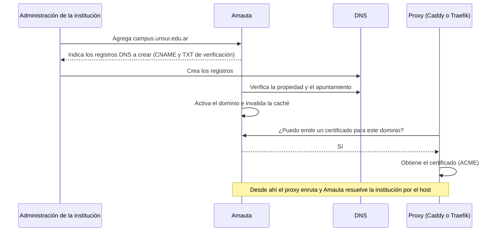

**Integración por proxy:**

- **Caddy:** TLS bajo demanda; Amauta provee el endpoint de verificación, que responde afirmativamente solo para dominios activos. Es la opción más automática.
- **Traefik:** certificado comodín para subdominios y, para dominios propios, configuración dinámica servida por Amauta (proveedor HTTP).
- **Nginx y HAProxy:** dominios propios con configuración manual o con scripts documentados.

**Decisiones de implementación:**

- Las rutas se definen una sola vez y se montan en las dos formas: con prefijo de institución (modo ruta) y sin prefijo (modo host).
- **Todas las URLs se generan con un único constructor consciente de la institución.** Nunca se arma una URL a mano.
- Instituciones, trayectos y cursos tienen slugs editables; los anteriores quedan como redirecciones permanentes. Hay una lista de slugs reservados (`api`, `admin`, `assets`, `live`, `health`, `login`…).
- Trayectos y cursos no tienen dominio propio: un dominio por curso suma costo operativo sin un beneficio claro. Como mucho, un alias de dominio puede redirigir a un trayecto o curso (RF-INS-021).
- La API vive en `/api/v1/…` y determina la institución a partir del token.

### 8.5 Árbol de supervisión

```mermaid
flowchart TD
  ROOT["Amauta.Supervisor<br/>one_for_one"]
  ROOT --> TEL["AmautaWeb.Telemetry"]
  ROOT --> REPO["Amauta.Repo<br/>pool de conexiones"]
  ROOT --> CL["Cluster.Supervisor<br/>autodescubrimiento de nodos"]
  ROOT --> PS["Phoenix.PubSub"]
  ROOT --> CACHE["Amauta.Cache.Supervisor<br/>rest_for_one"]
  CACHE --> CT["TableOwner<br/>dueño de las tablas ETS"]
  CACHE --> CW["CacheWarmer<br/>precarga al arrancar"]
  CACHE --> CI["CacheInvalidator<br/>escucha eventos de invalidación"]
  ROOT --> RL["Amauta.RateLimiter<br/>contadores en ETS"]
  ROOT --> REG["Registry<br/>Amauta.Registry"]
  ROOT --> RT["Amauta.Realtime.Supervisor<br/>one_for_one"]
  RT --> PR["AmautaWeb.Presence"]
  RT --> AS["DynamicSupervisor<br/>monitores de evaluaciones en curso"]
  ROOT --> TS["Task.Supervisor<br/>tareas asíncronas supervisadas"]
  ROOT --> OB["Oban<br/>colas de trabajos"]
  ROOT --> MD["Amauta.Mailer.Dispatcher<br/>límite de tasa global del correo"]
  ROOT --> FED["Amauta.Federation.Supervisor<br/>solo si está habilitada"]
  ROOT --> EP["AmautaWeb.Endpoint<br/>último: acepta tráfico cuando todo está listo"]
```

| Proceso | Responsabilidad | Si falla |
|---|---|---|
| `Repo` | Pool de conexiones a PostgreSQL | Reconecta solo; mientras tanto, las solicitudes fallan rápido con un mensaje claro. |
| `TableOwner` | Es dueño de las tablas ETS y no hace nada más, para no fallar nunca | Se recrean las tablas y se reinician el precargador y el invalidador (`rest_for_one`). La caché nunca es la fuente de verdad: si falta un dato, se lee de la base. |
| `CacheInvalidator` | Escucha el tema `cache:invalidate` en todos los nodos | Al reiniciarse vacía la caché, por precaución. |
| `RateLimiter` | Contadores con escritura concurrente | Se reinician los contadores (la consecuencia es tolerable). |
| `Presence` | Quién está conectado en cursos y evaluaciones | Se reconstruye solo (CRDT). |
| Monitores de evaluaciones | Un proceso por evaluación en curso: agrega estados y difunde contadores al docente | Se reinicia y reconstruye su estado desde la base. |
| `Oban` | Trabajos persistentes | Los trabajos sobreviven a reinicios. |
| `Mailer.Dispatcher` | Aplica el límite de tasa global del correo (corre en el nodo líder) | Otro nodo asume el liderazgo; los emails esperan en la cola. |
| `Endpoint` | HTTP y WebSockets; cada conexión LiveView es un proceso aislado | El fallo de una conexión no afecta a ninguna otra. |

### 8.6 Concurrencia y procesos

- **Un proceso por conexión** (LiveView): aislamiento natural de fallos y de memoria.
- Se crean procesos para manejar estado en ejecución, concurrencia o aislamiento de fallos; **nunca para organizar código**.
- **Sin procesos únicos en los caminos calientes** (serían cuellos de botella): las lecturas van a ETS con `read_concurrency` y los contadores usan `:counters` o `:atomics`.
- **El estado autoritativo vive en PostgreSQL**; los procesos con estado son agregadores o cachés reconstruibles.
- LiveViews livianas: streams para listas (tablón, entregas, personas, mensajes), assigns temporales y paginación.
- El trabajo pesado va a Oban o a `Task.Supervisor`, nunca al proceso de la solicitud.
- **Pico de un parcial**, en concreto: iniciar un intento es una inserción más una lectura de la evaluación desde caché (las preguntas de cada evaluación activa se precargan en ETS con su versión); cada autoguardado es una escritura chica (upsert); el monitor del docente recibe contadores agregados cada pocos cientos de milisegundos, no un mensaje por cada evento.

### 8.7 Caché en memoria (ETS)

| Tabla o mecanismo | Clave → valor | Invalidación |
|---|---|---|
| `tenant_by_host` | Host o slug → institución (identificador, schema, estado) | Cambio de dominio, slug o estado |
| `tenant_config` | Institución → configuración, tema y terminología | Cambio de configuración |
| `effective_permissions` | {institución, persona, ámbito} → conjunto de permisos | **Versión de autorización por institución:** cualquier cambio en roles, asignaciones o ajustes incrementa la versión y deja inválidas, al instante, todas las entradas anteriores |
| `notification_prefs` | {institución, persona, ámbito} → preferencias resueltas en cascada | Misma técnica de versión |
| `assessment_snapshot` | Evaluación activa → preguntas y configuración versionadas | Al publicar cambios en la evaluación |
| `rate_limits` | {acción, clave} → contador por ventana | Vencimiento de la ventana |
| `:persistent_term` | Catálogo de permisos y configuración estática de la instancia | Solo al desplegar o al cambiar la configuración global |

Reglas: la caché nunca es la fuente de verdad; las invalidaciones se difunden a todos los nodos por PubSub; y hay protección contra estampidas (una sola carga concurrente por clave).

### 8.8 Tiempo real

| Tema (topic) | Quién se suscribe | Qué viaja |
|---|---|---|
| `inst:{id}:course:{id}:feed` | Personas del curso que pueden ver el tablón | Identificadores de publicaciones y respuestas |
| `inst:{id}:course:{id}:gradebook` | Docentes con el libro abierto | La celda que cambió |
| `inst:{id}:assessment:{id}:monitor` | Docentes en el monitor | Contadores agregados |
| `inst:{id}:conversation:{id}` | Participantes de la conversación | Mensajes nuevos y estado de lectura |
| `inst:{id}:user:{id}` | La persona | Notificaciones |
| `cache:invalidate` | Todos los nodos | Claves a invalidar |

Reglas: se verifica la autorización antes de suscribirse; los mensajes llevan identificadores mínimos y cada LiveView consulta solo lo que puede ver (así no hay fugas por difusión); Presence indica quién está en línea en cursos, conversaciones y evaluaciones.

### 8.9 Trabajos en segundo plano

| Cola | Trabajos | Concurrencia orientativa por nodo |
|---|---|---|
| `deadlines` | Envío automático de evaluaciones y cierre de tareas | 20 (prioridad alta) |
| `notifications` | Resolución de destinatarios y entrega de notificaciones en la plataforma | 20 |
| `mailers` | Armado y envío de emails, a través del despachador con límite de tasa | 10 |
| `default` | Tareas varias | 10 |
| `webhooks` | Entregas de webhooks con reintentos | 10 |
| `media` | Miniaturas, vistas previas y extracción de texto | 4 |
| `certificates` | Generación de PDF | 4 |
| `exports` | Reportes, ZIP de entregas y exportaciones | 2 |
| `imports` | CSV, paquetes e importación de Moodle | 2 |
| `maintenance` | Limpieza, retención, verificación de auditoría y respaldos | 1 |

- **Correo sin saturar:** los emails se encolan con prioridad (acceso > notificación > resumen o masivo) y pasan por un despachador que aplica el límite de tasa global configurado (por segundo, minuto, hora y día). Corre en el nodo líder del clúster, de modo que el límite se respeta aunque haya varios nodos. Si se alcanza el límite, los trabajos se posponen; nunca se descartan.
- **Equidad entre instituciones:** las colas pesadas limitan cuántos trabajos simultáneos puede tener una misma institución, para que una exportación grande no frene a las demás. Se resuelve en la capa que encola, porque el particionado por clave es una función de la edición comercial de Oban y el proyecto usa solo la edición open source.

### 8.10 Archivos y almacenamiento (DEC-006)

- Interfaz de almacenamiento (`Amauta.Storage`) con dos adaptadores: S3 (cualquier proveedor compatible) y disco local (solo para desarrollo y pruebas).
- **Requisitos mínimos del proveedor:** firma V4, URLs prefirmadas, subida multiparte, CORS configurable por API, `CopyObject`, `ListObjectsV2` y reglas de ciclo de vida para expirar subidas incompletas.
- **Por defecto: Garage**, liviano, pensado para autoalojamiento y compatible con todo lo anterior. Alternativas: SeaweedFS, Ceph RGW o cualquier S3 externo.
- **Por qué no MinIO:** su edición comunitaria dejó de publicar imágenes y binarios en octubre de 2025, pasó a modo mantenimiento en diciembre de 2025 y su repositorio fue archivado en febrero de 2026. Seguir usándolo implicaría compilarlo y mantenerlo por cuenta propia.
- Organización de las claves: `inst/{institution_id}/{entidad}/{uuidv7}/{nombre-saneado}`.
- **Subida:** la aplicación emite una URL prefirmada con condiciones (tamaño y tipo); el navegador sube directo; la aplicación confirma (verifica el objeto y su tipo real), registra los metadatos y encola las miniaturas.
- **Descarga:** URL prefirmada de pocos minutos con `Content-Disposition` adecuado (RNF-SEG-007).
- Garage no ofrece versionado ni bloqueo de objetos, así que la inmutabilidad de la auditoría se garantiza en PostgreSQL (encadenamiento de hashes), no en el almacenamiento.
- El almacenamiento se publica en un dominio propio de archivos detrás del proxy, y la aplicación mantiene sus reglas CORS sincronizadas con los dominios de las instituciones.

### 8.11 Clúster y federación

| Modo | Qué es | Fase |
|---|---|---|
| Clúster homogéneo | N nodos idénticos que comparten base de datos y almacenamiento, con autodescubrimiento (DNS o gossip), PubSub y Presence distribuidos. Sirve para escalar y para alta disponibilidad. | V1 |
| Federación | Nodos autónomos, cada uno con su base de datos y su almacenamiento, y un nodo máster que los ve a todos y orquesta movimientos de instituciones. | V3 |

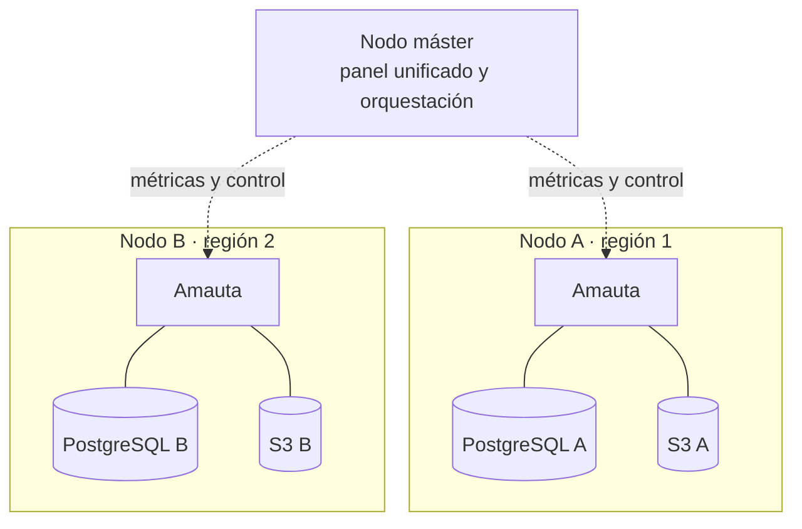

- **Canal de control:** distribución de Erlang con TLS sobre una red privada (por ejemplo, WireGuard) cuando son pocos nodos cercanos; una API de control HTTP con mTLS cuando los nodos están en redes distintas. El máster nunca es una dependencia en tiempo de ejecución (RF-FED-007).
- **Mover una institución** (una saga reanudable, con vuelta atrás automática si algo falla antes del paso 6):
  1. Verificaciones previas: versiones compatibles y espacio disponible.
  2. Modo solo lectura en el origen.
  3. Volcado del schema y copia de los objetos.
  4. Restauración en el destino.
  5. Verificación: conteos y sumas de control.
  6. Cambio de enrutamiento: registro global y proxy o DNS.
  7. Fin del modo solo lectura, ya en el destino.
  8. Limpieza diferida en el origen, después de un período de seguridad.
- La malla completa de la distribución de Erlang es razonable hasta decenas de nodos.

### 8.12 Convenciones de datos

- Claves primarias UUIDv7: ordenables por tiempo y únicas entre nodos (generadas con `uuidv7()` de PostgreSQL 18 o por la aplicación).
- Fechas en `timestamptz`, siempre en UTC. Nombres de tablas y columnas en inglés y en `snake_case`.
- Borrado lógico (`deleted_at`) para la papelera, con purga programada.
- Bloqueo optimista (`lock_version`) en entidades que se editan en paralelo (páginas, notas).
- Restricciones en la base: claves foráneas dentro de cada schema, `CHECK` para estados válidos e índices únicos para los slugs de cada institución.
- JSONB solo para contenido estructurado (documentos del editor) y configuración flexible. Todo lo que se filtra o se reporta va en columnas relacionales.
- Búsqueda con columnas `tsvector` en español, `unaccent` y `pg_trgm`.
- Tablas de alto volumen (actividad, auditoría, notificaciones y registro de envíos de email) particionadas por mes. La retención se aplica eliminando particiones completas, sin borrados masivos que degraden la base.
- Migraciones sin bloqueos largos (índices concurrentes, columnas nuevas en varios pasos), verificadas en CI.

### 8.13 Contenido enriquecido

- Se guarda como documento estructurado (el JSON del editor), no como HTML libre. El HTML se genera en el servidor con una lista blanca de elementos y atributos, y se guarda en caché.
- Las fórmulas se guardan en LaTeX (y se renderizan con KaTeX); el código, con resaltado de sintaxis; los videos incrustados, solo desde una lista configurable de sitios permitidos (o como archivos propios).
- El mismo documento alimenta la búsqueda (texto plano extraído) y los PDF.

### 8.14 Framework de dominio (DEC-007)

| Criterio | Phoenix con contextos y Ecto | Ash Framework 3 |
|---|---|---|
| API para todo | A mano (controladores y especificación OpenAPI), apoyada en el catálogo de acciones | Se deriva de los recursos (JSON:API con OpenAPI y GraphQL opcional): paridad casi automática |
| Permisos granulares | Capa propia sobre el catálogo de permisos | Políticas declarativas por acción y por campo, integradas |
| Multi-tenancy por schema | Prefijos de Ecto más disciplina y tests propios | Estrategia `:context` integrada en cada recurso |
| Auditoría, borrado lógico, máquinas de estado | Propias | Extensiones existentes |
| Curva de aprendizaje | Baja: es el Phoenix estándar | Media a alta: lenguaje declarativo propio |
| Control y transparencia | Total y explícito | Menor; más «magia» declarativa |
| Rendimiento | Óptimo, a medida | Muy bueno, con un costo bajo; se puede bajar a Ecto donde haga falta |
| Comunidad y documentación | Máximas | Activa y en crecimiento |
| Riesgo principal | Más código a mano | Acoplarse a un framework más joven |

**Decisión (DEC-007):** decidir con evidencia. Al comenzar el MVP se construye una misma porción vertical (institución, curso y tablón, con permisos, tenancy, API y LiveView) con cada enfoque, en un spike acotado de 1 a 2 semanas. Se comparan la claridad del código, el tiempo de desarrollo, la paridad de la API, el rendimiento y la facilidad para testear, y se decide con un ADR.

---

## 9. Metodología de desarrollo

### 9.1 Control de versiones: Gitflow

- **`main`**: solo código estable y en producción. Cada commit en `main` es una versión etiquetada y probada.
- **`develop`**: rama de integración. Refleja lo entregado para la próxima versión y es la base de los nuevos desarrollos.
- **`feature/*`**: ramas efímeras que salen de `develop` para desarrollar una funcionalidad de forma aislada, y que vuelven a `develop` mediante un PR.
- **`release/*`**: preparan una versión a partir de `develop` (pruebas finales, correcciones menores y ajuste del número de versión). Se fusionan en `main`, que es el despliegue, y de vuelta en `develop`.
- **`hotfix/*`**: salen de `main` para corregir fallas críticas en producción. Se fusionan en `main` (despliegue inmediato) y en `develop`, para que la corrección persista en las versiones siguientes.

**Nomenclatura:** `feature/<n.º de issue>-<descripcion-corta>`, `release/x.y.z` y `hotfix/x.y.z`.

**Integración:** las ramas `feature` entran a `develop` por PR con squash. Las ramas `release` y `hotfix` entran a `main` con merge `--no-ff` y la etiqueta `vX.Y.Z`, y luego vuelven a `develop`. Las ramas `main` y `develop` están protegidas: solo aceptan PRs con la CI en verde.

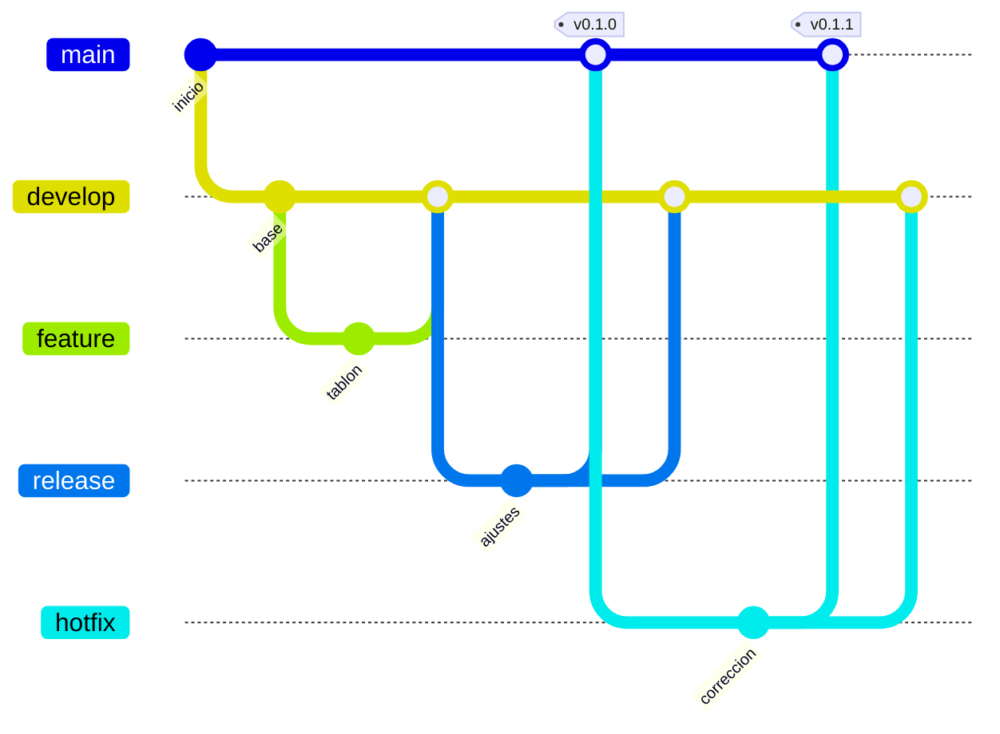

### 9.2 Mensajes de commit

Se usa Conventional Commits: `tipo(ámbito): descripción`.

- **Tipos** (en inglés, porque son parte de la convención): `feat`, `fix`, `docs`, `style`, `refactor`, `perf`, `test`, `build`, `ci` y `chore`.
- **Ámbito**: el contexto o área del código, en inglés (`feed`, `gradebook`, `auth`…).
- **Descripción** (DEC-018): en español, en minúscula y en presente, coherente con la documentación. Ejemplo: `feat(feed): agrega respuestas en hilo al tablón`.

### 9.3 Autoría

Cada commit tiene como autor a la persona que lo realiza. **No se agregan trailers de coautoría (`Co-Authored-By`) ni firmas, menciones o enlaces a herramientas de asistencia** en commits, PRs, issues, changelogs, código o documentación.

### 9.4 Convenciones de código

- **Idioma:** inglés para todo identificador (módulos, funciones, variables, tablas, columnas, rutas y parámetros de la API, claves JSON, nombres de archivos, mensajes de log y de excepciones). Español para los comentarios, `@moduledoc`, `@doc` y la documentación en `docs/`.
- **Textos de interfaz:** siempre con Gettext, nunca escritos en el código. Los `msgid` están en inglés (son parte del código) y la traducción al español rioplatense es obligatoria y completa, porque es el idioma por defecto: la CI falla si falta alguna.
- **Interfaz:** solo componentes de la biblioteca y tokens del sistema de diseño (RNF-MAN-007 y sección 6.5.7).
- **Dominio:** las acciones son la única puerta al dominio (sección 8.2). Funciones puras siempre que se pueda y efectos en los bordes. `{:ok, valor}` y `{:error, motivo}` para errores esperables; excepciones solo para lo excepcional.
- **Calidad:** `mix format`, Credo en modo estricto, compilación sin warnings y tipos verificados por el compilador.
- **Pruebas:** cada cambio viene con sus tests (sección 7.13).
- **Instrucciones para asistentes de código:** un archivo `AGENTS.md` en la raíz (Phoenix 1.8 lo genera), neutral respecto de las herramientas, que resume estas convenciones.

### 9.5 Definición de terminado

Un cambio está terminado cuando:

- [ ] Referencia los requisitos que implementa (por su identificador).
- [ ] Tiene tests (unitarios, de integración, de LiveView o de API y, si corresponde, extremo a extremo).
- [ ] Sus permisos están en el catálogo y se verifican en el servidor.
- [ ] La acción está disponible en la API (paridad) y documentada en OpenAPI.
- [ ] Emite los eventos de auditoría, notificaciones y webhooks que correspondan.
- [ ] Sus textos están en Gettext, con la traducción al español.
- [ ] Su interfaz usa la biblioteca de componentes, tiene su historia en el catálogo y funciona en modo oscuro, en el celular y con teclado (axe sin errores).
- [ ] Sus migraciones son seguras.
- [ ] Está documentado (`@moduledoc` y `docs/` si aplica) y anotado en el CHANGELOG.
- [ ] `mix precommit` y la CI están en verde.

### 9.6 Revisión de código

- Todo cambio entra por PR, aunque haya un solo desarrollador (autorrevisión con el checklist anterior).
- Con más colaboradores: al menos una aprobación; los cambios en autorización, tenancy o seguridad requieren una revisión específica.

### 9.7 Versionado y publicación

- Versionado semántico (SemVer) y CHANGELOG según Keep a Changelog.
- Cada versión se publica en GitHub Releases con notas de actualización y su imagen en el registro de contenedores de GitHub.
- Las versiones mayores incluyen una guía de migración.

### 9.8 Documentación

```
docs/
├── ERS.md          # este documento
├── MVP.md          # alcance del MVP (siguiente documento)
├── adr/            # registros de decisiones de arquitectura (0001-*.md)
├── arquitectura/   # diagramas y detalle técnico
├── diseno/         # sistema de diseño, identidad y guías visuales
├── guias/          # instalación, actualización, desarrollo y contribución
└── api/            # guías de la API (la referencia se genera desde OpenAPI)
```

### 9.9 Licencia y comunidad

- **Licencia: AGPL-3.0** (DEC-008). Garantiza que las mejoras que alguien ofrezca como servicio vuelvan a la comunidad. Es la licencia de Canvas y de Open edX; Moodle usa GPL-3.0.
- **Archivos de comunidad:** `LICENSE`, `README`, `CONTRIBUTING`, `CODE_OF_CONDUCT` (Contributor Covenant), `SECURITY` y plantillas de issues y PRs.
- Hoja de ruta pública (GitHub Projects) y espacio de discusiones.

---

## 10. Fases y hoja de ruta

| Fase | Objetivo | Contenido principal |
|---|---|---|
| F0 · Fundaciones | Un esqueleto sólido sobre el cual construir | Repositorio con Gitflow y CI; compose de desarrollo (con soporte para Windows); Phoenix 1.8; tenancy por schemas; constructor de URLs (modo ruta); autenticación nativa con proveedores enchufables; catálogo de permisos y roles base; i18n; tokens y primeros componentes con su catálogo vivo; spike de framework (DEC-007); exploración visual |
| MVP | Dictar una materia completa de punta a punta (detalle en `docs/MVP.md`) | Institución; trayectos (estructura y matriculación); cursos con comisiones; tablón (respuestas, adjuntos y fijados); contenido con el editor de bloques; tareas con corrector rápido; evaluaciones con tiempo y autocorrección; banco de preguntas; calificaciones; notificaciones y correo con colas; paleta de comandos; importación y exportación de personas y notas; auditoría y registro de actividad; dashboard v0 y consola de errores; respaldos automáticos; API v1 con paridad |
| V1 | Una universidad real | Mapa del trayecto; nuevo ciclo; asistencia; rúbricas; varios correctores; etiquetas de resultado; certificados; segundo factor; webhooks; analítica y reportes; subdominios y dominios propios; clúster homogéneo; push; biblioteca y plantillas; archivado en frío y panel de almacenamiento; fusión de personas duplicadas; copias entre instituciones; clonar instituciones; mensajería; duplicar cursos y trayectos; centro de configuración; autorregistro con antibot; notificaciones en cascada completas; calendario; dashboard profesional; landing del proyecto y lanzamiento público |
| V2 | Profundidad | LDAP; importador de Moodle; Open Badges 3.0; evaluación entre pares; anotación de PDF; OAuth para terceros; GraphQL; modo en vivo; turnos de consulta; grabación en el navegador |
| V3 | Escala y ecosistema | Federación con nodo máster y migración de instituciones; servidor MCP; IA opcional |

El MVP es un esqueleto que dicta una materia de punta a punta (DEC-034): 171 requisitos en 20 capacidades, con sus hitos y criterios de éxito, detallados en `docs/MVP.md` 1.0.

---

## 11. Riesgos

| Riesgo | Prob. | Impacto | Mitigación |
|---|---|---|---|
| Alcance excesivo frente a la filosofía «al hueso» | Alta | Alto | Priorización estricta, `docs/MVP.md` y P1 como filtro de cada decisión |
| Un solo desarrollador (riesgo de continuidad) | Alta | Alto | Documentación, ADR, tests, convenciones claras y comunidad desde temprano |
| Schema por institución a gran escala (migraciones lentas, catálogo grande) | Media | Medio | Migraciones en paralelo, límites documentados y reparto entre nodos |
| Conectividad móvil inestable con LiveView | Media | Alto | Reconexión, autoguardado, respuestas livianas y pruebas con red degradada |
| Evaluaciones en línea: picos y fraude | Media | Alto | Reloj del servidor, autoguardado, pruebas de carga e integridad informativa, sin prometer un antifraude total |
| Integración del editor de bloques (JS) con LiveView | Media | Medio | Componente aislado con hooks y tests extremo a extremo |
| Cambios en proveedores de infraestructura (el caso MinIO) | Media | Medio | Abstracción S3 con adaptadores y alternativas documentadas |
| Distribución de Erlang entre redes distintas (seguridad y latencia) | Media | Alto | Federación mediante una API de control con mTLS |
| Accesibilidad de las visualizaciones creativas (mapa, quipu) | Media | Medio | Alternativas textuales obligatorias y pruebas con lectores de pantalla |
| Peso de las librerías JS (lienzos, editor, efectos) | Media | Medio | Carga diferida y presupuesto de tamaño controlado en CI |
| Entregabilidad del correo (emails que caen en spam) | Media | Medio | Guía de SPF, DKIM y DMARC; límites de tasa; baja con un clic |
| Mal uso de la mensajería entre estudiantes | Media | Medio | Políticas por institución y curso, bloqueo, denuncias y moderación auditada |
| Desarrollo en Windows (rendimiento y recarga con bind mounts) | Alta | Bajo | Vigilancia de archivos por sondeo activada por defecto; mover el repositorio a WSL2 como alternativa (RNF-DEV-004) |
| Datos personales y sensibles de estudiantes | Media | Alto | Minimización, permisos para datos sensibles, auditoría y respaldos cifrados |

---

## 12. Registro de decisiones

Estados: ✅ decidida · 🔶 propuesta (se asume salvo objeción) · ⏳ abierta.

| ID | Tema | Estado | Decisión o propuesta |
|---|---|---|---|
| DEC-001 | Nombres de los niveles | ✅ 2026-10-05 | Institución › Trayecto › Curso. En código: `Institution`, `Pathway`, `Course`. Renombrables con presets por institución. |
| DEC-002 | Modelo de cuentas | ✅ 2026-10-05 | Cuentas por institución, con vinculación y selector al estilo de Slack. |
| DEC-003 | Público prioritario | ✅ 2026-10-05 | Universidades e institutos terciarios. |
| DEC-004 | Autonomía | ✅ 2026-10-05 | Sistema autónomo, sin integraciones obligatorias: sin SIU ni SCORM. LTI queda fuera por el mismo principio (derivado, revisable). |
| DEC-005 | Distribución | ✅ 2026-10-05 | Solo open source y autoalojado. |
| DEC-006 | Almacenamiento de objetos | ✅ 2026-10-05 | S3 compatible, con Garage por defecto (MinIO CE está archivado). |
| DEC-007 | Framework de dominio | ✅ 2026-10-05 | Spike comparativo (Phoenix con contextos frente a Ash) de 1 a 2 semanas al comenzar, y decisión final en un ADR. |
| DEC-008 | Licencia | ✅ 2026-10-05 | AGPL-3.0. |
| DEC-009 | Modelo de ciclos lectivos | ✅ 2026-10-05 | Ediciones clonadas con linaje y desplazamiento automático de fechas. |
| DEC-010 | Alcance académico | ✅ 2026-10-05 (revisada en 0.3) | Amauta es un LMS al estilo Moodle: acá se arman y se dictan los cursos. La gestión académica (inscripción a cursadas, condición oficial, correlatividades que bloquean, mesas de examen y actas) le corresponde a otro sistema. La nota final se traduce en etiquetas configurables. |
| DEC-011 | Tono de la interfaz | ✅ 2026-10-05 | Voseo rioplatense por defecto; español neutro como segundo idioma en V1. |
| DEC-012 | Mensajería | ✅ 2026-10-05 | Los estudiantes pueden escribir a docentes y a compañeros de su curso, con políticas configurables. Los mensajes entre estudiantes vienen activados por defecto. |
| DEC-013 | Inteligencia artificial | ✅ 2026-10-05 | Opcional y a futuro (V3): desactivada por defecto, con modelos autoalojables y nunca obligatoria; servidor MCP a futuro. |
| DEC-014 | Cursos compartidos entre trayectos | ✅ 2026-10-05 | Un trayecto propietario; los demás incluyen el curso por referencia. |
| DEC-015 | Biblioteca de componentes | ✅ 2026-10-05 | Componentes propios sobre Tailwind v4, sin daisyUI. |
| DEC-016 | Direcciones (URLs) | ✅ 2026-10-05 | Modo ruta en `localhost` para empezar; dominios por institución previstos por diseño, con constructor de URLs desde el MVP. |
| DEC-017 | Firma visual andina | ✅ 2026-10-05 | Sí, sutil: paleta con nombres de tintes andinos, portadas inspiradas en tocapus y progreso tipo quipu, siempre abstracto y respetuoso. |
| DEC-018 | Idioma de los commits | ✅ 2026-10-05 | Conventional Commits con la descripción en español. |
| DEC-019 | Generación de PDF | ✅ 2026-10-05 | Servicio autoalojado (por ejemplo, Gotenberg) o ChromicPDF; la herramienta concreta se elige en un ADR. |
| DEC-020 | SSO (OIDC y SAML) | ✅ 2026-10-05 | Conectores opcionales a futuro (V2 o después), nunca obligatorios. |
| DEC-021 | H5P | ✅ 2026-10-05 | Fuera de la versión 1; a futuro, reproductor embebido si se pide. |
| DEC-022 | Aplicaciones móviles | ✅ 2026-10-05 | PWA, sin aplicaciones nativas. |
| DEC-023 | Ubicación de la landing | ✅ 2026-10-05 | Dentro de la aplicación, con los mismos componentes. |
| DEC-024 | Escala objetivo | ✅ 2026-10-05 | Primer despliegue: una universidad mediana, de hasta 30.000 estudiantes y picos de 3.000 conexiones simultáneas, en un servidor con margen para pasar a dos. |
| DEC-025 | Dirección visual | ✅ 2026-10-05 | Minimalismo pastel, claro y amigable, con efectos sutiles y cuidados que lo distingan de la competencia. |
| DEC-026 | LDAP | ✅ 2026-10-05 | Previsto para más adelante (V2), con proveedores de identidad enchufables desde el MVP. |
| DEC-027 | Notificaciones y correo | ✅ 2026-10-05 | Sistema claro, configurable en cascada, con colas y límites de tasa. |
| DEC-028 | Archivado en frío | ✅ 2026-10-05 | Empaquetar los cursos archivados en el almacenamiento para liberar la base de datos, con restauración en minutos. |
| DEC-029 | Antibot | ✅ 2026-10-05 | Captcha autoalojado de prueba de trabajo y progresivo, más campos trampa y límites de tasa, sin servicios externos. |
| DEC-030 | Respaldo y restauración | ✅ 2026-10-05 | Respaldos completos exportables e importables al estilo Moodle: por curso, trayecto, institución e instancia, con o sin datos de personas, más respaldos automáticos verificados. |
| DEC-031 | Registro de actividad | ✅ 2026-10-05 | Actividad granular por persona, curso y elemento, con historial por entidad, transparencia y retención configurable. El nivel estándar viene por defecto y el completo se puede activar. |
| DEC-032 | Dashboard de administración | ✅ 2026-10-05 | Dashboard profesional en el MVP (instancia e institución), con telemetría en vivo, logs y consola de errores. |
| DEC-033 | Correlatividades | ✅ 2026-10-05 | Pospuestas: quedan fuera del alcance actual, incluso como información visual. Se evaluarán más adelante, junto con las condiciones de acceso entre cursos (RF-TRA-017). |
| DEC-034 | Tamaño del MVP | ✅ 2026-10-05 | Un esqueleto que dicta una materia de punta a punta con muy buena calidad. El recorte real quedó en 171 requisitos (la estimación inicial de 60 a 80 no contemplaba la granularidad de este documento); el detalle está en `docs/MVP.md` 1.0. |
| DEC-035 | Ubicación del repositorio en desarrollo | ✅ 2026-10-05 | El repositorio vive en el disco de Windows, sin WSL; la recarga en vivo usa vigilancia por sondeo. |
| DEC-036 | Materia y edición en el trayecto | ⏳ abierta | Hoy cada curso es a la vez la materia y su dictado en un período. Pregunta: ¿las etapas del trayecto deberían contener materias (la entidad estable) y cada curso ser una edición que apunta a su materia? Afecta el nuevo ciclo (RF-TRA-007), el historial por materia, los cursos compartidos (RF-TRA-006) y los reportes. Decidir antes de empezar V1. |
| DEC-037 | Notificar las menciones | 🔶 2026-10-07 | Mencionar con «@» en el tablón notifica a la persona mencionada (evento `feed.mentioned`, en la app y por email según sus preferencias). Solo se avisa a quien puede ver la publicación y sin duplicar: si la mención llega en una respuesta a una publicación propia, se envía un único aviso. |

---

## Anexo A — Investigación comparativa de LMS

### A.1 Panorama 2025–2026

| Plataforma | Qué es | Fortalezas | Debilidades | Movimientos recientes |
|---|---|---|---|---|
| Moodle | El LMS open source más usado del mundo (PHP, GPL-3.0) | Completitud, comunidad enorme, miles de plugins, estándares | Miles de ajustes, interfaz inconsistente, curva de aprendizaje alta, picos de carga difíciles, multi-institución solo con su edición comercial (Workplace) o con derivados como IOMAD, actualizaciones que rompen plugins | 5.0 (2025): quita Chat y Encuesta del núcleo y suma bancos de preguntas compartidos. 5.2 (2026): varios correctores en tareas, más proveedores de IA en el núcleo (Gemini, Amazon Bedrock), mejoras del inicio de sesión y del Dashboard, base de React y tokens de diseño, y mensajes más claros sobre por qué una actividad está bloqueada. 5.3 (documentada en octubre de 2026): modo oscuro, navegación lineal anterior/siguiente, resultados de aprendizaje, fecha de vencimiento en cuestionarios y reportes de uso de IA por curso. |
| Canvas (Instructure) | LMS líder en educación superior en Norteamérica (Ruby on Rails, AGPL-3.0) | Interfaz limpia, SpeedGrader, API REST y GraphQL muy completas, ecosistema LTI | Funciones clave detrás de licencias pagas; autoalojar la versión open source es complejo | 2026: niveles Core, Plus y Next; agente de IA (IgniteAI) que crea módulos y ajusta fechas; progreso de módulos; portfolios; detección de plagio nativa en adopción temprana. |
| Google Classroom | Aula simple dentro de Google Workspace | Simplicidad radical (Novedades, Trabajo de clase, Personas, Calificaciones) y adopción masiva | Depende por completo de Google; poca estructura institucional; sin asistencia; libro de calificaciones básico; poco control de los datos | 2026: grabación de audio, video y pantalla dentro de Classroom; IA (Gemini) también en las apps móviles; inicio rediseñado según el rol (julio de 2026); reutilización de publicaciones entre clases. |
| Brightspace (D2L) | LMS comercial para educación superior y empresas | Agentes inteligentes (automatizaciones por reglas), condiciones de liberación, analítica | Complejo y comercial | — |
| Blackboard Learn Ultra (Anthology) | LMS comercial modernizado | Interfaz renovada y asistente de IA para armar cursos | Comercial; migración costosa desde la versión clásica | — |
| Open edX | Plataforma de cursos masivos (Python, AGPL-3.0) | Escala de MOOC; separa el curso de sus ejecuciones (*course runs*) | Compleja de operar; orientada a cursos abiertos | — |
| Chamilo | LMS open source popular en Latinoamérica y España (PHP, GPL) | Simple; sesiones de formación; asistencia y certificados nativos | Interfaz anticuada; ecosistema chico | — |

### A.2 Matriz de funcionalidades

Decisión: **Tomar** (se implementa con su sentido original), **Adaptar** (se implementa simplificado), **Descartar**, **Podría** o **Futuro**.

| Funcionalidad | Moodle | Canvas | Classroom | Decisión en Amauta | Fase |
|---|---|---|---|---|---|
| Multi-institución | Solo con Workplace (comercial) o derivados | Subcuentas | Dominios de Workspace | Tomar: un schema por institución | MVP |
| Jerarquía | Categorías y cursos | Cuentas, subcuentas y cursos | Clases sueltas | Tomar: 3 niveles fijos | MVP |
| Programas o trayectos | Workplace (comercial) | Blueprint y Catalog | No | Tomar: trayecto con mapa | MVP / V1 |
| Formatos de curso | Temas, semanal, actividad única, social… | Módulos | Temas | Adaptar: un único formato por unidades | MVP |
| Bloques laterales configurables | Sí (decenas) | No | No | Descartar | — |
| Tablón de avisos | Foro de avisos | Anuncios | Novedades | Tomar: tablón en tiempo real con respuestas, adjuntos y fijados | MVP |
| Foros complejos | Varios tipos de foro | Discusiones | Comentarios | Adaptar: respuestas en hilo y publicación tipo «pregunta» | MVP / V1 |
| Chat | Quitado del núcleo en 5.0 | No | No | Descartar (la mensajería lo cubre) | — |
| Mensajería directa | Sí | Inbox | No | Tomar, con políticas por curso | MVP |
| Tareas | Sí, muy configurables | Sí, con SpeedGrader | Sí | Tomar: estados claros y corrector rápido | MVP |
| Varios correctores | Sí (5.2 y 5.3) | Corrección moderada | No | Adaptar | V1 |
| Rúbricas | Sí | Sí | Sí | Tomar | V1 |
| Exámenes con tiempo y autocorrección | Muy completos | New Quizzes | Formularios de Google | Tomar los tipos núcleo; el resto en V1 | MVP / V1 |
| Banco de preguntas | Sí; compartido desde 5.0 | Bancos | No | Tomar | MVP / V1 |
| Navegador seguro para exámenes | Safe Exam Browser | Vía terceros | Modo bloqueado en Chromebooks | Descartar (dependencia externa) | — |
| Lecciones ramificadas | Lección | Mastery Paths | No | Futuro (primero, condiciones simples) | V2 |
| Evaluación entre pares | Taller | Revisión entre pares | No | Podría | V2 |
| Wiki, glosario y base de datos | Sí | Páginas wiki | No | Descartar (la página cubre lo esencial) | — |
| Encuestas | Feedback (Encuesta, quitada en 5.0) | Encuestas en New Quizzes | Formularios | Adaptar: encuesta rápida | V1 |
| H5P | En el núcleo | Vía LTI | No | Futuro, opcional | V2+ |
| SCORM | En el núcleo | Vía terceros | No | Descartar (DEC-004) | — |
| LTI | En el núcleo | Líder | Complementos | Descartar por ahora (DEC-004) | — |
| Libro de calificaciones | Muy potente y complejo | Sí | Básico | Adaptar: simple, con ponderaciones | MVP |
| Competencias y planes de aprendizaje | Sí | Outcomes | No | Futuro | V3 |
| Insignias | Open Badges | Canvas Credentials | No | Futuro (Open Badges 3.0) | V2 |
| Certificados | Plugin | No nativo | No | Tomar: editor visual | V1 |
| Progreso y finalización | Sí | Requisitos de módulo y progreso | No | Tomar | MVP / V1 |
| Acceso condicional | Restricciones complejas | Requisitos y prerrequisitos | No | Adaptar: reglas simples con explicación | V1 |
| Grupos y comisiones | Grupos y agrupamientos | Grupos y secciones | Grupos de estudiantes | Tomar: comisiones y grupos | MVP / V1 |
| Asistencia | Plugin muy usado | Roll Call | No | Tomar, nativa | V1 |
| Calendario e iCal | Sí | Sí | Calendario por clase | Tomar | MVP / V1 |
| Analítica y alertas de riesgo | Modelos de analítica | Analytics e Intelligent Insights | Analíticas básicas | Adaptar: reglas simples | V1 |
| Generador de reportes | Report builder | Canvas Data | No | Tomar simplificado | V1 |
| Auditoría | Logs | Auditoría | Consola de administración | Tomar: inmutable | MVP |
| Respaldo y restauración | `.mbz` | Exportar e importar | No | Tomar: paquete `.amauta` | V1 |
| Importar desde Moodle | — | Importador | No | Tomar | V2 |
| API | Servicios web por funciones | REST y GraphQL completas | Classroom API | Tomar: paridad total | MVP |
| Webhooks y eventos | Observadores internos | Live Events | Notificaciones push | Tomar | V1 |
| App móvil | App oficial | Apps oficiales | Apps oficiales | Adaptar: PWA | MVP |
| Modo oscuro | Nuevo en 5.3 | Alto contraste | Sí | Tomar | MVP |
| Navegación lineal | Nueva en 5.3 | Botón «siguiente» en módulos | No | Tomar | MVP |
| «Por qué está bloqueado» | Mejorado en 5.2 | Sí (requisitos) | — | Tomar | V1 |
| Inicio según el rol | Dashboard | Dashboard | Rediseño por rol (2026) | Tomar | MVP |
| Grabación en el navegador | No | Studio (pago) | Sí (2026) | Podría | V2 |
| IA integrada | Proveedores en el núcleo | IgniteAI | Gemini | Opcional (DEC-013) | V3 |
| Plugins de terceros | Más de 2.000 | Apps LTI | Complementos | Descartar en el núcleo | — |
| Temas visuales | Temas y CSS | Branding | Temas de clase | Adaptar: tokens por institución | MVP |
| Paleta de comandos | No | No | No | **Diferencial** | MVP |
| Mapa visual del trayecto | No | No | No | **Diferencial** | V1 |
| Explicador de permisos | Parcial («comprobar permisos») | No | No | **Diferencial** | MVP |
| Notificaciones con «por qué la recibo» | No | No | No | **Diferencial** | MVP |

### A.3 Lecciones para Amauta

1. **La simplicidad gana adopción** (Classroom), **pero la estructura institucional retiene** (Moodle, Canvas). Amauta necesita las dos cosas.
2. **Cada ajuste tiene un costo cognitivo.** Moodle muestra adónde lleva acumular opciones, y sus versiones recientes simplifican y quitan funciones del núcleo.
3. **El rendimiento en los picos es una funcionalidad.** Los parciales masivos son el momento de la verdad.
4. **Explicar el porqué reduce el soporte.** Moodle 5.2 tuvo que mejorar sus mensajes de «por qué está bloqueado»; en Amauta es un principio (P10).
5. **El inicio según el rol es el estándar de 2026** (Classroom, julio de 2026).
6. **La IA llegó a todos los LMS**, pero atada a proveedores externos. Amauta la trata como opcional y autoalojable, coherente con la autonomía (P4).
7. **El multi-tenancy y los trayectos suelen ser funciones pagas.** En Amauta son el núcleo.
8. **Depender de un proveedor es un riesgo real**, como mostró MinIO. De ahí las abstracciones y los formatos abiertos.

### A.4 Tendencias 2025–2026

- IA en todas las plataformas: Moodle con proveedores en el núcleo y reportes de uso por curso; Canvas con un agente que ejecuta acciones; Classroom con Gemini también en el celular.
- Interfaces más simples: modo oscuro, navegación lineal, inicios según el rol y mensajes más claros.
- Grabación multimedia nativa en el navegador.
- Corrección colaborativa (varios correctores) y portfolios.
- Sistemas de diseño con tokens (Moodle 5.2 incorpora tokens de diseño y una base de React).

---

## Anexo B — Catálogo inicial de permisos

Convención: `<ámbito>.<recurso>.<acción>`. El ámbito indica el nivel más alto en el que el permiso tiene sentido; una asignación en un nivel superior lo hereda en cascada. Riesgo: 🟢 bajo · 🟡 medio · 🔴 alto.

**Plataforma** (personal de la instancia):

| Permiso | Permite | Riesgo |
|---|---|---|
| `platform.institutions.manage` | Crear, suspender y eliminar instituciones | 🔴 |
| `platform.settings.manage` | Configurar la instancia | 🔴 |
| `platform.health.view` | Ver salud, telemetría y colas | 🟢 |
| `platform.logs.view` | Ver logs y errores del servidor | 🟡 |
| `platform.impersonate` | Suplantar a una persona (auditado) | 🔴 |
| `platform.backups.manage` | Respaldar y restaurar | 🔴 |
| `platform.email.manage` | Configurar el SMTP global y los límites de tasa | 🟡 |
| `platform.federation.manage` | Gestionar nodos y mover instituciones (futuro) | 🔴 |

**Institución:**

| Permiso | Permite | Riesgo |
|---|---|---|
| `institution.settings.update` | Editar la configuración general | 🟡 |
| `institution.branding.update` | Editar la identidad visual | 🟢 |
| `institution.terminology.update` | Editar la terminología | 🟢 |
| `institution.auth.manage` | Configurar la autenticación | 🔴 |
| `institution.domains.manage` | Gestionar dominios propios | 🟡 |
| `institution.roles.manage` | Crear y editar roles y ajustes locales | 🔴 |
| `institution.users.view` | Ver el directorio de personas | 🟡 |
| `institution.users.manage` | Crear, editar, suspender e importar personas | 🔴 |
| `institution.users.view_sensitive` | Ver campos sensibles (DNI, salud, adaptaciones) | 🔴 |
| `institution.periods.manage` | Gestionar períodos lectivos | 🟡 |
| `institution.taxonomy.manage` | Gestionar categorías, etiquetas y campos personalizados | 🟢 |
| `institution.pathways.create` | Crear trayectos | 🟡 |
| `institution.courses.create` | Crear cursos | 🟢 |
| `institution.announcements.publish` | Publicar avisos institucionales | 🟡 |
| `institution.notifications.manage` | Configurar las notificaciones en cascada y los eventos obligatorios | 🟡 |
| `institution.email.manage` | Configurar el SMTP y las plantillas, y ver el registro de envíos | 🟡 |
| `institution.messages.review_reported` | Revisar conversaciones denunciadas (auditado) | 🔴 |
| `institution.reports.view` | Ver reportes institucionales | 🟡 |
| `institution.data.export` | Exportar datos de la institución | 🔴 |
| `institution.audit.view` | Ver la auditoría | 🟡 |
| `institution.integrations.manage` | Gestionar cuentas de servicio, tokens y webhooks | 🔴 |
| `institution.library.manage` | Gestionar la biblioteca institucional | 🟢 |
| `institution.imports.manage` | Ejecutar y deshacer importaciones masivas | 🔴 |
| `institution.storage.manage` | Archivar en frío, restaurar y purgar según la retención | 🟡 |
| `institution.users.merge` | Fusionar personas duplicadas | 🔴 |
| `institution.security.manage` | Configurar la seguridad institucional (contraseñas, sesiones, IP permitidas) | 🔴 |
| `institution.activity.view` | Ver la actividad detallada de cualquier persona (auditado) | 🔴 |
| `institution.backups.manage` | Respaldar y restaurar la institución | 🔴 |
| `institution.certificates.manage_templates` | Gestionar plantillas de certificados | 🟢 |

**Trayecto:**

| Permiso | Permite | Riesgo |
|---|---|---|
| `pathway.view` | Ver el trayecto | 🟢 |
| `pathway.update` | Editar datos y ajustes | 🟡 |
| `pathway.structure.update` | Editar etapas y cursos del trayecto | 🟡 |
| `pathway.archive` | Archivar o enviar a la papelera | 🟡 |
| `pathway.enrollments.manage` | Matricular y gestionar cohortes | 🟡 |
| `pathway.feed.post` | Publicar en el tablón del trayecto | 🟢 |
| `pathway.progress.view_all` | Ver el progreso de todas las personas | 🟡 |
| `pathway.cycle.clone` | Crear un nuevo ciclo | 🟡 |
| `pathway.reports.view` | Ver reportes del trayecto | 🟡 |

**Curso** (si se asigna en una comisión, su alcance se limita a esa comisión):

| Permiso | Permite | Riesgo |
|---|---|---|
| `course.view` | Ver el curso | 🟢 |
| `course.update` | Editar los ajustes | 🟡 |
| `course.archive` | Archivar, archivar en frío o enviar a la papelera | 🟡 |
| `course.duplicate` | Duplicar el curso, exportarlo como paquete o copiar su contenido a otro curso | 🟡 |
| `course.activity.view` | Ver la actividad de los estudiantes del curso (quién vio, descargó o entregó) | 🟡 |
| `course.content.view_hidden` | Ver contenido oculto o programado | 🟢 |
| `course.content.manage` | Crear, editar, ordenar y eliminar unidades y elementos | 🟡 |
| `course.feed.post` | Publicar en el tablón | 🟢 |
| `course.feed.reply` | Responder en el tablón | 🟢 |
| `course.feed.pin` | Fijar publicaciones | 🟢 |
| `course.feed.moderate` | Ocultar, eliminar y silenciar | 🟡 |
| `course.assignments.manage` | Crear y editar tareas | 🟡 |
| `course.submissions.create_own` | Entregar tareas propias | 🟢 |
| `course.submissions.view_all` | Ver todas las entregas | 🟡 |
| `course.submissions.grade` | Calificar y devolver entregas | 🟡 |
| `course.submissions.extend` | Otorgar prórrogas y excepciones | 🟡 |
| `course.assessments.manage` | Crear y editar evaluaciones y el banco de preguntas | 🟡 |
| `course.assessments.monitor` | Ver el monitor en vivo | 🟢 |
| `course.attempts.create_own` | Rendir evaluaciones | 🟢 |
| `course.attempts.manage` | Reabrir intentos y otorgar adaptaciones | 🟡 |
| `course.grades.view_own` | Ver las notas propias | 🟢 |
| `course.gradebook.view_all` | Ver el libro de calificaciones | 🟡 |
| `course.gradebook.edit` | Editar notas | 🔴 |
| `course.gradebook.override_final` | Reemplazar la nota final | 🔴 |
| `course.gradebook.publish` | Publicar notas | 🟡 |
| `course.gradebook.lock` | Cerrar y reabrir las calificaciones | 🔴 |
| `course.attendance.take` | Tomar asistencia | 🟢 |
| `course.attendance.manage` | Gestionar sesiones y justificaciones | 🟡 |
| `course.people.view` | Ver participantes | 🟢 |
| `course.people.view_contact` | Ver datos de contacto | 🟡 |
| `course.people.enroll` | Matricular y dar de baja | 🟡 |
| `course.sections.manage` | Gestionar comisiones y grupos | 🟡 |
| `course.messages.send_teachers` | Escribir al equipo docente | 🟢 |
| `course.messages.send_peers` | Escribir a compañeros | 🟢 |
| `course.messages.send_selection` | Escribir a una selección de personas | 🟢 |
| `course.notifications.manage` | Configurar qué notifica el curso | 🟢 |
| `course.certificates.issue` | Emitir y revocar certificados | 🟡 |
| `course.analytics.view` | Ver la analítica del curso | 🟡 |
| `course.view_as` | Ver el curso como otra persona (auditado) | 🔴 |

**Personales** (siempre sobre lo propio):

| Permiso | Permite | Riesgo |
|---|---|---|
| `self.profile.update` | Editar el perfil propio | 🟢 |
| `self.data.export` | Descargar los datos propios | 🟢 |
| `self.tokens.manage` | Gestionar los tokens de API propios | 🟡 |
| `self.accounts.link` | Vincular cuentas de otras instituciones | 🟢 |

---

## Anexo C — Roles predeterminados

● total · ◐ parcial (lo propio, su comisión o solo lectura) · — ninguno.

| Grupo de permisos | Admin. institucional | Gestión académica | Coordinación de trayecto | Docente responsable | Docente | Ayudante | Estudiante | Observador |
|---|---|---|---|---|---|---|---|---|
| Configuración institucional | ● | — | — | — | — | — | — | — |
| Roles y autenticación | ● | — | — | — | — | — | — | — |
| Personas de la institución | ● | ● | ◐ | — | — | — | — | — |
| Datos sensibles | ● | ◐ | — | — | — | — | — | — |
| Períodos y taxonomía | ● | ● | — | — | — | — | — | — |
| Trayectos (estructura) | ● | ◐ | ● | — | — | — | — | — |
| Matriculación | ● | ● | ● | ◐ | — | — | — | — |
| Ajustes del curso | ● | — | ● | ● | — | — | — | — |
| Contenido | ● | — | ● | ● | ● | ◐ | — | — |
| Tablón: publicar y fijar | ● | — | ● | ● | ● | ◐ | ◐ | — |
| Tablón: responder | ● | — | ● | ● | ● | ● | ● | — |
| Tareas y evaluaciones (crear) | ● | — | ● | ● | ● | — | — | — |
| Corregir y calificar | ● | — | ● | ● | ● | ◐ | — | — |
| Reemplazar nota final y cerrar calificaciones | ● | — | ◐ | ● | — | — | — | — |
| Asistencia | ● | — | ● | ● | ● | ● | — | — |
| Entregar y rendir | — | — | — | — | — | — | ● | — |
| Ver notas | ● | ◐ | ● | ● | ● | ◐ | ◐ | ◐ |
| Mensajería | ● | ● | ● | ● | ● | ● | ● | — |
| Reportes y analítica | ● | ● | ● | ● | ◐ | — | — | ◐ |
| Auditoría | ● | — | — | — | — | — | — | — |

Con los presets, los roles toman los nombres de cada institución: en una universidad, «Docente responsable» puede llamarse «Titular»; «Docente», «Adjunto» o «JTP»; «Coordinación de trayecto», «Dirección de carrera»; y «Gestión académica», «Bedelía».

---

## Anexo D — Catálogo de eventos

| Evento | Descripción | Auditoría | Notificación | Webhook |
|---|---|---|---|---|
| `auth.login_succeeded` / `auth.login_failed` | Inicio de sesión exitoso o fallido | ✔ | Dispositivo nuevo | — |
| `user.created` / `user.updated` / `user.suspended` | Alta, cambios y suspensión de personas | ✔ | Bienvenida | ✔ |
| `role.assignment_changed` | Cambio de asignaciones o de roles | ✔ | ✔ | ✔ |
| `enrollment.created` / `enrollment.ended` | Matriculación y baja | ✔ | ✔ | ✔ |
| `pathway.created` / `pathway.updated` | Cambios en trayectos | ✔ | — | ✔ |
| `course.created` / `course.published` / `course.archived` | Ciclo de vida del curso | ✔ | Al publicarse | ✔ |
| `feed.post_published` | Nueva publicación en un tablón | — | ✔ | ✔ |
| `feed.reply_created` | Nueva respuesta en el tablón | — | ✔ | ✔ |
| `feed.mentioned` | Mención con «@» en una publicación o respuesta del tablón (DEC-037) | — | ✔ | — |
| `feed.post_pinned` | Publicación fijada | — | Opcional | — |
| `content.item_published` | Nuevo material, página, tarea o evaluación | — | ✔ | ✔ |
| `assignment.due_soon` | Vencimiento próximo | — | ✔ | — |
| `submission.submitted` | Entrega realizada | — | ✔ (equipo docente) | ✔ |
| `submission.returned` | Entrega devuelta con nota | — | ✔ | ✔ |
| `assessment.attempt_started` / `assessment.attempt_submitted` | Inicio y entrega de un intento | — | — | ✔ |
| `grade.updated` | Cambio de una nota | ✔ | Si está publicada | ✔ |
| `grades.published` | Publicación de notas en lote | ✔ | ✔ | ✔ |
| `attendance.recorded` | Toma de asistencia | — | Opcional | ✔ |
| `message.sent` | Nuevo mensaje directo | — | ✔ | — |
| `message.reported` | Denuncia de un mensaje | ✔ | ✔ (moderación) | — |
| `certificate.issued` / `certificate.revoked` | Emisión y revocación de certificados | ✔ | ✔ | ✔ |
| `announcement.published` | Aviso institucional o de trayecto | ✔ | ✔ | ✔ |
| `data.exported` | Exportación de datos personales | ✔ | — | — |
| `settings.changed` | Cambio de configuración | ✔ | — | — |
| `impersonation.started` / `impersonation.ended` | Suplantación | ✔ | Opcional | — |

Los mensajes directos no se envían por webhook, por privacidad. Además de estos eventos, el registro de actividad (RF-AUD-004) guarda eventos de uso (vistas, descargas, reproducciones y navegación en intentos) que no generan notificaciones ni webhooks.

---

## Anexo E — Presets de terminología

| Preset | Nivel 1 | Nivel 2 | Nivel 3 | Comisión | Unidad | Etapa |
|---|---|---|---|---|---|---|
| Genérico (por defecto) | Institución | Trayecto | Curso | Comisión | Unidad | Etapa |
| Universidad | Universidad o Facultad | Carrera | Materia | Comisión | Unidad | Año |
| Instituto terciario | Instituto | Carrera | Materia | División | Unidad | Año |
| Posgrado | Escuela de posgrado | Programa | Seminario | Grupo | Módulo | Ciclo |
| Escuela secundaria (futuro) | Escuela | Año | Materia | División | Unidad | Ciclo |
| Capacitación (futuro) | Organización | Ruta | Curso | Grupo | Módulo | Nivel |

Cada término guarda su singular, su plural y su género gramatical, para que la interfaz concuerde («la Carrera», «las Materias», «Nuevo Seminario»).

---

## Anexo F — Fuentes

Investigación realizada en octubre de 2026.

- Moodle 5.2, novedades: <https://www.catalyst-ca.net/blog/moodle-5-2-has-arrived-discover-whats-new>
- Moodle 5.3, novedades: <https://docs.moodle.org/503/en/New_features>
- Moodle, retiro de Chat y Encuesta del núcleo (MDL-82457): <https://tracker-old.moodle.org/browse/MDL-82457>
- Google Classroom, inicio rediseñado según el rol (julio de 2026): <https://workspaceupdates.googleblog.com/2026/07/redesigned-google-classroom-homepage-with-tailored-views-based-on-users-role.html>
- Google Classroom, grabación de audio, video y pantalla (enero de 2026): <https://workspaceupdates.googleblog.com/2026/01/record-screencasts-audio-video-classroom.html>
- Google Classroom, novedades de Gemini (junio de 2026): <https://workspaceupdates.googleblog.com/2026/06/updates-to-gemini-in-google-classroom.html>
- Canvas, niveles y ecosistema (2026): <https://www.nasdaq.com/press-release/instructure-introduces-simplified-canvas-tiers-and-ecosystem-updates-new-next>
- Canvas, novedades de octubre de 2025: <https://community.canvaslms.com/t5/Higher-Ed-Users/Resource-Roundup-from-Instructure-New-amp-Next-October-2025/ba-p/659790>
- MinIO Community Edition en 2026 y alternativas: <https://glukhov.org/data-infrastructure/object-storage/minio-dead/>
- Garage, compatibilidad con S3: <https://garagehq.deuxfleurs.fr/documentation/reference-manual/s3-compatibility/>
- Phoenix 1.8: <https://www.phoenixframework.org/blog/phoenix-1-8-released>
- Phoenix LiveView 1.1: <https://phoenixframework.org/blog/phoenix-liveview-1-1-released>
- Elixir 1.20: <https://elixir-lang.org/blog/2026/06/03/elixir-v1-20-0-released>
- Atkinson Hyperlegible Next: <https://fontsource.org/fonts/atkinson-hyperlegible-next/about>
- PhoenixStorybook: <https://phoenix-storybook.hexdocs.pm/PhoenixStorybook.html>
- Docker Desktop y WSL2, buenas prácticas: <https://docs.docker.com/desktop/features/wsl/best-practices/>
