# Amauta — Alcance del MVP

> Una materia completa, de punta a punta, con la calidad definitiva desde el primer día.

| Campo | Valor |
|---|---|
| Documento | Alcance del producto mínimo viable (MVP) |
| Versión | 1.0 — aprobada |
| Estado | Aprobado. Es la base del desarrollo, que empieza por el hito H0 |
| Fecha | 2026-10-05 |
| Base | `docs/ERS.md` versión 1.1, sincronizada con este documento (DEC-034) |

## Control de cambios

| Versión | Fecha | Cambios |
|---|---|---|
| 0.1 | 2026-10-05 | Primer recorte del MVP a partir de los requisitos que el ERS 1.0 marcaba como MVP. |
| 0.2 | 2026-10-05 | Ronda de preguntas: se acepta el alcance; las comisiones entran al MVP porque la materia piloto las tiene; la mensajería, duplicar cursos y la landing quedan para V1; el dashboard v0 se mantiene en el MVP. |
| 1.0 | 2026-10-05 | Aprobación. Piloto: una materia de hasta 100 estudiantes con varias comisiones, sin fecha definida, así que se planifica por hitos. El ERS se sincroniza a la versión 1.1. |

## Cómo leer este documento

- Este documento **no repite** los requisitos: los referencia por su identificador del ERS (`RF-…`, `RNF-…`) e indica si entran **completos** o **parciales**. En los parciales se aclara qué parte entra y qué parte queda para V1.
- Lo que el ERS 1.0 marcaba como MVP y no aparece acá pasa a V1 (sección 6). El ERS 1.1 ya tiene esas fases corregidas.
- Lo que el ERS ya marcaba como V1, V2, V3 o Futuro no cambia.

---

## 1. Objetivo

**Que una institución pueda dictar una materia completa en Amauta:** armar el curso, comunicarse, publicar contenido, recibir entregas, tomar evaluaciones con tiempo, corregir y calificar. Todo con la calidad visual, técnica y de accesibilidad definitiva, no con una versión provisoria.

El MVP prioriza **pocas cosas, pero terminadas**. Además incluye completas las **fundaciones** que serían caras de agregar después: multi-institución, permisos, direcciones, idioma y terminología, auditoría, capa de acciones con API y sistema de diseño.

### 1.1 Sobre el tamaño

Al decidir el tamaño (DEC-034) estimé que el MVP tendría unos 60 a 80 requisitos. Esa estimación quedó corta: el ERS describe cada funcionalidad con mucha granularidad, y por ejemplo las evaluaciones con tiempo son 11 requisitos para una sola pantalla. Hecho el recorte real, el esqueleto de una materia queda en **171 requisitos atómicos**, de los 232 que el ERS marcaba como MVP; los otros 61 pasan a V1. Agrupados, son **20 capacidades más las fundaciones**. Se evaluó un recorte más estricto y se descartó (sección 11).

---

## 2. Criterios de éxito

El MVP está terminado cuando se cumple **todo** lo siguiente:

1. **Recorrido completo automatizado:** el escenario de la sección 3 pasa como prueba de extremo a extremo en un navegador real.
2. **Día del parcial:** la prueba de carga del escenario «inicio de un parcial» (2.000 estudiantes inician la misma evaluación en 60 segundos, RNF-REN-004) pasa en el hardware de referencia, con 0 errores y 0 respuestas perdidas. Aunque el piloto es chico, la prueba valida la escala objetivo del producto (DEC-024).
3. **Accesibilidad:** la auditoría WCAG 2.2 AA de las pantallas del MVP no tiene hallazgos bloqueantes (RNF-ACC-001 y RNF-ACC-007).
4. **Instalación:** una persona sigue la guía y deja Amauta funcionando en un servidor limpio con `docker compose` en menos de 30 minutos.
5. **Usabilidad:** en una prueba con 5 docentes, cada uno crea un curso, publica un aviso y una tarea en menos de 5 minutos (RNF-USA-001), y los estudiantes encuentran sus pendientes de la semana en menos de 10 segundos (RNF-USA-002).
6. **Calidad del código:** la CI está en verde, incluidos los tests de aislamiento entre instituciones y la matriz de autorización (RNF-TST-002 y RNF-TST-003).
7. **Piloto:** la materia piloto, que tiene varias comisiones, se dicta en Amauta sin incidentes críticos (PREG-006).

---

## 3. El recorrido de punta a punta

```mermaid
flowchart LR
  A["1. Instalación<br/>docker compose y asistente"] --> B["2. Institución<br/>período y personas por CSV"]
  B --> C["3. Trayecto y curso<br/>comisiones y matriculación"]
  C --> D["4. Armado del curso<br/>unidades, páginas, tarea, parcial"]
  D --> E["5. Comunicación<br/>tablón en tiempo real, notificaciones, email"]
  E --> F["6. Cursada<br/>entregas y parcial con tiempo"]
  F --> G["7. Corrección<br/>autocorrección, corrector rápido, libro"]
  G --> H["8. Cierre<br/>exportar notas, auditoría, respaldo"]
```

1. **Instalación.** El equipo de TI levanta Amauta con `docker compose`. El asistente de primera ejecución crea la cuenta de superadministración y la institución «Universidad del Sur».
2. **Institución.** La administración crea el período «2027 · 1.er cuatrimestre» e importa por CSV a 90 estudiantes y 3 docentes, el tamaño del piloto: primero simula la importación, revisa los errores y después la confirma. Las personas reciben su invitación por email.
3. **Trayecto y curso.** Crea el trayecto «Lic. en Sistemas» con sus etapas y el curso «Programación I» dentro de la primera etapa, con dos comisiones (mañana y noche), cada una con su docente. Matricula al trayecto, la matrícula se propaga a sus cursos y después reparte a los estudiantes entre las comisiones. Los rezagados se suman con el código del curso.
4. **Armado.** La docente responsable crea las unidades, escribe páginas con el editor de bloques (con fórmulas y código), sube materiales, programa la publicación de la unidad 2, crea el «TP 1» y el «Primer parcial»: 20 preguntas del banco, 60 minutos, con orden al azar. Revisa todo con la vista como estudiante.
5. **Comunicación.** Publica un aviso para todo el curso con un adjunto y lo fija; otro aviso va solo para la comisión noche. Los estudiantes responden en hilo y todo aparece en tiempo real. Las notificaciones explican por qué llegan, y los emails salen dosificados por la cola, agrupados y con baja en un clic.
6. **Cursada.** Cada estudiante ve en «Para hacer» qué vence esta semana y entrega el TP con su comprobante. El día del parcial, los 90 estudiantes lo rinden con el reloj del servidor y autoguardado; a quien se le corta la conexión, retoma sin perder nada, y al vencer el tiempo el parcial se envía solo. El equipo docente sigue todo desde el monitor en vivo. Un estudiante con adaptación tiene 20 minutos extra.
7. **Corrección.** Las preguntas objetivas se corrigen solas. Cada docente corrige el TP de su comisión con el corrector rápido y deja comentarios privados. El libro de calificaciones calcula la nota con ponderaciones; cada docente ve a su comisión, y si dos editan a la vez, ninguno pisa los cambios del otro.
8. **Cierre.** La docente responsable exporta la planilla de notas. Cada cambio de nota quedó auditado con su historial, los respaldos corrieron solos todas las noches y la misma operación se puede hacer por la API.

---

## 4. Principios del recorte

1. **Fundaciones completas, funcionalidades finas.** Entra completo lo que es caro de agregar después (aislamiento, permisos, direcciones, idioma, auditoría, acciones y API, sistema de diseño). Lo que se puede sumar sin rehacer nada pasa a V1.
2. **Calidad definitiva en lo que entra.** Diseño, accesibilidad y rendimiento con su nivel final, no provisorio.
3. **Una materia antes que muchas funciones.** Si algo no hace falta para dictar la materia piloto, va a V1.
4. **Configuración por defecto antes que pantallas de configuración.** El MVP funciona con valores opinados; los paneles para cambiarlos llegan en V1.
5. **Registrar desde el día uno, consultar después.** La auditoría y la actividad se guardan desde el MVP; las pantallas para analizarlas pueden llegar en V1.

---

## 5. Alcance incluido

### 5.1 Fundaciones

| Fundación | Requisitos del ERS | Qué incluye el MVP |
|---|---|---|
| Multi-institución por schemas | RF-ADM-002, RF-ADM-006, RF-FED-001, RNF-SEG-002 | Schema global y uno por institución, migraciones por institución, identificadores UUIDv7, sin claves foráneas entre schemas y tests de fuga entre instituciones. |
| Direcciones | RF-ADM-008 (parcial) | Constructor de URLs consciente de la institución, con modo ruta (`localhost:4000/<institución>/…`). Subdominios y dominios propios, en V1. |
| Capa de acciones | ERS, sección 8.2 | Toda operación es una acción que autoriza, valida, audita y encola sus efectos. Es la base de la interfaz y de la API. |
| Permisos | RF-ROL-001, RF-ROL-002 (parcial), RF-ROL-003, RF-ROL-004, RF-ROL-005, RF-ROL-009 (parcial), RF-ROL-010, RF-ROL-011, RF-ROL-012, RF-INS-008 (parcial) | Catálogo de permisos, roles de sistema (Anexo C del ERS), asignación por ámbito con cascada (incluido el ámbito de comisión), anti-escalada, verificación en el servidor y caché en ETS versionada. Solo la superadministración como rol de plataforma; roles personalizados en V1. |
| Autenticación | RF-AUT-001, RF-AUT-002, RF-AUT-003, RF-AUT-004 (parcial), RF-AUT-005 (parcial), RF-AUT-006, RF-AUT-008 | Contraseña con Argon2id, enlace mágico, confirmación y recuperación, inicio de sesión con el nombre y logo de la institución, cierre de las otras sesiones, protección contra fuerza bruta y proveedores de identidad enchufables. |
| Auditoría inmutable | RF-AUD-001, RF-AUD-002, RF-AUD-003 | Bitácora encadenada por hashes, sin permisos de modificación en la base. |
| Idioma y terminología | RF-I18N-001, RF-I18N-002, RF-I18N-003, RF-I18N-004 (parcial), RF-I18N-005, RF-I18N-006 (parcial), RF-I18N-007, RF-I18N-009, RF-INS-006 (parcial) | Gettext con español rioplatense y voseo, guía de estilo de redacción, formatos CLDR, zonas horarias, propiedades lógicas de CSS, emails localizados y el mecanismo de terminología con concordancia de género, con el preset genérico. Otros idiomas y la edición de presets, en V1. |
| Sistema de diseño | RF-UI-012; ERS, sección 6.5 | Tokens (paleta andina en pastel), tipografía Atkinson Hyperlegible Next, íconos Phosphor, modo claro y oscuro, movimiento sutil con «reducir movimiento», biblioteca de componentes con su catálogo vivo y portadas generativas. |
| Infraestructura | RNF-DEP y RNF-DEV (sección 5.3) | Compose de desarrollo (con soporte para Windows) y de producción, Garage, Mailpit, Oban, CI con GitHub Actions y `mix precommit`. |

### 5.2 Funcionalidades por capacidad

**C1 · Instalación y administración de la instancia**

| Requisito | En el MVP |
|---|---|
| RF-ADM-001 | Parcial: el asistente crea la superadministración y la primera institución. El almacenamiento, el SMTP y la URL base se configuran por variables de entorno. |
| RF-ADM-002 | Parcial: crear, editar y suspender instituciones. Archivar y eliminar, en V1. |
| RF-ADM-003 | Completo. |
| RF-ADM-004, RF-ADM-019 y RF-ANA-002 | Parcial («dashboard v0», PREG-005): indicadores clave (personas activas hoy, cursos, entregas e intentos del día, evaluaciones en curso, almacenamiento, colas y errores) y estado de los servicios. Gráficos en tiempo real y personalización, en V1. |
| RF-ADM-006 | Completo. |
| RF-ADM-007 | Parcial: respaldo automático diario de la instancia completa (base de datos y archivos), con retención simple y una restauración documentada y probada. El panel, el cifrado, la copia externa y la verificación automática llegan en V1. |
| RF-ADM-013 y RF-ANA-004 | Parcial: telemetría con Phoenix LiveDashboard, solo para la superadministración. |

**C2 · Institución y personas**

| Requisito | En el MVP |
|---|---|
| RF-INS-001 y RF-INS-012 | Parcial: nombre, nombre corto, slug, logo, zona horaria y remitente de los emails. |
| RF-INS-002 | Completo (ver RF-UI-001). |
| RF-INS-003 | Parcial: crear, editar y archivar trayectos y cursos. Duplicar y mover, en V1. |
| RF-INS-004 | Parcial: alta manual, invitación por email, importación CSV, suspensión y búsqueda. |
| RF-INS-009 | Parcial: crear períodos y marcar el actual. Anidarlos, en V1. |
| RF-USR-001 | Parcial: nombre, apellido, nombre preferido, foto, email y zona horaria. Campos personalizados, en V1. |
| RF-USR-002 | Parcial: equipo docente y estudiantes agrupados por rol y comisión, con las acciones de cambiar de comisión y quitar del curso. |
| RF-USR-003 | Completo. |
| RF-USR-004 | Completo, para personas y matrículas. |
| RF-USR-005 | Parcial: preferencias de notificación, tema claro u oscuro y reducir movimiento. |

**C3 · Trayectos**

| Requisito | En el MVP |
|---|---|
| RF-TRA-001 | Parcial: nombre, código, slug, descripción y responsables. |
| RF-TRA-002 | Parcial: etapas ordenadas y cursos obligatorios u optativos. Grupos de optativas, en V1. |
| RF-TRA-003 | Parcial: matriculación por CSV o por selección, con propagación a sus cursos. |

**C4 · Cursos**

| Requisito | En el MVP |
|---|---|
| RF-CUR-001 | Parcial: nombre, código, slug, período, descripción, ícono y portada generativa. |
| RF-CUR-002 | Parcial: Tablón, Contenido, Personas y Calificaciones. Asistencia, en V1. |
| RF-CUR-003 | Parcial: portada, nombre, período, selector de comisión, equipo docente y código de inscripción. |
| RF-CUR-004 | Parcial: vista previa como estudiante. «Ver como esta persona», en V1. |
| RF-CUR-005 | Parcial: borrador, publicado y archivado. Papelera, en V1. |
| RF-CUR-007 | Parcial: visibilidad, código de inscripción, comisiones, quién publica en el tablón, escala de calificación y nombre de las unidades. |
| RF-CUR-008 | Completo. |

**C5 · Matriculación y comisiones**

| Requisito | En el MVP |
|---|---|
| RF-MAT-001 | Parcial: manual, por CSV, por trayecto y con el código del curso. |
| RF-MAT-002 | Completo. |
| RF-MAT-003 | Completo. |
| RF-COM-001 | Completo (PREG-003). |
| RF-COM-002 | Completo. |
| RF-COM-003 | Parcial: filtro por comisión en el tablón, las entregas, las calificaciones y las personas. En asistencia, en V1. |

**C6 · Tablón**

| Requisito | En el MVP |
|---|---|
| RF-TAB-001 | Completo, con el editor de bloques del MVP (C7). |
| RF-TAB-002 | Parcial: todo el curso o una comisión. Grupos y personas, en V1. |
| RF-TAB-003 | Parcial: borrador autoguardado, edición con marca «editado» y eliminación. Publicación programada, en V1. |
| RF-TAB-004 | Completo. |
| RF-TAB-005 | Completo. |
| RF-TAB-006 | Completo. |
| RF-TAB-007 | Parcial: publican solo docentes o todos; se puede ocultar y eliminar. Moderación previa y denuncias, en V1. |
| RF-TAB-008 | Completo. |
| RF-TAB-009 | Completo. |
| RF-TAB-010 | Completo. |

**C7 · Contenido**

| Requisito | En el MVP |
|---|---|
| RF-CON-001 | Completo. |
| RF-CON-002 | Parcial: material, página, tarea y evaluación. El tipo «pregunta», en V1. |
| RF-CON-003 | Parcial: texto con formato, títulos, listas, enlaces, cita, recuadro destacado, código, fórmula LaTeX, imagen, archivo y video incrustado. Tablas, desplegables y lista de verificación, en V1. |
| RF-CON-004 | Completo. |
| RF-CON-005 | Parcial: visible, oculto o programado. Asignación a comisiones, grupos o personas, en V1. |
| RF-CON-006 | Parcial: «marcar como hecho» y finalización automática al entregar o rendir. |
| RF-CON-007 | Completo. |
| RF-CON-008 | Parcial: imágenes, audio y video con los reproductores nativos del navegador, y PDF con su visor nativo. |

**C8 · Tareas y entregas**

| Requisito | En el MVP |
|---|---|
| RF-TAR-001 | Completo. |
| RF-TAR-002 | Completo. |
| RF-TAR-003 | Completo. |
| RF-TAR-004 | Completo, con filtro por estado y por comisión. |
| RF-TAR-005 | Completo. |
| RF-TAR-006 y RF-MSG-009 | Completo. |
| RF-TAR-007 | Completo. |

**C9 · Evaluaciones y banco de preguntas**

| Requisito | En el MVP |
|---|---|
| RF-EVA-001 | Completo. |
| RF-EVA-002 | Completo: opción única, opción múltiple, verdadero o falso, respuesta corta, numérica y desarrollo. |
| RF-EVA-003 | Completo. |
| RF-EVA-004 | Completo. |
| RF-EVA-005 | Completo. |
| RF-EVA-006 | Completo. |
| RF-EVA-007 | Parcial: orden al azar de las preguntas y de las opciones. Selección al azar desde el banco, en V1. |
| RF-EVA-008 | Completo. |
| RF-EVA-009 | Completo. |
| RF-EVA-010 | Completo. |
| RF-EVA-011 | Completo. |
| RF-PRE-001 | Parcial: banco por curso, con categorías. |
| RF-PRE-002 | Completo. |

**C10 · Calificaciones**

| Requisito | En el MVP |
|---|---|
| RF-CAL-001 | Parcial: con filtro por comisión. El filtro por grupo, en V1. |
| RF-CAL-002 | Parcial: escalas numérica y porcentual. Conceptual y personalizadas, en V1. |
| RF-CAL-003 | Completo. |
| RF-CAL-004 | Completo. |
| RF-CAL-005 | Completo. |
| RF-CAL-006 | Completo. |
| RF-CAL-007 | Parcial: CSV y XLSX. PDF, en V1. |
| RF-CAL-008 | Completo. |
| RF-CAL-009 | Parcial: bloqueo optimista con aviso y actualización en vivo de las celdas. |

**C11 · Progreso y pendientes**

| Requisito | En el MVP |
|---|---|
| RF-PRO-001 | Completo. |
| RF-CUR-008 | Completo (ver C4). |

**C12 · Notificaciones**

| Requisito | En el MVP |
|---|---|
| RF-NOT-001 | Completo. |
| RF-NOT-002 | Completo, incluido el «por qué lo recibís». |
| RF-NOT-003 | Parcial: los eventos de las capacidades del MVP. |
| RF-NOT-004 | Parcial: valores por defecto de la instancia y preferencias de cada persona. Los niveles intermedios (institución, trayecto, curso) y los bloqueos, en V1. |
| RF-NOT-007 | Completo. |
| RF-NOT-008 | Completo. |

**C13 · Correo electrónico**

| Requisito | En el MVP |
|---|---|
| RF-EML-001 | Completo. |
| RF-EML-002 | Parcial: límite de tasa de la instancia. Límites por institución, en V1. |
| RF-EML-003 | Completo. |
| RF-EML-004 | Completo. |
| RF-EML-005 | Parcial: matriz evento × canal de cada persona. Los niveles de la cascada, en V1. |
| RF-EML-006 | Parcial: SMTP por variables de entorno, con un botón de envío de prueba en el dashboard. SMTP por institución, en V1. |
| RF-EML-007 | Parcial: plantillas fijas, localizadas, con el nombre y el logo de la institución. Edición por institución, en V1. |
| RF-EML-009 | Completo. |
| RF-EML-010 | Completo. |

**C14 · Archivos**

| Requisito | En el MVP |
|---|---|
| RF-ARC-001 | Completo. |
| RF-ARC-002 | Completo. |
| RF-ARC-003 | Parcial: tamaño y tipos permitidos por instancia. Cuotas y límites por institución y curso, en V1. |
| RF-ARC-004 | Completo. |
| RF-ARC-007 | Completo. |

**C15 · Navegación**

| Requisito | En el MVP |
|---|---|
| RF-BUS-001 | Parcial: ir a cursos, personas y elementos por nombre, y acciones básicas («crear tarea», «ir a calificaciones»). |
| RF-UI-001 | Completo. |
| RF-UI-002 | Completo. |
| RF-UI-003 | Parcial: paleta de comandos y ayuda de atajos con la tecla «?». |

**C16 · Auditoría, actividad y errores**

| Requisito | En el MVP |
|---|---|
| RF-AUD-004 | Parcial: se registra el nivel estándar desde el primer día. Las pantallas de consulta, en V1. |
| RF-AUD-008 | Completo. |
| RF-AUD-010 | Completo. |

**C17 · API**

| Requisito | En el MVP |
|---|---|
| RF-API-001 | Parcial: paridad para todas las acciones del MVP, verificada por test. |
| RF-API-002 | Completo. |
| RF-API-003 | Parcial: tokens personales. Cuentas de servicio, en V1. |
| RF-API-004 | Completo. |
| RF-API-005 | Parcial: paginación por cursor y filtros básicos. |
| RF-API-006 | Completo. |
| RF-API-007 | Completo. |
| RF-API-008 | Completo. |

**C18 · Importación y exportación**

| Requisito | En el MVP |
|---|---|
| RF-IMP-005 | Parcial: exportar personas, matrículas y notas. |
| RF-IMP-006 | Parcial: importar personas y matrículas. Deshacer la importación y los demás tipos de dato, en V1. |
| RF-ANA-001 | Completo. |

**C19 · Privacidad**

| Requisito | En el MVP |
|---|---|
| RF-PRV-001 | Parcial: descarga de los datos propios y rectificación desde el perfil. La supresión se gestiona por solicitud a la administración. |
| RF-USR-006 | Completo. |
| RF-PRV-002 | Completo. |
| RF-PRV-004 | Completo. |

**C20 · Calidad de interfaz**

| Requisito | En el MVP |
|---|---|
| RF-UI-005 | Completo. |
| RF-UI-006 | Completo. |
| RF-UI-007 | Completo. |
| RF-UI-008 | Completo. |
| RF-UI-009 | Completo. |
| RF-UI-010 | Completo. |
| RF-UI-011 | Completo. |
| RF-UI-018 | Completo. |
| RF-UI-019 | Completo. |
| RF-UI-020 | Completo. |
| RF-LND-005 | Parcial: la raíz de la instancia muestra el acceso a la institución o la lista de instituciones. |

### 5.3 Requisitos no funcionales en el MVP

| Área | En el MVP | Queda para V1 |
|---|---|---|
| Rendimiento | RNF-REN-001 a RNF-REN-011 y RNF-REN-013. Los escenarios «inicio de un parcial», «autoguardado», «difusión en el tablón» y «cierre de una entrega» se verifican con una prueba de carga antes del piloto. | RNF-REN-012 a escala de envíos masivos institucionales. |
| Escalabilidad | RNF-ESC-001, RNF-ESC-003 y RNF-ESC-004, con un solo nodo. | Clúster de varios nodos. |
| Disponibilidad | RNF-DIS-002, RNF-DIS-003, RNF-DIS-005 y RNF-DIS-006. | RNF-DIS-001 y RNF-DIS-004 (despliegues sin corte con varios nodos). |
| Seguridad | RNF-SEG-001 a RNF-SEG-015, RNF-SEG-018, RNF-SEG-019 y RNF-SEG-020. | Captcha y campos trampa con el autorregistro (RNF-SEG-016 y RNF-SEG-017), listas de IP (RNF-SEG-021) y eventos de seguridad en el panel (RNF-SEG-022). |
| Privacidad | RNF-PRV-001 a RNF-PRV-005. | — |
| Accesibilidad | RNF-ACC-001 a RNF-ACC-009. | — |
| Usabilidad | RNF-USA-001, RNF-USA-002, RNF-USA-004 y RNF-USA-005. | RNF-USA-003 (SUS con un grupo más grande). |
| Mantenibilidad | RNF-MAN-001 a RNF-MAN-009. | — |
| Observabilidad | RNF-OBS-002 y RNF-OBS-004, más la consola de errores (RF-AUD-010). | RNF-OBS-001, RNF-OBS-003 y RNF-OBS-005. |
| Despliegue | RNF-DEP-001 a RNF-DEP-005, RNF-DEP-007, RNF-DEP-009 y RNF-DEP-010. | RNF-DEP-006 (dominios propios) y RNF-DEP-008 (guía de actualización con vuelta atrás). |
| Respaldo | RNF-RES-001 (parcial), RNF-RES-002 y RNF-RES-004 (restauración probada a mano). | RNF-RES-003, RNF-RES-005, RNF-RES-006 y RNF-RES-007. |
| Entorno de desarrollo | RNF-DEV-001 a RNF-DEV-012. | — |
| Pruebas | RNF-TST-001 a RNF-TST-010 y RNF-TST-012. | RNF-TST-011 (pruebas de actualización, desde la segunda versión). |

---

## 6. Fuera del MVP (pasa a V1)

Estos requisitos estaban marcados como MVP en el ERS 1.0 y pasan a V1:

| Área | Requisitos | Motivo |
|---|---|---|
| Instancia | RF-ADM-005, RF-ADM-016, RF-ADM-017 | En el MVP alcanza con variables de entorno y valores seguros por defecto. |
| Institución | RF-INS-005, RF-INS-007, RF-INS-010, RF-INS-011, RF-INS-022, RF-INS-023, RF-INS-027 | Personalización y configuración avanzadas. El MVP usa valores por defecto; el logo sí entra (capacidad C2). |
| Trayectos | RF-TRA-004, RF-TRA-005, RF-TRA-006, RF-TRA-014 | El MVP valida la jerarquía con lo mínimo. |
| Cursos | RF-CUR-006, RF-CUR-013 | Duplicar y copiar sirven a partir del segundo ciclo (PREG-004). |
| Tareas | RF-TAR-008 | En el MVP se corrige en el navegador; la descarga masiva en ZIP llega en V1. |
| Evaluaciones | RF-EVA-012 | El modo práctica es una variante de configuración; llega en V1. |
| Calendario | RF-CLD-001, RF-CLD-002 | «Para hacer» cubre los vencimientos en el MVP. |
| Mensajería | RF-MSG-001 a RF-MSG-008 | En el MVP alcanzan el tablón con respuestas y los comentarios privados de las entregas (PREG-002). |
| Roles | RF-ROL-006, RF-ROL-007, RF-ROL-008 | Sin roles personalizados en el MVP, el editor y el explicador llegan en V1. |
| Autenticación | RF-AUT-007 | Sin autorregistro: las cuentas se crean por importación o invitación. |
| Notificaciones | RF-NOT-005, RF-NOT-006 | Sin avisos institucionales ni silencios en el MVP. |
| Correo | RF-EML-008 | El registro de envíos con pantalla llega en V1; en el MVP están los logs. |
| Archivos | RF-ARC-005, RF-ARC-006, RF-ARC-008 | Miniaturas, gestor de archivos y limpieza programada. |
| Búsqueda | RF-BUS-002 | En el MVP se busca por nombre y título. |
| Auditoría y actividad | RF-AUD-005, RF-AUD-006, RF-AUD-007, RF-AUD-009, RF-AUD-011 | Se registra todo desde el MVP; las pantallas de consulta y los logs en vivo llegan en V1. |
| API | RF-API-009, RF-API-010 | Con una sola versión todavía no hace falta la política de deprecación. |
| Importación | RF-IMP-001 | Exportación completa de la institución. |
| Taxonomía | RF-TAX-001, RF-TAX-002, RF-TAX-003 | Categorías y etiquetas. |
| Privacidad | RF-PRV-003 | El MVP no maneja datos sensibles. |
| Landing | RF-LND-001, RF-LND-002, RF-LND-003, RF-LND-004, RF-LND-006 | La landing del proyecto acompaña el lanzamiento público (PREG-007). |
| Interfaz | RF-UI-004, RF-UI-013, RF-UI-016, RF-UI-017, RF-UI-021 | Deshacer, zoom semántico, acciones masivas, tablas avanzadas y favoritos. |

Todo lo demás que el ERS marca como V1, V2, V3 o Futuro (asistencia, rúbricas, certificados, nuevo ciclo, archivado en frío, respaldos al estilo Moodle, LDAP, dominios propios, mapa del trayecto, federación, etc.) sigue igual.

---

## 7. Pantallas del MVP

| Ámbito | Pantallas |
|---|---|
| Público | Raíz de la instancia, inicio de sesión (con el logo de la institución), enlace mágico, recuperación de contraseña y aceptación de políticas. |
| Instancia | Asistente de primera ejecución, instituciones y dashboard v0. LiveDashboard y consola de errores para la superadministración. |
| Institución | Inicio de administración, personas (lista, alta e importación), períodos, trayectos (lista y detalle) y cursos (lista). |
| Persona | Inicio según el rol, «Para hacer» y «Para revisar», notificaciones, perfil y preferencias, y «Mis datos». |
| Curso | Tablón, contenido (índice y elemento), editor de páginas, tarea (vista del estudiante y del docente), corrector rápido, evaluación (configuración, editor de preguntas y banco), rendir en modo foco, monitor en vivo, calificaciones (libro y «mis notas»), personas y comisiones, ajustes y vista como estudiante. |
| Integradores | Portal de documentación de la API. |

---

## 8. Hitos

La API de cada capacidad se construye en el mismo hito que su interfaz, porque ambas usan las mismas acciones: así la paridad se mantiene desde el principio.

| Hito | Contenido | Demostración de cierre |
|---|---|---|
| **H0 · Fundaciones** | Spike de framework y ADR (DEC-007); repositorio, Gitflow, CI y compose de desarrollo en Windows; multi-institución y migraciones; constructor de URLs; autenticación; capa de acciones; permisos y roles de sistema; auditoría inmutable; idioma y terminología; sistema de diseño base con su catálogo vivo; Garage, Mailpit y Oban. | Inicio de sesión en una institución de ejemplo con la interfaz del sistema de diseño, en modo claro y oscuro; tests de fuga entre instituciones y matriz de autorización en verde. |
| **H1 · Estructura** | Asistente e instituciones; personas e importación CSV; períodos; trayectos; cursos (creación, pestañas y estados); comisiones; matriculación; archivos con subida directa; inicio según el rol; paleta de comandos. | Una institución con 300 personas importadas, un trayecto y un curso con dos comisiones y sus estudiantes repartidos. |
| **H2 · El aula** | Editor de bloques; tablón completo; contenido (unidades, páginas, materiales, publicación programada, navegación y progreso); notificaciones; correo con cola, límite, agrupación, plantillas y baja. | Una docente arma una unidad y publica un aviso para una comisión, y sus estudiantes reciben las notificaciones y los emails dosificados. |
| **H3 · Evaluar** | Tareas y entregas con comprobante y corrector rápido; evaluaciones con tiempo, autocorrección, autoguardado, envío automático, adaptaciones y monitor; banco de preguntas; libro de calificaciones con ponderación, historial y exportación; «Para hacer» y «Para revisar». | Un parcial rendido por 2.000 estudiantes simulados, con las notas en el libro de calificaciones, filtrable por comisión. |
| **H4 · Operación y piloto** | Portal de la API; actividad y privacidad; dashboard v0 y consola de errores; respaldos automáticos; imagen y compose de producción; guía de instalación; prueba de carga; auditoría de accesibilidad; prueba con docentes; piloto. | Todos los criterios de éxito de la sección 2 en verde. |

---

## 9. Estimación orientativa

Para una persona a tiempo completo:

| Hito | Duración orientativa |
|---|---|
| H0 · Fundaciones | 4 a 6 semanas, incluido el spike |
| H1 · Estructura | 5 a 6 semanas |
| H2 · El aula | 5 a 7 semanas (el editor de bloques es la pieza más incierta) |
| H3 · Evaluar | 6 a 8 semanas |
| H4 · Operación y piloto | 4 a 6 semanas |
| **Total** | **unos 6 a 8 meses** |

Es una estimación gruesa: se recalibra al cerrar H0, con la velocidad real y el framework elegido.

---

## 10. Riesgos del MVP

| Riesgo | Mitigación |
|---|---|
| Integración del editor de bloques (JavaScript) con LiveView | Prototiparlo temprano, dentro de H0 o al inicio de H2, como componente aislado y con tests de extremo a extremo. |
| Confiabilidad de las evaluaciones bajo carga | Prueba de carga del parcial desde H3, no recién al final. |
| El piloto todavía no tiene fecha | Se planifica por hitos. Cuando se fije la fecha, si cae antes de terminar H4, la materia puede arrancar con lo que esté listo (tablón, contenido y tareas) mientras se terminan las evaluaciones, con la fecha del primer parcial como hito fijo. |
| Crecimiento del alcance durante el desarrollo | Todo pedido nuevo va a V1, salvo que bloquee el recorrido de la sección 3. |
| Una sola persona desarrollando | Hitos cortos con demostración, ADR y documentación al día. |
| La vara visual consume más tiempo del previsto | Reservar tiempo de pulido en cada hito, reutilizando siempre la biblioteca de componentes. |
| Entregabilidad del correo en el piloto | Guía de SPF, DKIM y DMARC y un SMTP confiable antes del piloto. |
| Rendimiento del desarrollo en Windows | Vigilancia de archivos por sondeo activada por defecto en el compose de desarrollo; mover el repositorio a WSL2 queda como alternativa (RNF-DEV-004). |

---

## 11. Decisiones de alcance

| ID | Decisión | Fecha |
|---|---|---|
| PREG-001 | Se acepta el alcance de 171 requisitos. El recorte estricto (sin API, trayectos, monitor, dashboard v0, registro de actividad ni paleta) se descartó: saca prioridades explícitas y ahorra solo unas pocas semanas. | 2026-10-05 |
| PREG-002 | La mensajería directa queda para V1. | 2026-10-05 |
| PREG-003 | Las comisiones entran al MVP, porque la materia piloto tiene varias. | 2026-10-05 |
| PREG-004 | Duplicar cursos queda para V1. | 2026-10-05 |
| PREG-005 | Dashboard v0 en el MVP; el dashboard profesional completo, en V1. | 2026-10-05 |
| PREG-006 | Hay una materia piloto de hasta 100 estudiantes, con varias comisiones. Todavía no tiene fecha de inicio, así que se planifica por hitos y la fecha se fija cuando esté más claro. | 2026-10-05 |
| PREG-007 | La landing del proyecto acompaña el lanzamiento público (V1). | 2026-10-05 |

---

## 12. Sincronización con el ERS

Con la aprobación de este documento:

- El ERS pasó a la versión 1.1, y los 61 requisitos de la sección 6 cambiaron su fase de MVP a V1.
- Los requisitos incluidos de forma parcial mantienen la fase MVP en el ERS; este documento detalla qué parte entra.
- Cualquier cambio posterior de alcance se registra en ambos documentos.
